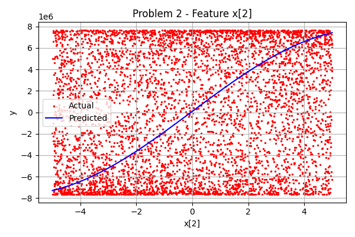
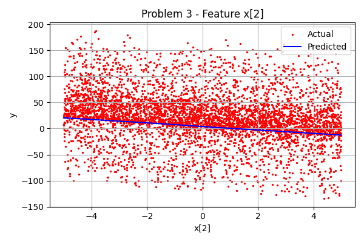
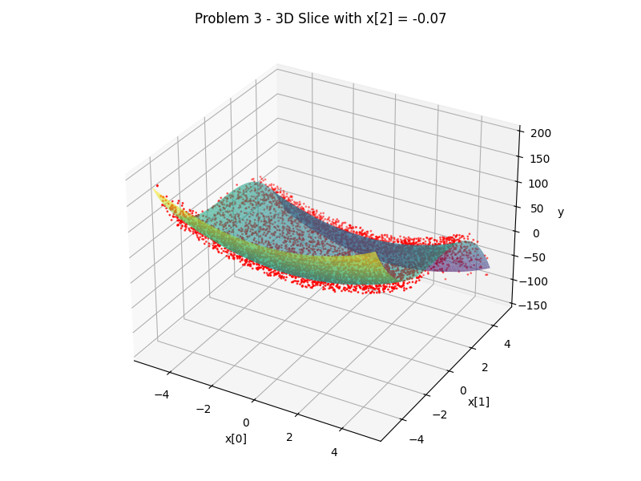
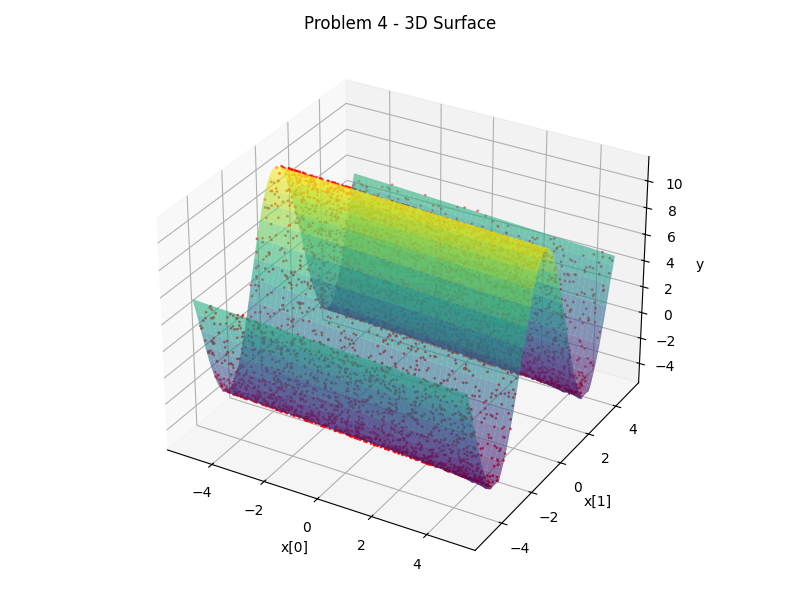
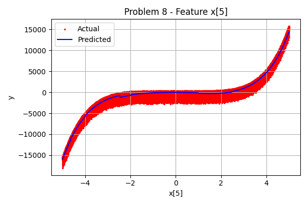

# Mattia Cappellino s327277 Computational Intelligence report

---

[🔗 GitHub Repository](https://github.com/CappePolito/CI2024_project-work)


In case the link does not work

https://github.com/CappePolito/CI2024_project-work


## Lab 1

**ReadMe**
CI2024_lab1 Mattia Cappellino s327277

Hi, i have 2 algorithms in my code, (and 3 starting sets for each algoritm exploring different ideas for the starting sets): a more advanced algorithm with more features and a less advanced one that is able to cycle more. Depending on the set one might work better than the other (the second gets to lower scores, the first one does less cycles).

My suggestion if you are looking from github and it's all in line is to wiew the file from raw (i dont know why it ignored newlines...)

UNIVERSE_SIZE = 100 NUM_SETS = 10 DENSITY = 0.2

more advanced algorithm cost value Diversity => 274.6877793889713 Least covered => 274.6877793889713 Random constrained => 274.6877793889713

more advanced algorithm cost calls Diversity => 41 Least covered => 40 Random constrained => 33

less advanced algorithm cost value Diversity => 274.6877793889713 Least covered => 274.6877793889713 Random constrained => 274.6877793889713 less advanced algorithm cost calls Diversity => 1 Least covered => 1 Random constrained => 1

UNIVERSE_SIZE = 1000 NUM_SETS = 100 DENSITY = 0.2

more advanced algorithm cost value Diversity => 6807.528466334823 Least covered => 5984.429477107501 Random constrained => 7306.036763556991 more advanced algorithm cost calls Diversity => 940 Least covered => 716 Random constrained => 897

less advanced algorithm cost value Diversity => 6747.2901121323675 Least covered => 5984.429477107501 Random constrained => 6964.471043499645 less advanced algorithm cost calls Diversity => 3328 Least covered => 3329 Random constrained => 3291

UNIVERSE_SIZE = 10000 NUM_SETS = 1000 DENSITY = 0.2

more advanced algorithm cost value Diversity => 140764.59204838471 Least covered => 101059.39408340261 Random constrained => 135854.0398608833 more advanced algorithm cost calls Diversity => 903 Least covered => 346 Random constrained => 765

less advanced algorithm cost value Diversity => 127915.45233571355 Least covered => 101059.39408340261 Random constrained => 141130.46520863142 less advanced algorithm cost calls Diversity => 4022 Least covered => 4051 Random constrained => 3999

UNIVERSE_SIZE = 100000 NUM_SETS = 10000 DENSITY = 0.1

more advanced algorithm cost value Diversity => 2209283.905103824 Least covered => 1497734.62056129 Random constrained => 2310731.0671332455 more advanced algorithm cost calls Diversity => 832 Least covered => 345 Random constrained => 495

less advanced algorithm cost value Diversity => 1959502.377867543 Least covered => 1497734.62056129 Random constrained => 2057202.8250984834 less advanced algorithm cost calls Diversity => 4114 Least covered => 4121 Random constrained => 4105

UNIVERSE_SIZE = 100000 NUM_SETS = 10000 DENSITY = 0.2

more advanced algorithm cost value Diversity => 2425064.311360715 Least covered => 1732961.565243992 Random constrained => 2476789.397980283 more advanced algorithm cost calls Diversity => 592 Least covered => 353 Random constrained => 408

less advanced algorithm cost value Diversity => 2210720.348796752 Least covered => 1732961.565243992 Random constrained => 2317491.0218742155 less advanced algorithm cost calls Diversity => 4117 Least covered => 4117 Random constrained => 4124

UNIVERSE_SIZE = 100000 NUM_SETS = 10000 DENSITY = 0.3

more advanced algorithm cost value Diversity => 2765623.033983041 Least covered => 1775688.5793046472 Random constrained => 2519873.5267095375 more advanced algorithm cost calls Diversity => 426 Least covered => 358 Random constrained => 667

less advanced algorithm cost value Diversity => 2262834.899135061 Least covered => 1775688.5793046472 Random constrained => 2355434.4048249093 less advanced algorithm cost calls Diversity => 4130 Least covered => 4130 Random constrained => 4130

**Main ideas**

***Contained in the code***

Main ideas:
I avoided starting from a random solution, because that will have negatively impacted the time 
I created 3 semy-greedy methods to find the most interesting solutions (not the optimal ones, it can be seen because they dont check the cost of the solution, buto only the coverage (least vovered ones), distribution of the sets and the ones that add the most elements for more coverage )    
I added tweaking, temperature and cooling rate to avoid getting stuck in local minimum. The knn groupes similar interesting sets to esplore together.


Diversity greedy start
Purpose: Builds an initial solution by selecting sets that maximize the coverage of new, previously uncovered elements.
Rationale: A diverse starting solution can give a better foundation for optimization, as it ensures high initial coverage.


Least Covered greedy start
Purpose: Builds a solution by prioritizing sets that cover the least-covered elements (elements that appear in fewer sets).
Rationale: This approach ensures that rarer elements are covered early, balancing the coverage.


Random Constrained greedy start
Purpose: Visualizes the progress of both the current solution's cost and the best solution's cost over the iterations.
Rationale: Helps to track and understand the algorithm's performance during the optimization process.


Tweak function
it's objective is to generates a neighboring solution by flipping one or more sets (from selected to not selected and vice versa). It adds randomness in the search process.

Multiple flips: Introduces variation, increasing the chance of escaping local minima.
Improvement attempts: If the solution is valid, it randomly swaps sets to search for better coverage or lower cost.    


simulated annealing
I used a temperature and cooling rate to find an optimal solution by iteratively tweaking the current solution and gradually reducing the search randomness (temperature).
Temperature and cooling rate: The algorithm explores more widely at high temperatures but narrows the search as the temperature decreases. Even if a tweak increases the cost, it can be accepted with a certain probability based on the temperature, helping to avoid local minima.
Early stopping: The process terminates if the temperature gets too low or if no improvement is observed for patience iterations.

K-NN clustering
Clustering: Periodically clusters the best solutions found and refocuses the search on a cluster center, diversifying exploration.


---


**Objective:**  
Implement and compare advanced neighborhood moves and greedy initialization strategies within a simulated annealing framework to solve the set-cover problem efficiently and robustly.

---


### Best performer:

``` python


def valid(solution):
    """Checks wether solution is valid (ie. covers all universe)"""
    return np.all(np.logical_or.reduce(SETS[solution]))


def cost(solution):
    """Returns the cost of a solution (to be minimized)"""
    return COSTS[solution].sum()


def fitness(solution, valid, cost):
    """Evaluate the fitness of the solution."""
    if not valid(solution):
        return float('inf') 
    
    return 1 / (1 + cost(solution))


def advanced_tweak(current_solution):
    #An advanced tweak function that makes multiple changes to the solution.
    # Clone the current solution to avoid modifying the original directly
    new_solution = np.copy(current_solution)
    
    # Probability of flipping multiple sets
    flip_prob = 0.3
    num_flips = np.random.randint(1, 5) if np.random.rand() < flip_prob else 1
    
    # Flip multiple random sets
    for _ in range(num_flips):
        flip_index = np.random.randint(0, len(new_solution))
        new_solution[flip_index] = not new_solution[flip_index]
    
    # Additional modification based on coverage or cost
    if valid(new_solution):  # If the new solution is valid
        # Choose a set to remove and find a better one to add
        if np.random.rand() < 0.5:  # 50% chance to swap a set
            to_remove = np.random.choice(np.where(new_solution)[0])  # Choose a set to remove
            available_to_add = np.where(~new_solution)[0]  # Find sets that are not in the solution
            if available_to_add.size > 0:  # Only proceed if there are sets to add
                to_add = np.random.choice(available_to_add)  # Choose a set to add
                new_solution[to_remove] = False
                new_solution[to_add] = True
    
    return new_solution


def simulated_annealing_with_advanced_tweak(initial_solution, valid, cost, fitness,
                                            max_iterations=10000, initial_temp=1000, cooling_rate=0.995,
                                            patience=500, cluster_check_interval=100, num_clusters=3):
    """
    Simulated annealing with adaptive cooling, advanced tweak function, early stopping, and solution clustering.
    """
    current_solution = initial_solution
    if not valid(current_solution):
        print("Warning: Initial solution is not valid!")
    
    current_cost = cost(current_solution)
    current_fitness = fitness(current_solution, valid, cost)
    
    best_solution = np.copy(current_solution)
    best_cost = current_cost
    best_fitness = current_fitness
    temperature = initial_temp
    
    print("Starting simulated annealing with advanced tweak")
    print(f"Initial cost: {current_cost}, fitness: {current_fitness}")
    
    # To track cost checks and improvements
    cost_checks = 1
    no_improvement_iterations = 0
    cluster_solutions = []
    
    current_costs = []
    best_costs = []

    for iteration in range(max_iterations):
        # Probabilistic tweak function to generate a neighbor solution
        neighbor_solution = advanced_tweak(current_solution)
        
        if valid(neighbor_solution):
            neighbor_cost = cost(neighbor_solution)
            neighbor_fitness = fitness(neighbor_solution, valid, cost)
            cost_checks += 1
            
            # Accept new solution if better or with a probability based on the temperature
            if neighbor_cost < current_cost or np.random.rand() < np.exp((current_cost - neighbor_cost) / temperature):
                current_solution = neighbor_solution
                current_cost = neighbor_cost
                current_fitness = neighbor_fitness
                no_improvement_iterations = 0  # Reset improvement counter
            else:
                no_improvement_iterations += 1
            
            # Track the best solution found so far
            if neighbor_cost < best_cost:
                best_solution = neighbor_solution
                best_cost = neighbor_cost
                best_fitness = neighbor_fitness

            # Keep track of current and best costs for graphing
            current_costs.append(current_cost)
            best_costs.append(best_cost)

        # Adjust cooling rate dynamically based on iteration
        if no_improvement_iterations > patience // 2:
            cooling_rate *= 0.999  # Slow down cooling if no improvements
        temperature *= cooling_rate
        
        # Stop if temperature is too low or no improvement for many iterations
        if temperature < 1e-6 or no_improvement_iterations > patience:
            print(f"Stopping early at iteration {iteration}, temperature too low or no improvement for {no_improvement_iterations} iterations.")
            break

        # Clustering check
        if iteration % cluster_check_interval == 0:
            # Save current good solutions for clustering
            if len(cluster_solutions) < cluster_check_interval:
                cluster_solutions.append(best_solution)
            else:
                # Perform clustering if enough solutions are saved
                cluster_solutions = np.array(cluster_solutions)
                kmeans = KMeans(n_clusters=num_clusters).fit(cluster_solutions)
                cluster_centers = kmeans.cluster_centers_
                
                # Refocus on one of the cluster centers
                best_cluster_solution = cluster_centers[np.argmin([cost(sol) for sol in cluster_centers])]
                print(f"Refocusing search to cluster center at iteration {iteration} with cost: {cost(best_cluster_solution)}")
                cost_checks += 1
                current_solution = best_cluster_solution
                cluster_solutions = []

        # Print progress
        if iteration % 100 == 0:
            print(f"Iteration {iteration}: Current cost: {current_cost}, Best cost: {best_cost}, Temperature: {temperature}")

    print(f"Total number of cost checks: {cost_checks}")
    return best_solution, best_cost, best_fitness, cost_checks, current_costs, best_costs


def diversity_greedy_start():
    """Greedy start function to find an interesting starting solution by maximizing set diversity."""
    selected_sets = []
    covered = np.zeros(UNIVERSE_SIZE, dtype=bool)
    
    # Randomly pick an initial set to start with
    first_set = np.random.randint(len(SETS))
    selected_sets.append(first_set)
    covered = np.logical_or(covered, SETS[first_set])
    
    # Continue selecting sets that maximize diversity (i.e., add the most new elements)
    while not np.all(covered):
        # Score each set by how many uncovered elements it introduces
        uncovered_elements = ~covered
        uncovered_weights = np.dot(SETS, uncovered_elements)
        
        # Select the set that covers the most uncovered elements
        best_set = np.argmax(uncovered_weights)
        selected_sets.append(best_set)
        
        # Update the covered elements
        covered = np.logical_or(covered, SETS[best_set])
    
    # Generate a solution from the selected sets
    initial_solution = np.zeros(len(SETS), dtype=bool)
    for s in selected_sets:
        initial_solution[s] = True
    
    return initial_solution


def least_covered_greedy_start():
    """Greedy start function to find a solution by selecting sets that cover the least-covered elements."""
    selected_sets = []
    covered = np.zeros(UNIVERSE_SIZE, dtype=bool)
    element_cover_count = np.zeros(UNIVERSE_SIZE, dtype=int)
    
    # Continue selecting sets until all elements are covered
    while not np.all(covered):
        # For each set, calculate the sum of how rarely each element in that set is covered
        uncovered_elements = ~covered
        set_scores = np.dot(SETS, uncovered_elements / (1 + element_cover_count))
        
        # Select the set that covers the most uncovered and least-covered elements
        best_set = np.argmax(set_scores)
        selected_sets.append(best_set)
        
        # Update the coverage and cover count for elements in the selected set
        element_cover_count[SETS[best_set]] += 1
        covered = np.logical_or(covered, SETS[best_set])
    
    # Generate the solution
    initial_solution = np.zeros(len(SETS), dtype=bool)
    for s in selected_sets:
        initial_solution[s] = True
    
    return initial_solution


def random_constrained_greedy_start():
    """Greedy start function that randomly picks sets while ensuring coverage."""
    selected_sets = []
    covered = np.zeros(UNIVERSE_SIZE, dtype=bool)
    
    # Continue randomly picking sets that contribute new coverage
    while not np.all(covered):
        available_sets = np.where(np.dot(SETS, ~covered) > 0)[0]
        selected_set = np.random.choice(available_sets)
        selected_sets.append(selected_set)
        covered = np.logical_or(covered, SETS[selected_set])
    
    # Generate the solution
    initial_solution = np.zeros(len(SETS), dtype=bool)
    for s in selected_sets:
        initial_solution[s] = True
    
    return initial_solution

```


### 1. `advanced_tweak(current_solution)`  
- **Purpose:** Explore more aggressive neighborhood moves by flipping multiple random set-inclusion bits, then optionally swapping one selected set with an unselected one.  
- **Key Features:**  
  - Probabilistic “multi-flip” step (up to 4 bits at once).  
  - Conditional swap of a selected set for an unselected set, if the new solution remains valid.  

### 2. `simulated_annealing_with_advanced_tweak(...)`  
- **Purpose:** Perform simulated annealing using the `advanced_tweak` operator with:  
  - **Adaptive cooling:** Slows temperature drop when no improvements occur.  
  - **Early stopping:** Terminates if temperature falls below threshold or no improvement over a patience window.  
  - **Solution clustering:** Periodically clusters recent high-quality solutions and “refocuses” the search on the best cluster center.  
- **Inputs:**  
  - `initial_solution`, `valid`, `cost`, `fitness` functions  
  - Annealing hyperparameters: `initial_temp`, `cooling_rate`, `max_iterations`, etc.  
- **Outputs:**  
  - Best solution found, its cost & fitness, total cost evaluations, and cost‐history vectors for plotting.

### 3. Greedy Initialization Functions  
- **`diversity_greedy_start()`**  
  Build a starting solution by iteratively selecting the set that covers the largest number of *currently uncovered* elements, promoting high coverage diversity early.  
- **`least_covered_greedy_start()`**  
  Greedily add sets that cover the rarest (least-covered) elements first, balancing coverage across all universe elements.  
- **`random_constrained_greedy_start()`**  
  Randomly pick sets that still contribute new coverage until full coverage is achieved, injecting stochasticity into the initial state.

### 4. `plot_costs(current_costs, best_costs, title)`  
- **Purpose:** Visualize the evolution of current vs. best cost over iterations.  
- **Features:**  
  - Line plot of the best‐so‐far cost.  
  - Scatter plot of each iteration’s cost.  

---


``` python

def plot_costs(current_costs, best_costs, title):
    iterations = range(len(current_costs))
    
    plt.figure(figsize=(10, 6))
    
    # Plot best costs as a line
    plt.plot(iterations, best_costs, label="Best Cost (Line)", color='blue')
    
    # Plot current costs as points
    plt.scatter(iterations, current_costs, label="Current Cost (Points)", color='red', s=10)
    
    plt.title(title)
    plt.xlabel("Iteration")
    plt.ylabel("Cost")
    plt.legend()
    plt.show()

 

results = []

# Run with diversity-based greedy start
print("Running with diversity-based greedy start...")
initial_solution_diversity = diversity_greedy_start()
best_solution_diversity, best_cost_diversity, best_fitness_diversity, cost_checks_diversity, current_costs_diversity, best_costs_diversity = simulated_annealing_with_advanced_tweak(
    initial_solution_diversity, valid, cost, fitness
)
results.append(("Diversity Greedy Start", best_cost_diversity, current_costs_diversity, best_costs_diversity, cost_checks_diversity))

# Run with least-covered greedy start
print("Running with least-covered greedy start...")
initial_solution_least = least_covered_greedy_start()
best_solution_least, best_cost_least, best_fitness_least, cost_checks_least, current_costs_least, best_costs_least = simulated_annealing_with_advanced_tweak(
    initial_solution_least, valid, cost, fitness
)
results.append(("Least Covered Greedy Start", best_cost_least, current_costs_least, best_costs_least, cost_checks_least))

# Run with random constrained greedy start
print("Running with random constrained greedy start...")
initial_solution_random = random_constrained_greedy_start()
best_solution_random, best_cost_random, best_fitness_random, cost_checks_random, current_costs_random, best_costs_random = simulated_annealing_with_advanced_tweak(
    initial_solution_random, valid, cost, fitness
)
results.append(("Random Constrained Greedy Start", best_cost_random, current_costs_random, best_costs_random, cost_checks_random))


# Plot results for each approach
plt.figure(figsize=(16, 8))

for i, (name, best_cost, current_costs, best_costs, cost_checks) in enumerate(results):
    iterations = range(len(current_costs))
    
    plt.subplot(1, 3, i + 1)  # Create a subplot for each approach
    
    # Plot best costs as a line
    plt.plot(iterations, best_costs, label="Best Cost (Line)", color="blue", linestyle='--')
    
    # Plot current costs as points
    plt.scatter(iterations, current_costs, label="Current Cost (Points)", color="red", s=10)  # Use scatter plot for points
    
    # Add titles and labels
    plt.title(f"{name}")
    plt.xlabel("Iteration")
    plt.ylabel("Cost")
    plt.legend()

    # Annotate with number of cost checks
    plt.text(0.05, 0.95, f"Cost evals: {cost_checks}", transform=plt.gca().transAxes, fontsize=10,
             verticalalignment='top')

plt.tight_layout()
plt.suptitle("Simulated Annealing: Current and Best Costs for Different Greedy Start Strategies", y=1.02, fontsize=16)
plt.show()


```


---

### Experiment Routine  
1. **Initialization:** Generate three different starting solutions using each greedy strategy.  
2. **Annealing Runs:** Apply `simulated_annealing_with_advanced_tweak` to each start.  
3. **Comparison:** Collect best costs, cost‐history, and total evaluations.  
4. **Visualization:** Use `plot_costs` (and multi‐subplot figures) to compare convergence behavior across strategies.


### Reviews by collegues

Review by carlopantalax:

I believe that using a Simulated Annealing algorithm is a good choice for the Set Cover problem. This regard, in addiction to the usual parameters of this kind of agorithms (like temperature and cooling rate, which allow to escape local minima) I found the use of the patience parameter interesting. It is useful for speeding up the code, increasing the cooling rate if there is no improvement after n iteractions (with n = patience).
The use of clusters with KMeans library is original, they are updated every 100 cycles with the best solution, refocusing the search on a cluster center and diversifying exploration.
I have observed that this code is executed three times for each of the six sets of parameters (UNIVERSE_SIZE, NUM_SETS and DENSITY), using three different semi-greedy methods to generate the first solution: diversity_greedy_start() (which finds a starting solution by maximizing set diversity), last_covered_greedy_start() (which finds a solution by selecting sets that cover the least-covered elements) and random_constrained_greedy_start() (which randomly picks sets while ensuring coverage).
One last detail I noticed is the use of a flip probability, which allows for a more advanced tweak and faster mutation.

---


## Lab 2

**ReadMe**
Lab 2 of computational intelligence

The best performer is lab2Nuovo, you can run it to get good results with a popoulation of 200 and 20_000 generations. You will get good (usually optimal) results (not in china ofc) in reasonable time

The code has 3 mutate algorithms: the first one is the most simple one (and pretty inefficient the second one can get very good results, but it's a bit slow the third one is faster and can get results very similar to the second one, but struggles getting to the optimal solution.

If you have time to spare i got china down to 54877.11 km (in 3,5 hours mind you) with a population of 400 and 20_000 generations, and it was still improving... For the others i got optimal results for all of them.

Lab2BadVersion is the one where i was experimenting with new stuff, but has become really slow with the progressive updates... I do not suggest you run it, but if you have a couple hours to spare you are more than welcome to do XD.

The algorithm leverages a Genetic Algorithm (GA) to approximate the shortest path. Key components include:

Population Initialization: The population consists of a mix of routes: Greedy routes starting from various cities to create reasonable initial paths. Random routes for diversity.

Fitness Evaluation: Routes are evaluated by their total distance. The fitness score is inversely proportional to the route's distance, incentivizing shorter paths.

Selection: Uses roulette wheel selection to probabilistically favor shorter routes for breeding.

Crossover (PMX): Implements Partially Mapped Crossover (PMX) to produce valid children that inherit features from both parents without creating duplicates, thus preserving city visitation requirements.

Mutation: Applies two mutation strategies: Inversion Mutation: Randomly reverses a segment within a route to explore alternative subpaths. Insertion Mutation: Randomly repositions a city within a route, providing further diversity and exploring additional neighborhood routes.

Elitism: Preserves a portion of the top-performing routes in each generation to retain good solutions across generations.

In the code i have a couple of mutate algorithms, the one uncommented right now is the best performer one, if you want you can also try the other ones, they all work, albeit a bit slower.

VANUTATU

1345.5449564733112, 1000 generations, 50 popoulation, second mutate algorithm

.

ITALY

4172.762613916409 km, 6000 generations, 200 popoulation, second mutate algorithm

.

RUSSIA

34283.674646845226 km, 36000 generations, 200 popoulation, second mutate algorithm

.

US

40678,28 km, 50000 generations, 500 popoulation, third mutate algorithm

.

CHINA

54877.11 km, 20000 generations, 200 popoulation, third muatate algorithm


### Best Performer:


``` python


import numpy as np
import pandas as pd
from itertools import combinations
from geopy.distance import geodesic
import random
import matplotlib.pyplot as plt

# Load cities data
CITIES = pd.read_csv('cities/china.csv', header=None, names=['name', 'lat', 'lon'])

# Create distance matrix
DIST_MATRIX = np.zeros((len(CITIES), len(CITIES)))
for c1, c2 in combinations(CITIES.itertuples(), 2):
    DIST_MATRIX[c1.Index, c2.Index] = DIST_MATRIX[c2.Index, c1.Index] = geodesic(
        (c1.lat, c1.lon), (c2.lat, c2.lon)
    ).km

def tsp_cost(tsp):
    """Calculate total cost of a TSP route."""
    assert tsp[0] == tsp[-1]
    assert set(tsp) == set(range(len(CITIES)))
    
    tot_cost = 0
    for c1, c2 in zip(tsp, tsp[1:]):
        tot_cost += DIST_MATRIX[c1, c2]
    return tot_cost

class GeneticTSPSolver:
    def __init__(self, population_size=200, max_generations=20000, 
                 mutation_rate=0.2, elitism_ratio=0.1):
        """
        Initialize Genetic Algorithm for TSP
        
        Parameters:
        - population_size: Number of routes in each generation
        - max_generations: Maximum number of evolutionary iterations
        - mutation_rate: Probability of random mutation
        - elitism_ratio: Percentage of best routes preserved between generations
        """
        self.population_size = population_size
        self.max_generations = max_generations
        self.mutation_rate = mutation_rate
        self.elitism_ratio = elitism_ratio
        self.n_cities = len(CITIES)

    def create_greedy_route(self, start_city=0):
        """Create a greedy route starting from a given city."""
        route = [start_city]
        unvisited = set(range(self.n_cities)) - {start_city}
        
        while unvisited:
            last_city = route[-1]
            nearest = min(unvisited, key=lambda city: DIST_MATRIX[last_city, city])
            route.append(nearest)
            unvisited.remove(nearest)
        
        route.append(start_city)  # Complete the tour
        return route

    def initialize_population(self):
        """
        Create initial population with a mix of greedy and random routes
        """
        population = []
        
        # Add multiple greedy routes starting from different cities
        num_greedy_routes = int(self.population_size * 0.1)
        for start_city in range(num_greedy_routes):
            population.append(self.create_greedy_route(start_city=start_city))
        
        # Generate remaining random routes
        while len(population) < self.population_size:
            route = list(range(1, self.n_cities))
            random.shuffle(route)
            route = [0] + route + [0]  # Complete the tour
            population.append(route)
        
        return population
    
    def roulette_wheel_selection(self, fitness):
        """Select an individual based on roulette wheel selection"""
        total_fitness = sum(fitness)
        pick = random.uniform(0, total_fitness)
        current = 0
        for i, fit in enumerate(fitness):
            current += fit
            if current >= pick:
                return i

    def crossover(self, parent1, parent2):
        """Partially Mapped Crossover (PMX) for TSP ensuring valid child"""
        start, end = sorted(random.sample(range(1, self.n_cities), 2))
        
        child = [-1] * (self.n_cities + 1)
        child[0] = child[-1] = 0  # Start and end at the initial city
        
        # Copy subset from parent1
        child[start:end+1] = parent1[start:end+1]
        
        # Fill remaining positions from parent2
        for i in range(1, self.n_cities):
            if i < start or i > end:
                city = parent2[i]
                while city in child[start:end+1]:
                    city_index = parent1.index(city)
                    city = parent2[city_index]
                child[i] = city

        # Ensure no missing cities in the child
        missing_cities = set(range(1, self.n_cities)) - set(child[1:-1])
        for i in range(1, self.n_cities):
            if child[i] == -1:
                child[i] = missing_cities.pop()
        
        return child
    

    def mutate(self, route):
        
        if random.random() < self.mutation_rate:
            # Inversion mutation
            i, j = sorted(random.sample(range(1, self.n_cities), 2))
            route[i:j+1] = reversed(route[i:j+1])
    
        # Optionally apply an insertion mutation with a small chance
        if random.random() < self.mutation_rate / 2:
            # Select a city and insert it at a different position
            i, j = random.sample(range(1, self.n_cities), 2)
            city = route.pop(i)
            route.insert(j, city)
        
        return route

    

    def solve(self):
        """Main evolutionary algorithm solving method with sanity check"""
        population = self.initialize_population()
        
        # Sanity check for initial population
        population = [route for route in population if len(set(route)) == self.n_cities and route[0] == route[-1]]
        
        best_costs = []
        best_overall_route = None
        best_overall_cost = float('inf')
        
        for generation in range(self.max_generations):
            # Evaluate fitness (lower cost is better)
            fitness = []
            for route in population:
                try:
                    cost = tsp_cost(route)
                    fitness.append(1 / cost)
                except AssertionError as e:
                    print(f"Invalid route detected: {route}. Error: {e}")
            
            if not fitness:
                raise RuntimeError("All routes are invalid. Check initialization or crossover logic.")
            
            # Track best route
            best_route_index = np.argmax(fitness)
            current_best_route = population[best_route_index]
            current_best_cost = tsp_cost(current_best_route)
            
            # Update overall best
            if current_best_cost < best_overall_cost:
                best_overall_route = current_best_route
                best_overall_cost = current_best_cost
            
            best_costs.append(current_best_cost)

             # Print update every 1000 generations
            if generation % 1000 == 0:
                print(f"Generation {generation}: Best Cost So Far: {best_overall_cost}")
            
            # Select parents and apply elitism
            new_population = []
            elite_count = int(self.population_size * self.elitism_ratio)
            elite_indices = np.argsort(fitness)[-elite_count:]
            new_population.extend([population[i] for i in elite_indices])
            
            # Generate offspring
            while len(new_population) < self.population_size:
                parent1 = population[self.roulette_wheel_selection(fitness)]
                parent2 = population[self.roulette_wheel_selection(fitness)]
                
                # Crossover
                child = self.crossover(parent1, parent2)
                
                # Mutation
                child = self.mutate(child)
                
                # Verify child validity and add to population
                if len(set(child)) == self.n_cities and child[0] == child[-1]:
                    new_population.append(child)
            
            population = new_population
        
        # Plot convergence
        plt.figure(figsize=(10, 5))
        plt.plot(best_costs)
        plt.title('Best Route Cost over Generations')
        plt.xlabel('Generation')
        plt.ylabel('Route Cost (km)')
        plt.show()
        
        return best_overall_route, best_overall_cost


# main
solver = GeneticTSPSolver()
best_route, best_cost = solver.solve()

# Print results
print("Best Route:", [CITIES.loc[i, 'name'] for i in best_route])
print(f"Total Distance: {best_cost:.2f} km")

```


**Objective:**  
In this lab, I implement a Genetic Algorithm (GA) to approximate the optimal route for the Traveling Salesman Problem (TSP) on a set of Chinese cities. My goal is to evolve a population of candidate tours and minimize their total travel distance.

---

### Data Preparation
1. **City Coordinates**  
   - I load city names and latitude/longitude from `china.csv` into a Pandas DataFrame `CITIES`.
2. **Distance Matrix**  
   - I compute a symmetric matrix `DIST_MATRIX` of pairwise geodesic distances (in km) between all city pairs using `geopy.distance.geodesic`.

---

### Cost Evaluation
- **`tsp_cost(tsp)`**  
  - Validates that the tour starts and ends at the same city and includes every city exactly once.  
  - Sums the distances between successive cities in the route using `DIST_MATRIX`.

---

### `GeneticTSPSolver` Class

1. **Initialization**  
   - **Parameters:**  
     - `population_size`, `max_generations`, `mutation_rate`, `elitism_ratio`  
   - Stores the number of cities and GA hyperparameters.

2. **`create_greedy_route(start_city)`**  
   - Builds a tour by repeatedly traveling to the nearest unvisited city, completing the loop back to the start.

3. **`initialize_population()`**  
   - Generates an initial population mixing:  
     - 10% greedy tours (each starting from a different city)  
     - 90% completely random tours.

4. **`roulette_wheel_selection(fitness)`**  
   - Implements probabilistic parent selection proportional to individual fitness (1 / route cost).

5. **`crossover(parent1, parent2)`**  
   - Applies Partially Mapped Crossover (PMX):  
     - Copies a random subsequence from `parent1`,  
     - Fills remaining positions from `parent2` while avoiding duplicates,  
     - Ensures a valid child tour.

6. **`mutate(route)`**  
   - With probability `mutation_rate`:  
     1. **Inversion Mutation:** Reverse a random sub-route.  
     2. **Insertion Mutation:** Remove one city and reinsert it at a different position (with half the mutation probability).

7. **`solve()`**  
   - **Evolution Loop:**  
     - For up to `max_generations`, evaluates fitness of each individual.  
     - Preserves the top `elitism_ratio` fraction unchanged.  
     - Generates offspring via selection, crossover, and mutation, ensuring validity.  
   - Tracks and plots best route cost over generations.  
   - Returns the best tour and its total distance.

---

### Main Execution
- I instantiate `GeneticTSPSolver`, call `solve()`, and finally print the best route (as city names) and its total distance.


### Reviews by collegues

Review by yuripettorossi

I found your solution complete and well documented. I will focus my analysis on the lab2Nuovo.ipynb file, since, for what I have understood, it was the one you mainly used to solve the problem.

You start by creating a population with size population_size, of which 10% is initialized using the Nearest Neighbor approach, while the rest is generated randomly arranging all the cities.
Then before generating the offspring you filter off the population reducing it to 10% of the original size, by preserving only the individuals with the best fitness (lowest path length).
In my opinion, this approach basically cancels out almost all the 90% of randomly generated individuals of the first step, because their fitness will likely be lower than the individual initialized with a NN approach. Maybe preserving more than just 10% of population might be useful. Otherwise why to generate 180 individual that will be likely not considered?
Furthermore, even in the following steps, shrinking population size by 90% before the generation of the children reduces the variance among parents, and it may prevents from finding new optimal genomes, by taking portion of genes from individuals associated with “bad” fitness.
Why don’t you try to pick random parents to be mutate/combined from the entire original population and then filter the new population, keeping only the top individuals?
Having more parents may lead to better children, if we are lucky.

I have also noticed you always perform both crossover and mutation, at each generation. Maybe apply only one of them, also including different types of mutation, given that you have already implemented 3 different functions, could be a good alternative. But I suppose you have already thought about it, since in the second file you have implemented the hypermodern approach.

I’m sorry if I misunderstood something about your implementation.
In general, I think you showed to have achieved very good results and my suggestion may not lead to an actual improvement. 

---


## Lab 3

**ReadMe**

# CI2024_lab3
Lab 3 of Computational Intelligence


I have made 3 similar programs, but with a couple of differences

.


The best performer timewise is lab 3.1 , and also has a reduced ram usage

The second best is lab3.0  , with a very big ram usage

The worse performer is lab3.2 , also with a reduced ram usage

.


Table for a 4x4 with 10_000 RANDOMIZED STEPS

lab3.0	time: 17 mins , number of steps: 62 , total actions evaluated: 66141419 (A LOT)

lab3.1	time: 1,23 minutes , number of steps: 46 , total actions evaluated: 28699

lab3.2	time: 72 mins , number of steps: 68 , total actions evaluated: a lot

.


MY IDEAS

lab3.0

this is my start program, and uses a lot of ram (be careful if you run it with high matrixes and number of randomize steps, to avoid crashing your pc i suggest no more than a 7x7 and 200 randomize steps).

I used a a* search algorithm with a custom Manhattan distance heuristic

Custom Manhattan distance: i assign weight to larger tile number to try to simulate variable movement costs.

Pruning: i avoid revisiting states that i already explored with a better or equal cost

I use bytes to store the states to help mitigate the huge ram needs and help for faster hashing

I noticed that using linear conflicts worsened the performance on this program (somehow), but improves the performane significally in the 3.1

.


lab 3.1

This is my best performer, and it's a modified version of lab3.0

The a* algorithm uses a high-priority queue, that helps me to explore states more efficiently, and i track my visited states with a hash (to help use less ram => this one should use no more than 1 GB, even with 7x7 puzzles)

I use a Manhattan distance with linear conflict to predict better paths

i still describe the states with bytes to use less RAM.

.


Lab 3.2

It's a modified version of 3.1, but has a worse performance (and also the less ram used, probably why it's performing worse...). 

I implemented a iterative deepening a* that explores paths dynamically with an increasing cost threshold

I prune the already visited states

i still use the Manhattan distance with linear conflict


### Best performer (lab 3.1)

``` python

import heapq
from collections import namedtuple
from tqdm.auto import tqdm
import numpy as np
from random import choice
# Configuration
PUZZLE_DIM = 6
RANDOMIZE_STEPS = 200
action = namedtuple('Action', ['pos1', 'pos2'])
# Define the goal state
GOAL_STATE = np.array([i for i in range(1, PUZZLE_DIM**2)] + [0]).reshape((PUZZLE_DIM, PUZZLE_DIM))
GOAL_TUPLE = tuple(GOAL_STATE.flatten())
GOAL_POSITIONS = {value: divmod(idx, PUZZLE_DIM) for idx, value in enumerate(GOAL_TUPLE)}
def available_actions(state: np.ndarray, blank_pos: tuple[int, int]) -> list['Action']:
    x, y = blank_pos
    actions = []
    if x > 0:
        actions.append(action((x, y), (x - 1, y)))
    if x < PUZZLE_DIM - 1:
        actions.append(action((x, y), (x + 1, y)))
    if y > 0:
        actions.append(action((x, y), (x, y - 1)))
    if y < PUZZLE_DIM - 1:
        actions.append(action((x, y), (x, y + 1)))
    return actions


# Perform an action
def do_action(state: np.ndarray, action: 'Action') -> np.ndarray:
    new_state = state.copy()
    new_state[action.pos1], new_state[action.pos2] = new_state[action.pos2], new_state[action.pos1]
    return new_state
# Heuristic: Manhattan Distance
def manhattan_distance(state: tuple) -> int:
    distance = 0
    for idx, value in enumerate(state):
        if value != 0:  # Ignore the blank tile
            current_pos = divmod(idx, PUZZLE_DIM)
            goal_pos = GOAL_POSITIONS[value]
            distance += abs(current_pos[0] - goal_pos[0]) + abs(current_pos[1] - goal_pos[1])
    return distance

# A* Solver
def a_star_solver(start_state: np.ndarray):
    start_tuple = tuple(start_state.flatten())
    blank_idx = start_tuple.index(0)  # Locate the blank tile
    
    # Priority queue: (f_score, g_score, state, blank_idx, parent)
    frontier = [(manhattan_distance(start_tuple), 0, start_tuple, blank_idx, None)]
    heapq.heapify(frontier)
    
    visited = {}
    parents = {}
    
    while frontier:
        f_score, g_score, current_state, blank_idx, parent = heapq.heappop(frontier)
        
        if current_state in visited and visited[current_state] <= g_score:
            continue
        visited[current_state] = g_score
        parents[current_state] = parent
        
        if current_state == GOAL_TUPLE:
            return reconstruct_path(parents, current_state)  # Found the goal
        
        current_state_np = np.array(current_state).reshape((PUZZLE_DIM, PUZZLE_DIM))
        blank_pos = divmod(blank_idx, PUZZLE_DIM)
        for action in available_actions(current_state_np, blank_pos):
            new_state_np = do_action(current_state_np, action)
            new_state = tuple(new_state_np.flatten())
            new_blank_idx = action.pos2[0] * PUZZLE_DIM + action.pos2[1]  # Convert to flat index
            
            if new_state not in visited or visited[new_state] > g_score + 1:
                heapq.heappush(frontier, (
                    g_score + 1 + manhattan_distance(new_state),  # f = g + h
                    g_score + 1,  # g = cost so far
                    new_state,
                    new_blank_idx,
                    current_state
                ))
    return None

# Reconstruct the path from the goal to the start
def reconstruct_path(parents, state):
    path = []
    while state is not None:
        path.append(state)
        state = parents[state]
    return path[::-1]  # Reverse to get the path from start to goal
# Randomize the initial state
state = np.array([i for i in range(1, PUZZLE_DIM**2)] + [0]).reshape((PUZZLE_DIM, PUZZLE_DIM))
blank_pos = tuple(map(int, np.where(state == 0)))  # Initial blank tile position

for r in tqdm(range(RANDOMIZE_STEPS), desc='Randomizing'):
    actions = available_actions(state, blank_pos)  # Pass blank_pos
    chosen_action = choice(actions)               # Randomly pick an action
    state = do_action(state, chosen_action)       # Perform the action
    blank_pos = chosen_action.pos2                # Update blank tile position

# Solve the puzzle
print("Start State:\n", state)
solution_path = a_star_solver(state)
if solution_path:
    print(f"Solution found in {len(solution_path) - 1} moves!")
else:
    print("No solution exists.")


```

---
**Objective:**  
I implemented the A* search algorithm with a Manhattan-distance heuristic to solve a 6 × 6 sliding‐tile puzzle. Starting from a randomized but reachable configuration, the solver finds an optimal sequence of moves that returns the blank tile and all numbered tiles to their goal positions.

---

### Key Components

1. **State Representation**  
   - I represent each board as a flat tuple of length 36, where `0` denotes the blank tile.  
   - `GOAL_TUPLE` holds the target ordering `(1,2,…,35,0)` and `GOAL_POSITIONS` maps each tile value to its goal coordinates.

2. **`available_actions(state, blank_pos)`**  
   - Returns all valid moves of the blank tile (up, down, left, right) as pairs of positions to swap.

3. **`do_action(state, action)`**  
   - Swaps two positions in the board array, yielding a new state after sliding one tile into the blank.

4. **`manhattan_distance(state)`**  
   - Computes the sum of Manhattan distances from each tile’s current position to its goal position—serves as the admissible heuristic \(h(n)\).

5. **`a_star_solver(start_state)`**  
   - Implements A* search with a min‐heap priority queue of `(f = g + h, g, state, blank_idx, parent)`.  
   - Tracks `visited` with best‐known `g`‐scores and a `parents` map for path reconstruction.  
   - Expands states by generating neighbors via `available_actions`, pushing them into the frontier if they improve upon prior visits.

6. **`reconstruct_path(parents, state)`**  
   - Backtracks from the goal state through the `parents` dictionary to produce the ordered list of board configurations from start to goal.

7. **Randomization & Execution**  
   - I randomize the puzzle by applying 200 valid random moves to the solved board (ensuring solvability).  
   - After printing the randomized start, I invoke `a_star_solver`, then report the number of moves in the found solution.


---


### Reviews by collegues

Review of SciarraColonna

Your proposed solultions to the problem are really deatiled and not trivial at all.

lab 3.0: your custom Manhattan distance implementation probably makes the heuristic more dynamic. Moreover, the pruning allows to decrease (even by a small amount) the memory consumption, which, as you wrote, is already quite high.
lab 3.1: the use of heapq with a hash mapping (which guarantees a fast memory access) is probably the most efficient solution for the data structures of the problem, especially in combination with Manhattan distance with linear conflicts.
lab 3.2: this implementation of the A-star algorithm is quite interesting even though the overall performance does not get better (which could be caused by the choice of threshold parameter), but this is an acceptable compromise since the memory consumption of this approach is even lower.


Review by LucianaColella7


Hi,

First of all, I really appreciated the structure, clarity, and organization of your code. Additionally, the README contains helpful descriptions that clearly explain the different implementation choices you made.
One small suggestion: it would have been nice to see the results presented more clearly, maybe in a table, to better visualize the performance comparisons.

I truly appreciated the different files you uploaded, showing the various attempts you made by comparing alternative approaches both in terms of algorithms (A* and IDA*) and heuristics (Weighted Manhattan distance, Manhattan distance with Linear Conflict). In particular, I found your custom heuristic quite interesting, as it prioritizes moves of smaller puzzle pieces first, which reduces the puzzle's complexity early and makes it easier to solve the larger pieces later.

I also liked your focus on improving ram usage, which becomes crucial for larger puzzles. Specifically, using bytes for the visited states was a great idea as a memory-saving strategy.

Overall, your work is excellent. Keep it up!


---


# Project : Symbolic Regression with Genetic Programming Project


**Objective:**

The objective of this project is to implement a Genetic Programming (GP) algorithm to solve the problem of symbolic regression. Symbolic regression involves finding mathematical expressions that best approximate a target function, given a set of input-output data points.
 Rather than assuming a predetermined model structure, I allow the GP algorithm to simultaneously discover both the form and parameters of candidate functions, guided solely by their fitness on training data.

**Overview:**

Symbolic regression searches the space of mathematical expressions to discover both the form and parameters of the model. This project uses the `gxgp` library to evolve expression trees capable of approximating the hidden generating function behind a dataset.

To ensure numerical stability and robustness during evolution, i implemented a variety of custom mathematical primitives (e.g., protected division, logarithm, power, square root) that safely handle edge cases such as division by zero and overflow.

The resulting models are evaluated using the Mean Squared Error (MSE) between predicted and actual outputs, with the goal of minimizing this metric through genetic evolution.


## Introduction

I implemented a suite of “protected” primitives—including safe division, logarithm, power, square root, and trigonometric operations—to prevent runtime errors and ensure numerical stability during evolution. By wrapping traditional operators with guards against invalid inputs (e.g., division by zero or negative logarithms), I can widen the search space without sacrificing robustness and avoiding errors that can slow computations down.

Building on the `gxgp` library, I represent individuals as expression trees (via `DagGP`) and apply standard genetic operators: subtree crossover, point mutation, and tournament selection. I incorporate elitism to preserve top solutions and tune mutation and crossover probabilities to balance exploration versus exploitation.

 I measure fitness mainly by using Mean Squared Error (MSE) between predicted and actual values and track convergence over generations. I use tree lenght as a small penalty to avoid overexpansions of the tree when the generations are still few, relaxing the penalty later in the evolution.


# Custom Mathematical Primitives

This section provides a brief description of each custom mathematical function implemented in the code, along with its purpose and any special handling.

The reason i implemented so many is because in problem 2 i could not reach a good fitness value, so went wild with the operators thinking it was some weird operator the missing link (it was not)

---

## Trigonometric Functions

### `custom_sin(x)`  
Sine function that wraps `np.sin`, allowing it to accept both scalars and NumPy arrays.

### `custom_cos(x)`  
Cosine function that wraps `np.cos`, allowing it to accept both scalars and NumPy arrays.

### `custom_tanh(x)`  
Hyperbolic tangent function that wraps `np.tanh`, allowing it to accept both scalars and NumPy arrays.

### `sin1_over_x(x)`  
Computes `sin(1/x)` with a small epsilon (`1e-6`) added to `x` to prevent division by zero.

### `sinc(x)`  
Normalized sinc function, implemented as `np.sinc(x/π)`, which gracefully handles `x = 0`.

---

## Exponential & Logarithmic

### `custom_exp(x)`  
Clips `x` to the range [-100, 100] before calling `np.exp`, preventing overflow.

### `safe_exp(x)`  
Identical to `custom_exp`, but named to emphasize “overflow-safe” behavior.

### `safe_log(x)`  
Protected logarithm: computes `np.log(abs(x) + 1e-6)`, avoiding `log(0)` or negative inputs.

---

## Power & Root

### `square(x)`  
Returns \(x^2\).

### `cube(x)`  
Returns \(x^3\).

### `safe_pow(x, y)`  
1. Takes absolute value of `x` and replaces values below `1e-6` with `1e-6`.  
2. Clips the base to [0, 100] to avoid overflow.  
3. Raises the processed base to the power `y`.

### `safe_sqrt(x)`  
Computes \(\sqrt{|x|}\), ensuring the argument to `np.sqrt` is non-negative.

---

## Division & Modulo

### `safe_div(x, y)`  
Performs \(x / (y + 1e-6)\), adding a small epsilon to the denominator to avoid division by zero.

### `reciprocal(x)`  
Returns \(1 / (x + 1e-6)\), protecting against division by zero.

### `mod(x, y)`  
Computes `np.mod(x, y + 1e-6)`, preventing modulo by zero.

---

## Activation‐Style Functions

### `sigmoid(x)`  
Logistic sigmoid: \(1 / (1 + \exp(-x))\).

### `softsign(x)`  
Softsign: \(x / (1 + |x|)\).

### `hard_sigmoid(x)`  
Clipped linear approximation of sigmoid: \(\mathrm{clip}((x + 1)/2,\,0,\,1)\).

### `logit(x)`  
Inverse sigmoid with clipping:  
1. Clips `x` to [1e-6, 1−1e-6]  
2. Computes \(\log(x / (1 - x))\).

### `relu(x)`  
Rectified Linear Unit: `np.maximum(0, x)`.

### `leaky_relu(x, α=0.01)`  
Leaky ReLU: `x` if `x > 0`, otherwise `α * x`.

### `elu(x, α=1.0)`  
Exponential Linear Unit: `x` if `x > 0`, otherwise `α*(exp(x) − 1)`.

### `swish(x)`  
Swish activation: `x * sigmoid(x)`.

### `mish(x)`  
Mish activation: `x * tanh(ln(1 + exp(x)))`.

### `bent_identity(x)`  
Bent Identity: \(\tfrac{\sqrt{x^2 + 1} - 1}{2} + x\).

---

## Waveform Functions

### `sawtooth(x)`  
Standard sawtooth wave:  
\[
2\!\bigl(\tfrac{x}{2\pi} - \lfloor 0.5 + \tfrac{x}{2\pi}\rfloor\bigr)
\]

### `triangle_wave(x)`  
Triangle wave:  
\[
2\,\bigl|2(\tfrac{x}{2\pi} - \lfloor \tfrac{x}{2\pi} + 0.5\rfloor)\bigr| - 1
\]

### `square_wave(x)`  
Square wave, implemented as `np.sign(np.sin(x))`.

---

## Pairwise Operators

### `max_op(x, y)`  
Element-wise maximum of `x` and `y`.

### `min_op(x, y)`  
Element-wise minimum of `x` and `y`.

### `average(x, y)`  
Element-wise average: \((x + y)/2\).

---

**Notes:**

- All functions accept NumPy arrays (and scalars) as inputs and return arrays of the same shape.  
- Small epsilons (`1e-6`) and clipping (`np.clip`) are used consistently to prevent numerical issues such as division by zero, overflow, and invalid arguments for logarithms and square roots.  
- Activation-style functions broaden the search space of symbolic regression by providing both linear and non-linear transformation primitives.  


# Data Loading and Preprocessing

This section of code selects a problem dataset, loads the input–output arrays, and applies subsampling if the number of samples exceeds a maximum threshold. Finally, it reshapes the inputs so that each row corresponds to one sample.

---


## Load Problem Data

This section selects the problem dataset, loads the raw inputs and targets, applies subsampling if the number of samples exceeds a threshold, and reshapes the input matrix.

```python
# -------------------------------
# Load problem data
# -------------------------------
selected_problem = 8
data = np.load(f'../data/problem_{selected_problem}.npz')
x_data = data['x']
y_data = data['y']

MAX_SAMPLES = 1000000000
if y_data.shape[0] > MAX_SAMPLES:
    step = y_data.shape[0] // MAX_SAMPLES
    y_true = y_data[::step][:MAX_SAMPLES]
    x_data = x_data[:, ::step][:, :MAX_SAMPLES]
else:
    y_true = y_data

# Transpose x_data so that each row is one sample and each column is one variable.
x_data = x_data.T  


```

I used MAX_SAMPLES to limit the number of samples when testing new algorithms around 2000, and increased it to 5000 when running the whole program to avoid excessive computational times.
For the september exam i ran it with a higher number (1000000000) to avoid not reaching the optimal solution due just to a lack of data points.


---


```python
# -------------------------------
# Set up operators and GP parameters
# -------------------------------
# Use one consistent set of operators
operators = [
    operator.add,       # binary: +
    operator.sub,       # binary: -
    operator.mul,       # binary: *
    safe_div,           # binary: protected division
    square,             # unary: square
    cube,               # unary: cube
    custom_sin,         # unary: sine
    custom_cos,         # unary: cosine
    custom_exp,         # unary: exponential (with clipping)
    safe_log,           # unary: protected logarithm
    safe_sqrt,          # unary: protected square root
    custom_tanh,        # unary: tanh
    safe_pow,           # binary: protected power
    reciprocal,         # unary: reciprocal
    sigmoid,            # unary: sigmoid
    gaussian,           # unary: gaussian
    relu,               # unary: ReLU
    leaky_relu,         # unary: leaky ReLU
    elu,                # unary: ELU
    swish,              # unary: swish
    mish,               # unary: mish
    sin1_over_x,        # unary: sin(1/x)
    sinc,               # unary: sinc
    sawtooth,           # unary: sawtooth wave
    triangle_wave,      # unary: triangle wave
    square_wave,        # unary: square wave
    bent_identity,      # unary: bent identity
    softsign,           # unary: softsign
    hard_sigmoid,       # unary: hard sigmoid
    logit,              # unary: logit
    mod,                # binary: modulo
    max_op,             # binary: max
    min_op,             # binary: min
    average             # binary: average
]

# Adjusted parameter settings to allow for more growth and complexity
POP_SIZE = 4000          
NUM_GENS = 500         
OFFSPRING_NUM = 1200      
INITIAL_SIZE_MIN = 1    # Minimum size for initial trees
INITIAL_SIZE_MAX = 15   # Maximum size for initial trees 
TOURN_SIZE = 9        
LENGTH_PENALTY = 0
CROSSOVER_PROB = 0.7    
MUTATION_PROB = 0.3     
MAX_TREE_DEPTH = 15     
ADAPTIVE_PENALTY = True 
MIN_SEMANTIC_THRESHOLD = 0.01  

# -------------------------------
# Initialize the GP system with consistent operators
# -------------------------------
gp = DagGP(
    operators=operators,
    variables=x_data.shape[1],
    constants=np.linspace(-5, 5, 2000)
)


```


This is where i set the parameters for the code


---


```python
# -------------------------------
# Tree Structure Functions
# -------------------------------

# -------------------------------
# Tree Structure Functions
# -------------------------------
def get_operator_arity(op):
    """Determine the arity of an operator based on its function signature."""
    import inspect
    
    # Handle built-in operators
    if op in [operator.add, operator.sub, operator.mul]:
        return 2
    
    # For custom functions, check the number of parameters
    try:
        sig = inspect.signature(op)
        params = [p for p in sig.parameters.values() 
                 if p.default == p.empty and p.name not in ['alpha']]  # Exclude optional params
        return len(params)
    except:
        # If inspection fails, assume unary
        return 1

# Create dictionaries for quick lookup
unary_operators = [
    square, cube, custom_sin, custom_cos, custom_exp, safe_log, safe_sqrt,
    """custom_tanh, reciprocal, sigmoid, gaussian, relu, leaky_relu, elu,
    swish, mish, sin1_over_x, sinc, sawtooth, triangle_wave, square_wave,
    bent_identity, softsign, hard_sigmoid, logit"""
]

binary_operators = [
    operator.add, operator.sub, operator.mul, safe_div, safe_pow,
    """mod, max_op, min_op, average"""
]


#used done
def collect_nodes(node, nodes_list=None):
    """Collect all nodes in a tree into a list."""
    if nodes_list is None:
        nodes_list = []
    nodes_list.append(node)
    # Use public API for successors.
    for child in node.successors:
        collect_nodes(child, nodes_list)
    return nodes_list

#used done
def get_tree_depth(node, depth=0, max_depth=0):
    """Calculate the maximum depth of a tree."""
    current_depth = depth + 1
    max_depth = max(max_depth, current_depth)
    # Use public API for successors.
    for child in node.successors:
        max_depth = get_tree_depth(child, current_depth, max_depth)
    return max_depth

```


## Tree Structure Functions

- **`get_operator_arity(op)`**  
  Determine the number of operands `op` expects (used when building/mutating trees).  
  - Returns an integer arity used to choose/validate operator replacements.  
  - Prefers explicit checks for common binary ops, falls back to callable signature inspection, and returns `1` if unknown.  
  - Used by the tree constructor and mutation operators to enforce arity constraints.

- **`unary_operators` / `binary_operators`**  
  Lookup lists of available operators used during initialization and mutation.  
  - Contain actual callable objects (with placeholder names as strings for pending additions).  
  - Used for sampling operators, validating node replacements, and reporting available primitives.

- **`collect_nodes(node, nodes_list=None)`**  
  Gather every node from the subtree rooted at `node` into a flat Python list.  
  - Performs a depth-first, pre-order traversal and returns the accumulator list.  
  - Used to pick random mutation targets, compute tree statistics, and serialize trees.  
  - Note: recursive; very deep trees may hit the recursion limit (iterative alternative can be used if needed).

- **`get_tree_depth(node, depth=0, max_depth=0)`**  
  Compute the maximum depth (height) of the tree rooted at `node` (root counted as depth 1).  
  - Recursively tracks the current depth and propagates the maximum across successors.  
  - Used to enforce maximum-depth constraints and for diagnostics/performance checks.  
  - Note: recursion-based; consider an iterative BFS/stack approach for extremely deep trees.

---


---


```python
# -------------------------------
# Define an improved fitness evaluation function with adaptive complexity penalty
# -------------------------------
def unified_compute_fitness(ind, generation=0, pop_stats=None):
    
    try:
        pred = gp.evaluate2(ind, x_data, variable_names=[f'x{i}' for i in range(x_data.shape[1])])
        pred = np.array(pred)

        if np.any(np.isnan(pred)) or np.any(np.isinf(pred)):
            return -1e30

        mse_val = np.mean((pred - y_true) ** 2)
        complexity = len(collect_nodes(ind))
        
        # Base fitness is negative MSE
        fitness = -mse_val
        
        if pop_stats:
            best_mse = pop_stats.get('best_mse', 1.0)
            avg_mse = pop_stats.get('avg_mse', 1.0)
            avg_size = pop_stats.get('avg_size', 20)
            
            # Dynamic penalty based on population state
            if mse_val < avg_mse:  # Better than average
                # Scale penalty based on how much better than average
                improvement_ratio = (avg_mse - mse_val) / avg_mse
                
                # Less penalty for better improvements
                penalty_scale = max(0.0001, 0.01 * (1 - improvement_ratio))
                
                # Only penalize if significantly larger than average
                if complexity > avg_size * 1.5:
                    size_penalty = penalty_scale * (complexity - avg_size) / avg_size
                    fitness -= size_penalty
                    
            # Special handling for near-optimal solutions
            if mse_val < best_mse * 1.1:  # Within 10% of best
                # Prefer simpler solutions when MSE is similar
                fitness -= 0.0001 * complexity / avg_size
        
        # Generation-based adjustments
        evolution_progress = generation / NUM_GENS
        
        # Early generations: encourage diversity
        if evolution_progress < 0.3:
            # Small bonus for unusual sizes (exploration)
            size_deviation = abs(complexity - 20) / 20
            fitness += 0.00001 * size_deviation
            
        # Late generations: focus on refinement
        elif evolution_progress > 0.7:
            # Bonus for very low MSE
            if mse_val < 0.001:
                fitness += 0.1 * (0.001 - mse_val)
                
        return fitness

    except Exception as e:
        return -1e30


#used done
def semantic_distance(ind1, ind2, x_data):
    # Evaluate both individuals on a sample of x_data and return an appropriate distance measure.
    y1 = np.array(gp.evaluate2(ind1, x_data))
    y2 = np.array(gp.evaluate2(ind2, x_data))
    return np.mean(np.abs(y1 - y2))


```

## Fitness & Semantic Functions

-## Fitness & Semantic Functions

- **`unified_compute_fitness(ind, generation=0, pop_stats=None)`**  
  Compute a single scalar fitness combining prediction quality and an adaptive complexity penalty.  
  - Base metric: negative MSE (`-mse`) from `gp.evaluate2(ind, x_data, ...)` — higher is better (less negative = lower error).  
  - Robustness: returns a large negative constant (`-1e30`) if evaluation yields `NaN`/`Inf` or an exception occurs.  
  - Adaptive complexity penalty: when `pop_stats` is provided (`best_mse`, `avg_mse`, `avg_size`) the function applies small, dynamic penalties for overly large trees — penalties scale down for individuals that improve on population averages and add a small simplicity bias for near-best solutions.  
  - Generation-aware tweaks: early generations (< 30% of `NUM_GENS`) get a tiny exploration bonus for unusual sizes; late generations (> 70%) favour refinement (bonus for very low MSE).  
  - Uses: fitness-based selection, complexity control during evolution, and automatic trade-off between accuracy and parsimony.  
  - I/O / complexity: inputs are `ind`, `generation`, optional `pop_stats`; output is a float fitness. Dominant cost is model evaluation `O(S)` for `S = len(x_data)` plus `O(n)` to compute tree size via `collect_nodes`.

- **`semantic_distance(ind1, ind2, x_data)`**  
  Measure behavioral (semantic) difference between two individuals.  
  - Implementation: evaluate both individuals on `x_data` and return the mean absolute error between outputs.  
  - Uses: diversity measures, niching, clustering or replacement rules based on behavioural similarity.  
  - I/O / complexity: inputs are two individuals and `x_data`; output is a scalar distance. Complexity is `O(S)` where `S` is number of samples in `x_data`.  
  - Caveat: cost scales with `x_data` size — consider subsampling `x_data` for frequent distance checks.


---


```python
# -------------------------------
# Helper functions for mutation and crossover
# -------------------------------
#usded done
def get_mutation_strategies(current_size, generation, num_gens):
    """Determine mutation strategies and their probabilities based on tree size."""
    evolution_progress = generation / num_gens
    
    # Base probabilities that change with evolution
    point_mut_prob = 0.3
    subtree_prob = 0.2
    
    if current_size < 15:
        # Small trees: more aggressive growth early on
        grow_prob = 0.4 * (1 - evolution_progress)
        shrink_prob = 0.1 + 0.3 * evolution_progress
    else:
        # Large trees: also adapt over time
        grow_prob = 0.3 * (1 - evolution_progress)  # Less growth than small trees
        shrink_prob = 0.2 + 0.3 * evolution_progress  # More shrinking
        
    strategies = [
        ("point_mutation", point_mut_prob),
        ("subtree_replacement", subtree_prob),
        ("grow", grow_prob),
        ("shrink", shrink_prob)
    ]
    
    # Normalize probabilities
    total_prob = sum(prob for _, prob in strategies)
    return [(name, prob/total_prob) for name, prob in strategies]


#used done
def select_mutation_strategy(strategies):
    """Select a mutation strategy based on probabilities."""
    strategy_names, probabilities = zip(*strategies)
    return np.random.choice(strategy_names, p=probabilities)


#used done
def select_node_for_mutation(all_nodes, mutation_type):
    """Select a node to mutate with bias toward leaf nodes for growth operations."""
    if mutation_type == "grow" and len(all_nodes) > 1:
        # Separate nodes into internal and leaf nodes
        leaf_nodes = [node for node in all_nodes if node.is_leaf]
        if leaf_nodes and np.random.rand() < 0.7:  # 70% chance to select a leaf node for growth
            return np.random.choice(leaf_nodes)
    
    return np.random.choice(all_nodes)

#used done
def replace_subtree(node, new_subtree, parent=None, parent_idx=None):
    """
    Replace a node's subtree with a new subtree, respecting arity constraints.
    
    Parameters:
    - node: The node to replace
    - new_subtree: The new subtree to use
    - parent: The parent node (if known)
    - parent_idx: The index of node in parent's successors (if known)
    
    Returns:
    - True if replacement was successful, False otherwise
    """
    # If we have direct parent access, we can replace the entire node
    if parent is not None and parent_idx is not None:
        parent_successors = list(parent.successors)
        parent_successors[parent_idx] = new_subtree
        try:
            parent.successors = parent_successors
            return True
        except AssertionError:
            return False
    
    # If node and new_subtree have the same number of successors, we can replace content
    if len(node.successors) == len(new_subtree.successors):
        # Copy operator and data
        if hasattr(node, '_op') and hasattr(new_subtree, '_op'):
            node._op = new_subtree._op
        
        if hasattr(node, '_data') and hasattr(new_subtree, '_data'):
            node._data = new_subtree._data
            
        if hasattr(node, 'name') and hasattr(new_subtree, 'name'):
            node.name = new_subtree.name
        
        # Copy successors one by one
        for i, successor in enumerate(new_subtree.successors):
            node_successors = list(node.successors)
            node_successors[i] = successor
            node.successors = node_successors
            
        return True
    
    return False

#used done
def find_parent_and_index(root, node, path=None):
    """Find the parent of a node and its index in the parent's successors."""
    if path is None:
        path = []
    
    # Check if any of root's successors is the target node
    for i, child in enumerate(root.successors):
        if child is node:
            return root, i
    
    # Recursively check all children
    for i, child in enumerate(root.successors):
        result = find_parent_and_index(child, node, path + [(root, i)])
        if result is not None:
            return result
    
    return None

#used done
def apply_point_mutation(ind, node, gp_instance, current_depth, max_depth):
    """Apply point mutation to a node - change only the operator or terminal value."""
    if not node.is_leaf:
        # For internal nodes, change the operator to another with same arity
        current_arity = len(node.successors)
        
        if current_arity == 1:
            compatible_ops = unary_operators
        elif current_arity == 2:
            compatible_ops = binary_operators
        else:
            return ind
        
        # Select a new operator (different from current if possible)
        if hasattr(node, '_op') and node._op in compatible_ops and len(compatible_ops) > 1:
            # Try to select a different operator
            available_ops = [op for op in compatible_ops if op != node._op]
            if available_ops:
                new_op = np.random.choice(available_ops)
            else:
                new_op = np.random.choice(compatible_ops)
        else:
            new_op = np.random.choice(compatible_ops)
        
        # Update the operator
        if hasattr(node, '_op'):
            node._op = new_op
        if hasattr(node, 'name'):
            # Update the name to match the new operator
            node.name = new_op.__name__ if hasattr(new_op, '__name__') else str(new_op)
            
    else:
        # For leaf nodes (terminals), modify the value
        if hasattr(node, '_data'):
            data = node._data 
            if isinstance(data, str) and data.startswith('x'):
                current_var_num = int(data[1:]) if len(data) > 1 else 0
                
                # Change to a different variable with 50% probability
                if np.random.rand() < 0.5:
                    num_variables = 5  
                    new_var_num = np.random.choice([i for i in range(num_variables) if i != current_var_num])
                    node._data = f'x{new_var_num}'
            else:
                
                try:
                    current_val = float(data)
                    # Add Gaussian noise
                    perturbation = np.random.normal(0, 0.1 * abs(current_val) + 0.1)
                    new_val = current_val + perturbation
                    node._data = str(new_val)
                except:
                    # If conversion fails, leave it unchanged
                    pass
    
    return ind


#used done
def apply_subtree_replacement(ind, node, gp_instance, generation, current_depth, max_depth):
    """Replace node with a new subtree, respecting arity constraints."""
    if current_depth >= max_depth:
        return ind
    
    # Find parent and index
    parent_info = find_parent_and_index(ind, node)
    
    # Calculate new subtree size based on evolution progress
    evolution_progress = generation / NUM_GENS
    
    # Start small, grow larger as evolution progresses
    min_size = 2
    max_size = 3 + int(evolution_progress * 5)  # Grows from 3 to 8
    new_size = np.random.randint(min_size, max_size + 1)
    
    # Ensure we don't create too deep trees
    depth_remaining = max_depth - current_depth
    if depth_remaining < 3:  # If we're near max depth, create smaller subtrees
        new_size = min(new_size, depth_remaining + 1)
    
    # Try up to 5 times to create a compatible subtree
    for attempt in range(5):
        new_subtree = gp_instance.create_individual(new_size)
        
        # Check if the new subtree would exceed depth limit
        new_subtree_depth = get_tree_depth(new_subtree)
        if current_depth + new_subtree_depth > max_depth:
            continue  # Try again with potentially different structure
        
        # If we're replacing the root (no parent), just return the new subtree
        if parent_info is None and node is ind:
            return new_subtree
        
        # If we have parent info, try direct replacement
        if parent_info:
            parent, idx = parent_info
            parent_successors = list(parent.successors)
            parent_successors[idx] = new_subtree
            try:
                parent.successors = parent_successors
                return ind
            except AssertionError:
                continue  # Try again with a new subtree
        
        # If no parent info but same arity, try content replacement
        if len(node.successors) == len(new_subtree.successors):
            success = replace_subtree(node, new_subtree)
            if success:
                return ind
    
    # If all attempts failed, return unchanged individual
    return ind

#used done
def apply_grow_mutation(ind, node, gp_instance, generation, current_depth, max_depth):
    """Add complexity to the tree by growing a subtree, respecting arity constraints."""
    if current_depth >= max_depth:
        return ind
    
    # Calculate size for new subtree based on generation
    evolution_progress = generation / NUM_GENS
    min_growth = 2
    max_growth = min(5, 2 + int(evolution_progress * 3))  # Grows from 2-5
    new_size = np.random.randint(min_growth, max_growth + 1)
    
    # Ensure we don't exceed depth limit
    depth_budget = max_depth - current_depth
    
    if node.is_leaf:
        # For leaves, we must replace via parent
        parent_info = find_parent_and_index(ind, node)
        if not parent_info:
            return ind
            
        parent, idx = parent_info
        target_node = node
        parent_to_modify = parent
        child_idx = idx
    else:
        # For non-leaves, replace one of its children
        if not node.successors:
            return ind
            
        child_idx = np.random.randint(0, len(node.successors))
        target_node = node.successors[child_idx]
        parent_to_modify = node
    
    # Try to create a compatible subtree
    for attempt in range(5):
        new_subtree = gp_instance.create_individual(new_size)
        
        # Check depth constraint
        new_subtree_depth = get_tree_depth(new_subtree)
        if new_subtree_depth > depth_budget:
            continue
        
        # Try to replace
        try:
            parent_successors = list(parent_to_modify.successors)
            parent_successors[child_idx] = new_subtree
            parent_to_modify.successors = parent_successors
            return ind
        except AssertionError:
            continue
    
    return ind


#used done
def apply_shrink_mutation(ind, gp_instance, node):
    """Simplify part of the tree by replacing with a simpler subtree."""
    # Can't shrink a leaf
    if node.is_leaf:
        return ind
    
    # If this is the root and has children, replace root with one of its children
    if node is ind and node.successors:
        # Return a random child as the new root
        return np.random.choice(node.successors)
    
    # For non-root nodes, find parent
    parent_info = find_parent_and_index(ind, node)
    if not parent_info:
        return ind
        
    parent, idx = parent_info
    
    # Choose replacement strategy
    if node.successors and np.random.rand() < 0.8:  # 80% chance to use a child
        # Replace with one of node's children (promotes existing structure)
        replacement = np.random.choice(node.successors)
    else:
        # Replace with a new small terminal
        replacement = gp_instance.create_individual(1)  # Create a leaf
    
    # Perform replacement
    try:
        parent_successors = list(parent.successors)
        parent_successors[idx] = replacement
        parent.successors = parent_successors
    except AssertionError:
        pass  # If replacement fails, return unchanged
    
    return ind

#used done
def select_crossover_point(nodes, growth_bias):
    """Select a crossover point with preference for internal nodes in later generations."""
    # Skip root node
    if len(nodes) <= 1:
        return None
    
    # Separate internal nodes (with children) from leaf nodes
    internal_nodes = [n for n in nodes[1:] if not n.is_leaf]
    
    # If we have internal nodes, use them with higher probability based on growth bias
    if internal_nodes and np.random.rand() < growth_bias:
        return np.random.choice(internal_nodes)
    else:
        return np.random.choice(nodes[1:])  # Skip root

#used done
def swap_subtrees(parent1, parent2, point1, point2):
    """Swap subtrees between two parents."""
    # Get index of crossover points
    idx1 = parent1.successors.index(point1)
    idx2 = parent2.successors.index(point2)
    
    # Swap subtrees
    successors1 = parent1.successors[:]
    successors2 = parent2.successors[:]
    successors1[idx1], successors2[idx2] = point2, point1
    parent1.successors = successors1
    parent2.successors = successors2

#used done
def is_valid_depth(child1, child2, generation, num_gens):
    """Check if children have valid depths, with deterministic adaptive relaxation."""
    depth1 = get_tree_depth(child1)
    depth2 = get_tree_depth(child2)
    
    # Deterministically increase allowed depth as evolution progresses
    evolution_progress = generation / num_gens
    max_allowed_depth = MAX_TREE_DEPTH + int(2 * evolution_progress)
    
    return depth1 <= max_allowed_depth and depth2 <= max_allowed_depth
```


## Mutation & Crossover Helpers

- **`get_mutation_strategies(current_size, generation, num_gens)`**  
  Compute mutation operators and their probabilities conditioned on tree size and evolution progress.  
  - Returns a normalized list of strategy-probability pairs (point, subtree, grow, shrink).  
  - Encourages growth for small trees early and more shrinking for large/late-stage trees.  
  - Used by the mutation scheduler to adapt exploration/exploitation over generations.

- **`select_mutation_strategy(strategies)`**  
  Sample a mutation strategy from a probability distribution.  
  - Input: list of `(name, prob)` pairs. Output: chosen strategy name.  
  - Simple utility used by the main mutation routine.

- **`select_node_for_mutation(all_nodes, mutation_type)`**  
  Pick a node to mutate with bias towards leaves for growth operations.  
  - Prefers leaf nodes when `mutation_type == "grow"` (configurable probability), otherwise samples uniformly.  
  - Used to target sensible locations for grow/shrink/point mutations.

- **`replace_subtree(node, new_subtree, parent=None, parent_idx=None)`**  
  Replace a node's subtree with `new_subtree`, respecting arity and parent constraints.  
  - If parent and index provided, replaces by reassigning parent's successors.  
  - Otherwise attempts an in-place content/successor swap when arities match.  
  - Returns `True` on success, `False` otherwise. Useful for safe subtree swaps without breaking tree invariants.

- **`find_parent_and_index(root, node, path=None)`**  
  Locate the parent of `node` and the index within the parent's successors.  
  - Traverses the tree and returns `(parent, index)` or `None` if not found.  
  - Used by mutation/crossover operators that need parent access for replacements.

- **`apply_point_mutation(ind, node, gp_instance, current_depth, max_depth)`**  
  Apply a local operator/terminal change at `node` (operator swap or terminal perturbation).  
  - For internal nodes: replace the operator with another of the same arity and update the name.  
  - For leaves: mutate variables (switch `x#`) or perturb constants.  
  - Returns the (possibly modified) individual. Used for fine-grained exploration.

- **`apply_subtree_replacement(ind, node, gp_instance, generation, current_depth, max_depth)`**  
  Replace `node` with a newly generated subtree while respecting depth/arity constraints.  
  - New subtree size adapts with evolution progress; multiple attempts are tried to satisfy depth limits.  
  - Handles root replacement, parent-index replacement, and content-based replacement when compatible.  
  - Returns the updated individual or the original if replacement fails.

- **`apply_grow_mutation(ind, node, gp_instance, generation, current_depth, max_depth)`**  
  Increase tree complexity by inserting a new subtree at/under `node`.  
  - Chooses a growth size based on generation progress and enforces depth budget.  
  - Replaces a leaf via its parent or inserts under a non-leaf child.  
  - Attempts several creations to avoid violating depth constraints.

- **`apply_shrink_mutation(ind, gp_instance, node)`**  
  Simplify the tree by replacing `node` with a smaller subtree or an existing child.  
  - Can replace the root with one of its children or swap a non-root node with a child or new terminal.  
  - Useful for parsimony pressure and recovering from bloat.

- **`select_crossover_point(nodes, growth_bias)`**  
  Choose a crossover point (prefers internal nodes later in evolution).  
  - Skips the root and uses `growth_bias` to favor internal nodes; otherwise samples non-root nodes uniformly.  
  - Used to control how disruptive crossover is across generations.

- **`swap_subtrees(parent1, parent2, point1, point2)`**  
  Exchange subtrees between two parents at specified crossover points.  
  - Locates indices of the points in their respective parents' successors and swaps them atomically.  
  - Core operation for subtree crossover.

- **`is_valid_depth(child1, child2, generation, num_gens)`**  
  Check depth constraints for offspring with deterministic adaptive relaxation.  
  - Computes depths and allows a small, generation-dependent depth increase (`MAX_TREE_DEPTH + int(2 * progress)`).  
  - Ensures children do not violate the (adaptively relaxed) maximum depth before acceptance.


---


```python

# -------------------------------
# Streamlined Selection, Mutation, and Crossover Operations
# -------------------------------
#used done
def _dominates(o1, o2):
    """
    Return True if objective‐vector o1 dominates o2.
    Both are tuples of floats to be minimised.
    """
    return all(a <= b for a, b in zip(o1, o2)) and any(a < b for a, b in zip(o1, o2))

def fast_nondominated_sort(pop, objectives):
    """
    pop: list of individuals
    objectives: list of tuples (obj1, obj2) for each individual
    Returns: list of fronts, each front is a list of indices into pop
    """
    N = len(pop)
    S = [ [] for _ in range(N) ]     # S[p] = list of individuals p dominates
    n = [ 0 for _ in range(N) ]      # n[p] = how many dominate p
    fronts = [ [] ]

    for p in range(N):
        for q in range(N):
            if p == q: continue
            if _dominates(objectives[p], objectives[q]):
                S[p].append(q)
            elif _dominates(objectives[q], objectives[p]):
                n[p] += 1
        if n[p] == 0:
            fronts[0].append(p)

    i = 0
    while fronts[i]:
        next_front = []
        for p in fronts[i]:
            for q in S[p]:
                n[q] -= 1
                if n[q] == 0:
                    next_front.append(q)
        i += 1
        fronts.append(next_front)
    # the last front will be empty
    return fronts[:-1]


def crowding_distance(front, objectives):
    """
    front: list of indices into the population
    objectives: full list of objective‐tuples
    Returns: dict mapping index -> crowding distance
    """
    distance = {p: 0.0 for p in front}
    num_obj = len(objectives[0])

    for m in range(num_obj):
        # sort front by the m-th objective
        front_sorted = sorted(front, key=lambda p: objectives[p][m])
        min_val = objectives[front_sorted[0]][m]
        max_val = objectives[front_sorted[-1]][m]

        # assign infinite distance to extremes
        distance[front_sorted[0]] = distance[front_sorted[-1]] = float("inf")

        if max_val == min_val:
            # all equal; skip internal distances
            continue

        # for each interior point, add normalized objective‐range contribution
        for i in range(1, len(front_sorted) - 1):
            prev_obj = objectives[front_sorted[i - 1]][m]
            next_obj = objectives[front_sorted[i + 1]][m]
            distance[front_sorted[i]] += (next_obj - prev_obj) / (max_val - min_val)

    return distance


def nsga2_parent_selection(pop, num_parents, generation, pop_stats):
    """
    Select `num_parents` parents from `pop` via NSGA-II.
    - primary objective: minimize (–fitness)
    - secondary objective: minimize complexity = tree size
    """

    # 1) Compute objectives for each individual
    objectives = []
    for ind in pop:
        # fitness is higher == better, so we invert to get a "minimize" objective
        fit = unified_compute_fitness(ind, generation, pop_stats)
        complexity = len(collect_nodes(ind))
        objectives.append( ( -fit, complexity ) )

    # 2) Fast non‐dominated sort
    fronts = fast_nondominated_sort(pop, objectives)

    # 3) Fill parents by front, using crowding distance to break ties
    selected = []
    for front in fronts:
        if len(selected) + len(front) <= num_parents:
            # take all of this front
            selected.extend(front)
        else:
            # need only a subset: sort by descending crowding‐distance
            cd = crowding_distance(front, objectives)
            # sort indices by cd, largest first
            front_sorted = sorted(front, key=lambda p: cd[p], reverse=True)
            n_needed = num_parents - len(selected)
            selected.extend(front_sorted[:n_needed])
            break

    # finally, return the actual individual objects
    return [ copy.deepcopy(pop[i]) for i in selected ]


def lexicase_select(pop, errors):
    """
    Select one parent by lexicase:
      pop     : list of individuals
      errors  : dict mapping each individual -> 1D array of case-errors
    Returns a single individual.
    """
    # number of test cases / data points
    M = next(iter(errors.values())).shape[0]
    candidates = pop.copy()
    
    # random ordering of the M cases
    for case in np.random.permutation(M):
        # find the best (minimum) error on this case
        best_err = min(errors[ind][case] for ind in candidates)
        # filter out anyone who isn’t equally best
        candidates = [ind for ind in candidates if errors[ind][case] == best_err]
        # if only one left, stop early
        if len(candidates) == 1:
            break
    
    # if multiple remain after all cases, pick one at random
    return np.random.choice(candidates)


#used done
def enhanced_mutate(ind, gp_instance, generation):
    """
    Unified mutation function that handles all mutation strategies.
    
    Parameters:
    - ind: The individual to mutate
    - gp_instance: The GP system instance
    - generation: Current generation number
    """
    # Copy the individual to avoid modifying the original
    ind_copy = copy.deepcopy(ind)
    
    # Calculate current size and tree depth
    current_size = len(collect_nodes(ind_copy))
    current_depth = get_tree_depth(ind_copy)
    
    # Growth factor increases with generation
    growth_factor = min(0.8, generation / NUM_GENS)
    
    # Get mutation strategies with appropriate probabilities
    strategies = get_mutation_strategies(current_size, generation, NUM_GENS)
    
    # Select a mutation strategy
    strategy = select_mutation_strategy(strategies)
    
    # Get all nodes for potential mutation
    all_nodes = collect_nodes(ind_copy)
    
    # Select a node to mutate, with bias toward appropriate nodes for the strategy
    node = select_node_for_mutation(all_nodes, strategy)
    
    # Apply the selected mutation strategy
    if strategy == "point_mutation":
        ind_copy = apply_point_mutation(ind_copy, node, gp_instance, current_depth, MAX_TREE_DEPTH)
    elif strategy == "subtree_replacement":
        ind_copy = apply_subtree_replacement(ind_copy, node, gp_instance, generation, current_depth, MAX_TREE_DEPTH)
    elif strategy == "grow":
        ind_copy = apply_grow_mutation(ind_copy, node, gp_instance, generation, current_depth, MAX_TREE_DEPTH)
    elif strategy == "shrink":
        ind_copy = apply_shrink_mutation(ind_copy, gp_instance, node)
    
    
    return ind_copy


#used done
def growth_enhanced_crossover(parent1, parent2, generation):
    """Performs crossover between two parents with enhanced growth potential."""
    # Make deep copies to avoid modifying the parents
    child1 = copy.deepcopy(parent1)
    child2 = copy.deepcopy(parent2)
    
    # Calculate growth bias
    evolution_progress = generation / NUM_GENS
    growth_bias = min(0.8, 0.3 + evolution_progress * 0.5)
    
    # Collect nodes from both children
    nodes1 = collect_nodes(child1)
    nodes2 = collect_nodes(child2)
    
    # Select crossover points
    point1 = select_crossover_point(nodes1, growth_bias)
    point2 = select_crossover_point(nodes2, growth_bias)
    
    if point1 is None or point2 is None:
        return child1, child2
    
    # Find parents of crossover points
    parent1_info = find_parent_and_index(child1, point1)
    parent2_info = find_parent_and_index(child2, point2)
    
    if parent1_info is None or parent2_info is None:
        return child1, child2
    
    parent1_node, idx1 = parent1_info
    parent2_node, idx2 = parent2_info
    
    # Perform crossover by swapping subtrees
    try:
        successors1 = list(parent1_node.successors)
        successors2 = list(parent2_node.successors)
        
        # Swap the subtrees
        successors1[idx1], successors2[idx2] = point2, point1
        
        parent1_node.successors = successors1
        parent2_node.successors = successors2
        
        # Validate depth constraints
        if not is_valid_depth(child1, child2, generation, NUM_GENS):
            # Crossover created invalid trees, return originals
            # Don't create new individuals, just return copies of parents
            return copy.deepcopy(parent1), copy.deepcopy(parent2)
            
    except (AssertionError, Exception) as e:
        # If crossover fails, return copies of originals
        return copy.deepcopy(parent1), copy.deepcopy(parent2)
    
    return child1, child2


```

## Streamlined Selection, Mutation, and Crossover Operations

- **`_dominates(o1, o2)`**  
  Check Pareto dominance between two objective tuples (minimisation).  
  - Returns `True` iff `o1` is no worse in all objectives and strictly better in at least one.  
  - Used by non-dominated sorting.

- **`fast_nondominated_sort(pop, objectives)`**  
  Partition population into Pareto fronts (NSGA-II style).  
  - Input: `pop` and `objectives` (list of objective-tuples).  
  - Output: list of fronts (each a list of indices).  
  - Core of multi-objective parent selection.

- **`crowding_distance(front, objectives)`**  
  Compute crowding distances for individuals within a front.  
  - Returns a map index → crowding distance used to prefer diverse solutions at ties.  
  - Extremes get infinite distance; internal points receive normalized sums.

- **`nsga2_parent_selection(pop, num_parents, generation, pop_stats)`**  
  Select parents using NSGA-II (minimise `-fitness` and complexity).  
  - Builds objectives via `unified_compute_fitness` and tree size, sorts by fronts, breaks ties with crowding distance.  
  - Returns deep-copied individuals ready for variation.

- **`lexicase_select(pop, errors)`**  
  Single-parent selection by lexicase filtering across test-cases.  
  - Random case order; iteratively keep only best-on-case candidates; pick random if multiple remain.  
  - Useful for case-wise specialization and maintaining behavioral diversity.

- **`enhanced_mutate(ind, gp_instance, generation)`**  
  Unified mutation dispatcher that picks a strategy and applies it.  
  - Copies the individual, computes current size/depth, samples a strategy, selects a node, and applies the corresponding mutation.  
  - Centralises mutation logic and adaptive behaviour.

- **`growth_enhanced_crossover(parent1, parent2, generation)`**  
  Subtree crossover with a growth bias and depth validation.  
  - Chooses crossover points with a generation-dependent growth bias, swaps subtrees and rejects offspring that violate adaptive depth limits (returns originals in that case).  
  - Returns `(child1, child2)` ready for evaluation.

---


```python
#used done
def calculate_population_diversity(population, sample_size=None):
    """
    Calculate population diversity using semantic distance between individuals.
    
    Returns a diversity score between 0 and 1.
    """
    if len(population) <= 1:
        return 0.0
        
    # Sample for efficiency if population is large
    if sample_size and sample_size < len(population):
        individuals = random.sample(population, sample_size)
    else:
        individuals = population
    
    n = len(individuals)
    
    # Pre-compute evaluations for efficiency
    evaluations = []
    for ind in individuals:
        try:
            eval_result = np.array(gp.evaluate2(ind, x_data, variable_names=[f'x{i}' for i in range(x_data.shape[1])]))
            evaluations.append(eval_result)
        except:
            evaluations.append(None)
    
    # Calculate pairwise distances
    distances = []
    for i in range(n):
        for j in range(i+1, n):
            if evaluations[i] is not None and evaluations[j] is not None:
                distance = np.mean(np.abs(evaluations[i] - evaluations[j]))
                distances.append(distance)
    
    if not distances:
        return 0.0
    
    # Use percentile-based normalization for robustness
    avg_distance = np.mean(distances)
    # Normalize using 90th percentile to avoid outliers affecting the scale
    scale = np.percentile(distances, 90) if distances else 1.0
    
    return min(1.0, avg_distance / (scale + 1e-6))

#used done
def enhanced_diversity_injection(population, gp_instance, generation):
    """
    Inject diversity into the population with adaptive strategies.
    """
    # Calculate current population statistics
    sizes = [len(collect_nodes(ind)) for ind in population]
    avg_size = np.mean(sizes)
    max_size = max(sizes)
    min_size = min(sizes)
    
    # Calculate diversity
    sample_size = min(30, len(population))  # Increased sample for better estimate
    diversity = calculate_population_diversity(population, sample_size)
    
    # Adaptive thresholds
    evolution_progress = generation / NUM_GENS
    
    # Diversity threshold decreases over time (more tolerant of convergence)
    diversity_threshold = 0.4 * (1 - evolution_progress * 0.5)  # 0.4 to 0.2
    
    # Size threshold increases over time (expect larger trees)
    expected_avg_size = INITIAL_SIZE_MIN + evolution_progress * 15
    size_too_small = avg_size < expected_avg_size * 0.7
    
    # Determine if injection is needed
    need_diversity = diversity < diversity_threshold
    need_growth = evolution_progress > 0.3 and size_too_small
    
    if need_diversity or need_growth:
        # Adaptive replacement rate
        base_rate = 0.05
        if need_diversity and need_growth:
            replacement_rate = base_rate + 0.1 * evolution_progress
        elif need_growth:
            replacement_rate = base_rate + 0.05 * evolution_progress
        else:
            replacement_rate = base_rate
            
        num_to_replace = max(1, int(replacement_rate * len(population)))
        
        # Select individuals to replace
        if need_growth:
            # Prioritize small trees for replacement
            size_fitness_pairs = [(i, ind, len(collect_nodes(ind)), ind.fitness) 
                                for i, ind in enumerate(population)]
            
            # Sort by size first, then by fitness
            size_fitness_pairs.sort(key=lambda x: (x[2], x[3]))
            indices_to_replace = [x[0] for x in size_fitness_pairs[:num_to_replace]]
        else:
            # Replace lowest fitness individuals
            sorted_pop = sorted(enumerate(population), key=lambda x: x[1].fitness)
            indices_to_replace = [i for i, _ in sorted_pop[:num_to_replace]]
        
        # Create new individuals
        for idx in indices_to_replace:
            # Size range that grows with generation
            if need_growth:
                # Encourage larger trees
                new_min_size = int(avg_size * 0.8)
                new_max_size = int(max_size * 1.2)
            else:
                # Normal diversity injection
                new_min_size = INITIAL_SIZE_MIN + int(evolution_progress * 5)
                new_max_size = INITIAL_SIZE_MAX + int(evolution_progress * 10)
            
            # Ensure valid range
            new_min_size = max(INITIAL_SIZE_MIN, new_min_size)
            new_max_size = max(new_min_size + 1, new_max_size)
            
            size = np.random.randint(new_min_size, new_max_size + 1)
            new_ind = gp_instance.create_individual(size)
            new_ind.fitness = unified_compute_fitness(new_ind, generation)
            
            population[idx] = new_ind
        
        reason = []
        if need_diversity:
            reason.append(f"low diversity ({diversity:.3f})")
        if need_growth:
            reason.append(f"small trees (avg:{avg_size:.1f})")
            
        print(f"Generation {generation}: Injected {num_to_replace} individuals due to {' and '.join(reason)}")
    
    return population

```


## Diversity & Injection Utilities

- **`calculate_population_diversity(population, sample_size=None)`**  
  Compute a normalized population diversity score (0..1) using semantic distances.  
  - Evaluates individuals on `x_data` and computes pairwise mean absolute differences between outputs.  
  - Uses optional subsampling (`sample_size`) for efficiency; returns `0.0` for trivial or failed evaluations.  
  - Normalizes using a high-percentile scale (90th) to reduce outlier influence and returns `min(1.0, avg/scale)`.  
  - Input: `population`, optional `sample_size`. Output: scalar diversity.  
  - Cost: `O(S * n^2)` for `n` sampled individuals and `S` samples per evaluation (so subsample when used frequently).  
  - Use: monitoring population behaviour, triggering diversity-preserving interventions.

- **`enhanced_diversity_injection(population, gp_instance, generation)`**  
  Adaptively inject new individuals to maintain behavioural and structural diversity.  
  - Computes current size statistics and diversity (via `calculate_population_diversity`).  
  - Applies generation-aware thresholds: diversity tolerance decays over time; expected average size grows with evolution progress.  
  - Decides whether to inject (replace) a small fraction of the population and adapts replacement rate based on whether growth and/or diversity are needed.  
  - Replacement policy: prefer small/low-fitness individuals when growth is needed; otherwise replace lowest-fitness individuals.  
  - New individual sizes are chosen from generation-dependent ranges; new individuals are created with `gp_instance.create_individual()` and given an initial fitness via `unified_compute_fitness`.  
  - Returns the possibly modified `population`.  
  - Cost: dominated by diversity evaluation and individual creation; tuned to be conservative (small replacement rates).  
  - Use: avoid premature convergence, encourage controlled bloat when beneficial, and maintain exploration throughout the run.

---


```python


# Try to include specialized solutions like sin(x0)
#used done
def try_create_special_solutions():
    """Try to create potential solutions directly."""
    special_solutions = []
    
    # Make sure we're using the correct variable naming convention
    # Check how many variables we have first
    num_vars = x_data.shape[1]
    
    # Create terminal nodes by directly instantiating Node with a string,
    # which, per the teacher library, creates a terminal.
    if num_vars >= 1:
        try:
            # Create sin(x0)
            x0_node = Node("x0")
            sin_node = Node(custom_sin, [x0_node], name="custom_sin")
            special_solutions.append(sin_node)
        except Exception as e:
            print(f"Error creating sin(x0): {e}")
    
    if num_vars >= 2:
        try:
            # Create x0 + x1 using the library's Node constructor for operators
            x0_node = Node("x0")
            x1_node = Node("x1")
            add_node = Node(operator.add, [x0_node, x1_node], name="add")
            special_solutions.append(add_node)
        except Exception as e:
            print(f"Error creating x0 + x1: {e}")
        
        try:
            # Create x0 * x1
            x0_node = Node("x0")
            x1_node = Node("x1")
            mul_node = Node(operator.mul, [x0_node, x1_node], name="mul")
            special_solutions.append(mul_node)
        except Exception as e:
            print(f"Error creating x0 * x1: {e}")
    
    if num_vars >= 1:
        try:
            # Create sin(cos(x0))
            x0_node = Node("x0")
            cos_node = Node(custom_cos, [x0_node], name="custom_cos")
            sin_node = Node(custom_sin, [cos_node], name="custom_sin")
            special_solutions.append(sin_node)
        except Exception as e:
            print(f"Error creating sin(cos(x0)): {e}")
    
    return special_solutions


```

## Specialized Seed Solutions

- **`try_create_special_solutions()`**  
  Generate a small set of hand-crafted candidate individuals (e.g. `sin(x0)`, `x0 + x1`, `x0 * x1`, `sin(cos(x0))`) to seed the population.  
  - Checks `x_data.shape[1]` to decide which templates are valid given the number of input variables.  
  - Builds `Node` objects directly using the library's API (terminals like `"x0"` and operator callables like `custom_sin`, `operator.add`).  
  - Catches and logs construction errors per-template to avoid crashing the run.  
  - Returns a list of ready-to-evaluate individuals (may be empty if construction fails).  
  - Use: warm-start the run with known useful structures, speed up early convergence, provide sanity-check baselines.  
  - Notes: depends on the teacher `Node` constructor and the `x#` naming convention — adjust if your variable naming differs.


```python


#used done
def run_streamlined_evolution():
    """
    Streamlined evolutionary algorithm with adaptive fitness function.
    """
    # Initialize history tracking
    history = {
        'best_fitness': [],
        'avg_fitness': [],
        'complexity': [],
        'diversity': [],
        'best_mse': [],  # Add MSE tracking
        'avg_mse': []    # Add average MSE tracking
    }
    
    # Track algorithm state
    state = {
        'stagnation_counter': 0,
        'last_best_fitness': float('-inf'),
        'growth_stagnation': 0,
        'max_size_seen': max(len(collect_nodes(ind)) for ind in population),
        'found_special_solution': False,
        'special_solution_gen': -1,
        'best_formula_found': "",
    }
    
    # Initialize population statistics
    pop_stats = {'best_mse': float('inf'), 'avg_mse': float('inf'), 'avg_size': 20}
    
    # Define semantic threshold if not already defined
    MIN_SEMANTIC_THRESHOLD = 0.01
    
    # Evaluate initial population with pop_stats
    for ind in population:
        ind.fitness = unified_compute_fitness(ind, 0, pop_stats)
    
    # Sort initial population by fitness
    population_copy = sorted(population, key=lambda ind: ind.fitness, reverse=True)
    
    # Main evolutionary loop
    for gen in tqdm(range(NUM_GENS), desc="Generations", leave=True):
        # ---- PHASE 0: Update Population Statistics ----
        mse_values = []
        sizes = []
        for ind in population_copy:
            try:
                pred = gp.evaluate2(ind, x_data, variable_names=[f'x{i}' for i in range(x_data.shape[1])])
                mse = np.mean((pred - y_true) ** 2)
                mse_values.append(mse)
                sizes.append(len(collect_nodes(ind)))
            except:
                pass
                
        if mse_values:
            pop_stats['best_mse'] = min(mse_values)
            pop_stats['avg_mse'] = np.mean(mse_values)
            pop_stats['avg_size'] = np.mean(sizes)
        
        # ---- PHASE 1: Adaptive Offspring Size ----
        offspring_size = OFFSPRING_NUM
        
        # Increase offspring if stagnating
        if state['stagnation_counter'] > 10:
            offspring_size = min(int(OFFSPRING_NUM * 1.5), POP_SIZE)
            
        if state['growth_stagnation'] > 8:
            offspring_size = min(int(offspring_size * 1.2), POP_SIZE)
        
        # ---- PHASE 2: Diversity Injection ----
        population_copy = enhanced_diversity_injection(population_copy, gp, gen)
        
        # Build per‐case error dict for lexicase
        errors = {}
        for ind in population_copy:
            pred = np.array(
                gp.evaluate2(
                    ind,
                    x_data,
                    variable_names=[f'x{i}' for i in range(x_data.shape[1])]
                )
            )
            errors[ind] = (pred - y_true) ** 2  # squared‐error on each sample


        # ---- PHASE 3: Generate Offspring ----
        new_offspring = []
        attempts = 0
        max_attempts = offspring_size * 3

        while len(new_offspring) < offspring_size and attempts < max_attempts:
            attempts += 1

            # Select parents via lexicase
            parent1 = lexicase_select(population_copy, errors)

            if np.random.rand() < CROSSOVER_PROB:
                # Crossover
                parent2 = lexicase_select(population_copy, errors)
                child1, child2 = growth_enhanced_crossover(parent1, parent2, gen)

                # Semantic‐repair if too similar
                if semantic_distance(child1, parent1, x_data) < MIN_SEMANTIC_THRESHOLD:
                    child1 = enhanced_mutate(child1, gp, gen)
                if semantic_distance(child2, parent2, x_data) < MIN_SEMANTIC_THRESHOLD:
                    child2 = enhanced_mutate(child2, gp, gen)

                new_offspring.extend([child1, child2])
            else:
                # Mutation only
                mutant = enhanced_mutate(parent1, gp, gen)
                mutation_attempts = 0
                while (semantic_distance(mutant, parent1, x_data) < MIN_SEMANTIC_THRESHOLD
                    and mutation_attempts < 3):
                    mutant = enhanced_mutate(mutant, gp, gen)
                    mutation_attempts += 1

                new_offspring.append(mutant)

        # Trim to exact offspring size
        new_offspring = new_offspring[:offspring_size]
        
        # ---- PHASE 4: Evaluate Offspring with Population Statistics ----
        for ind in new_offspring:
            ind.fitness = unified_compute_fitness(ind, gen, pop_stats)
        
        # ---- PHASE 5: Selection ----
        # Combine populations
        combined_pop = population_copy + new_offspring
        # keep exactly POP_SIZE individuals, balancing fitness vs. complexity
        population_copy = nsga2_parent_selection(
            combined_pop,
            num_parents=POP_SIZE,
            generation=gen,
            pop_stats=pop_stats
        )

        # Ensure population sorted by fitness for stats
        population_copy.sort(key=lambda ind: ind.fitness, reverse=True)
        
        # ---- PHASE 6: Compute Statistics ----
        best_ind = population_copy[0]
        best_fitness = best_ind.fitness
        avg_fitness = np.mean([ind.fitness for ind in population_copy])
        best_complexity = len(collect_nodes(best_ind))
        
        sizes = [len(collect_nodes(ind)) for ind in population_copy]
        current_max_size = max(sizes)
        current_avg_size = np.mean(sizes)
        
        diversity = calculate_population_diversity(population_copy, sample_size=min(30, POP_SIZE))
        
        # Update history
        history['best_fitness'].append(best_fitness)
        history['avg_fitness'].append(avg_fitness)
        history['complexity'].append(best_complexity)
        history['diversity'].append(diversity)
        history['best_mse'].append(pop_stats['best_mse'])
        history['avg_mse'].append(pop_stats['avg_mse'])
        
        # ---- PHASE 7: Stagnation Detection ----
        # For negative fitness, improvement means more positive (closer to 0)
        fitness_improved = best_fitness > state['last_best_fitness'] + 1e-6
        
        if not fitness_improved:
            state['stagnation_counter'] += 1
        else:
            state['stagnation_counter'] = 0
            state['last_best_fitness'] = best_fitness
        
        # Size stagnation
        if current_max_size <= state['max_size_seen']:
            state['growth_stagnation'] += 1
        else:
            state['growth_stagnation'] = 0
            state['max_size_seen'] = current_max_size
        
        # ---- PHASE 8: Special Solution Detection ----
        best_formula = best_ind.long_name.lower()
        if not state['found_special_solution']:
            if "sin(x0)" in best_formula or "custom_sin(x0)" in best_formula:
                state['found_special_solution'] = True
                state['special_solution_gen'] = gen
                state['best_formula_found'] = best_formula
                tqdm.write(f"Found special solution at generation {gen}: {best_formula}")
        
        # ---- PHASE 9: Logging ----
        if gen % 2 == 0 or gen == NUM_GENS - 1:
            tqdm.write(f"\nGeneration {gen}:")
            tqdm.write(f"  Best Fitness: {best_fitness:.6f}")
            tqdm.write(f"  Best MSE: {pop_stats['best_mse']:.6e}")
            tqdm.write(f"  Avg MSE: {pop_stats['avg_mse']:.6e}")
            tqdm.write(f"  Tree sizes - Min: {min(sizes)}, Avg: {current_avg_size:.1f}, Max: {current_max_size}")
            tqdm.write(f"  Diversity: {diversity:.3f}")
            tqdm.write(f"  Best Formula: {best_ind.long_name}")  # full formula shown
            
            #new addition
            best_ind.draw()
    
    return (population_copy, history['best_fitness'], history['avg_fitness'], 
            history['complexity'], history['diversity'], state['found_special_solution'], 
            state['special_solution_gen'], state['best_formula_found'])


def unified_compute_fitness_with_penalty(ind, generation, penalty_factor):
    """
    Compute fitness with a specific penalty factor instead of using global.
    """
    #ind = validate_and_fix_tree(ind)
    
    try:
        pred = gp.evaluate2(ind, x_data, variable_names=[f'x{i}' for i in range(x_data.shape[1])])
        pred = np.array(pred)
        
        if np.any(np.isnan(pred)) or np.any(np.isinf(pred)):
            return -1e30
        
        mse_val = np.mean((pred - y_true) ** 2)
        complexity = len(collect_nodes(ind))
        
        # Use passed penalty factor instead of global
        penalty_weight = penalty_factor * max(0.1, 1.0 - generation / NUM_GENS)
        total_penalty = penalty_weight * complexity
        
        fitness = -(mse_val + total_penalty)
        return fitness
        
    except Exception as e:
        return -1e30

```


## `run_streamlined_evolution`: A Detailed Walkthrough

This function orchestrates the full symbolic regression run using Genetic Programming (GP). It integrates adaptive mechanisms for diversity preservation, semantic novelty checks, stagnation detection, and special-solution monitoring. Below we break down its structure and behaviour step by step.

---

### 1. Initialization & State Tracking

- **History Dictionary**  
  Records key metrics across generations:  
  - `best_fitness`, `avg_fitness` → performance curves  
  - `complexity` → structural size of best individual  
  - `diversity` → semantic spread in population  
  - `best_mse`, `avg_mse` → error metrics for analysis  

- **State Dictionary**  
  Tracks the algorithm’s health:  
  - `stagnation_counter` → consecutive generations without fitness improvement  
  - `last_best_fitness` → most recent best score  
  - `growth_stagnation` → consecutive gens without size growth  
  - `max_size_seen` → largest tree so far  
  - `found_special_solution`, `special_solution_gen`, `best_formula_found` → flags for detecting known formulas (e.g., `sin(x0)`)  

- **Initial Evaluation**  
  Each individual is scored with `unified_compute_fitness`. The population is then sorted by fitness.

---

### 2. Main Evolutionary Loop

The loop runs for `NUM_GENS` generations, structured into nine phases.

---

#### Phase 0: Update Population Statistics

- Compute per-individual MSE and tree size.  
- Update `pop_stats` with current `best_mse`, `avg_mse`, and `avg_size`.  
- These stats guide adaptive penalties in `unified_compute_fitness`.

---

#### Phase 1: Adaptive Offspring Size

- Base offspring count = `OFFSPRING_NUM`.  
- If stagnation > 10 gens → offspring ×1.5 (up to `POP_SIZE`).  
- If growth stagnation > 8 gens → offspring ×1.2.  
- Expands search when exploration stalls.

---

#### Phase 2: Diversity Injection

- Calls `enhanced_diversity_injection` to replace converged/undersized trees.  
- Injection reasons:  
  - **Low diversity** → population semantically too similar.  
  - **Small trees** → structural undergrowth late in evolution.  

---

#### Phase 3: Build Error Profiles

- For each individual, compute per-sample squared error.  
- Stored in `errors` dict for use in lexicase selection.  

---

#### Phase 4: Offspring Generation

- Loop until `offspring_size` reached (with attempt cap).  
- **Parent selection**: `lexicase_select`.  
- **Variation**:  
  - With `CROSSOVER_PROB`: do `growth_enhanced_crossover`.  
    - If children too semantically similar to parents → apply `enhanced_mutate`.  
  - Else: mutation only.  
    - Retry up to 3 times if semantics remain too close.  
- Ensures children are **novel**, not clones.

---

#### Phase 5: Evaluate Offspring

- Each child gets `fitness = unified_compute_fitness(...)` using current `pop_stats`.  
- Couples error accuracy with adaptive complexity control.

---

#### Phase 6: NSGA-II Selection

- Merge parents + offspring.  
- Apply `nsga2_parent_selection`:  
  - Objectives = `(-fitness, complexity)` (minimization).  
  - Uses Pareto fronts + crowding distance.  
- Ensures survival of both accurate and parsimonious solutions.

---

#### Phase 7: Compute Statistics

- Extract best individual and recompute:  
  - `best_fitness`, `avg_fitness`  
  - `best_complexity` and population size distribution  
  - `diversity` (semantic distance score)  
- Append metrics to history arrays for plotting.

---

#### Phase 8: Stagnation Detection

- **Fitness stagnation**: if best doesn’t improve >1e-6, increment counter.  
- **Growth stagnation**: if max tree size fails to increase, increment growth counter.  
- Triggers adaptive offspring scaling.

---

#### Phase 9: Special-Solution Detection

- Inspect `best_ind.long_name` for known target forms like `sin(x0)`.  
- If found, record generation and print discovery message.  
- Originally a debugging tool in early project phases (problem 1).

---

#### Phase 10: Logging

- Every 2 generations (and final one):  
  - Print best fitness, best/avg MSE, tree sizes, diversity, and best formula.  
  - Call `best_ind.draw()` to visualize the current champion.

---

### 3. Return Values

At the end, returns:  
1. Final `population`  
2. Histories of `best_fitness`, `avg_fitness`, `complexity`, `diversity`  
3. `found_special_solution` flag  
4. `special_solution_gen`  
5. `best_formula_found`

---

### Overall Objectives & Design Principles

1. **Adaptive Exploration** – offspring counts and injections respond to stagnation.  
2. **Balanced Objectives** – NSGA-II jointly optimizes accuracy and parsimony.  
3. **Semantic Novelty** – prevents wasted evaluations on near-clones.  
4. **Diversity Preservation** – injects novelty when population converges.  
5. **Diagnostics** – records all major signals for post-run analysis, with optional special-solution detection.

This loop is the **engine of the project**, integrating fitness evaluation, novelty checks, and adaptive heuristics to produce robust symbolic models.  


- **`unified_compute_fitness_with_penalty(ind, generation, penalty_factor)`**  
  Alternative fitness evaluator with explicit, user-controlled complexity penalty.  
  - **Process**:  
    1. Evaluates predictions of `ind` against `y_true` with `gp.evaluate2`.  
    2. Computes **mean squared error (MSE)**.  
    3. Calculates **complexity** as number of nodes in the tree.  
    4. Scales penalty as `penalty_factor * (1 – generation/NUM_GENS)` → penalty is stronger early, weaker late.  
    5. Fitness = `-(MSE + penalty_weight * complexity)`.  
    6. Returns `-1e30` if evaluation fails (`NaN`/`Inf`).  
  - **Differences vs. `unified_compute_fitness`**:  
    - Does not use adaptive population-level stats (e.g. `avg_mse`, `avg_size`).  
    - Instead applies a **fixed penalty factor** supplied by the user.  
  - **Use in project**: useful for controlled experiments on **parsimony pressure**, ablation studies, or debugging. Lets you directly test how different penalty strengths affect solution size vs. accuracy trade-offs.


---


```python
def main():
    """
    Main function to run the genetic programming algorithm.
    """
    # Set random seed for reproducibility
    np.random.seed(42)
    
    print(f"Loading problem {selected_problem}...")
    print(f"Data shape: x={x_data.shape}, y={y_true.shape}")
    
    # Initialize operators and GP system
    print("Initializing GP system...")
    global gp, population
    # Initialize the GP system
    """gp = DagGP(
        operators=operators,
        variables=x_data.shape[1],
        constants=np.linspace(-5, 5, 500)
    )"""
    
    # Initialize population with diverse individuals
    print("Initializing population...")
    population = []
    
    # Initialize with diverse sizes
    for _ in range(POP_SIZE):
        size = np.random.randint(INITIAL_SIZE_MIN, INITIAL_SIZE_MAX + 1)
        ind = gp.create_individual(size)
        ind.fitness = unified_compute_fitness(ind)
        population.append(ind)
    
    # Try to include specialized solutions
    print("Adding specialized solutions to population...")
    valid_solutions = []
    special_solutions = try_create_special_solutions()
    
    for solution in special_solutions:
        try:
            _ = gp.evaluate2(solution, x_data[:1], variable_names=[f'x{i}' for i in range(x_data.shape[1])])
            solution.fitness = unified_compute_fitness(solution)
            valid_solutions.append(solution)
        except Exception as e:
            print(f"Error evaluating solution: {e}")
    
    # Add valid solutions to the population
    for solution in valid_solutions:
        if len(population) >= POP_SIZE:
            lower_half = sorted(population, key=lambda ind: ind.fitness)[:POP_SIZE // 2]
            to_replace = np.random.choice(lower_half)
            population.remove(to_replace)
        population.append(solution)
    
    print(f"Initial population size: {len(population)}")
    
    # Run the evolutionary algorithm
    print("\nStarting evolutionary process...")
    (final_population, best_fitness_history, avg_fitness_history, 
     complexity_history, diversity_history, found_special_solution, 
     special_solution_gen, best_formula_found) = run_streamlined_evolution()    #-------------------------------------------------------------
    
    
    print("\nEvolution completed!")
    
    # Plot fitness evolution and population statistics
    print("Generating plots...")
    plt.figure(figsize=(15, 12))
    
    # Plot fitness evolution
    plt.subplot(3, 1, 1)
    plt.plot(best_fitness_history, label="Best Fitness")
    #plt.plot(avg_fitness_history, label="Average Fitness")
    if found_special_solution:
        plt.axvline(x=special_solution_gen, color='r', linestyle='--', 
                    label=f"{best_formula_found} found (gen {special_solution_gen})")
    plt.xlabel("Generation")
    plt.ylabel("Fitness (negative MSE with penalty)")
    plt.title("Evolution of Fitness")
    plt.legend()
    plt.grid(True)
    
    # Plot complexity
    plt.subplot(3, 1, 2)
    plt.plot(complexity_history, label="Complexity (nodes)")
    plt.xlabel("Generation")
    plt.ylabel("Number of Nodes")
    plt.title("Complexity of Best Individual")
    plt.legend()
    plt.grid(True)
    
    # Plot diversity
    plt.subplot(3, 1, 3)
    plt.plot(diversity_history, label="Population Diversity", color="green")
    plt.xlabel("Generation")
    plt.ylabel("Diversity (semantic distance)")
    plt.title("Population Diversity")
    plt.legend()
    plt.grid(True)
    
    plt.tight_layout()
    plt.savefig(f"evolution_problem_{selected_problem}.png")
    plt.show()
    
    # Visualize and Print the Best Individual
    best_individual = final_population[0]
    try:
        best_individual.draw()  # Leverage the teacher library's built-in draw method
        plt.title("Best GP Expression Tree")
        plt.savefig(f"best_tree_problem_{selected_problem}.png")
        plt.show()
    except Exception as e:
        print(f"Tree visualization failed: {e}")
    
    print("\nBest formula:", best_individual.long_name)
    
    # Compare Model Prediction vs Ground Truth
    predicted = gp.evaluate2(best_individual, x_data, 
                            variable_names=[f'x{i}' for i in range(x_data.shape[1])])
    plt.figure(figsize=(12, 6))
    plt.plot(predicted, label="GP Prediction", color="blue")
    plt.plot(y_true, label="True Data", color="red", linestyle="--")
    plt.xlabel("Data Index")
    plt.ylabel("Output")
    plt.title("GP Model Prediction vs Ground Truth")
    plt.legend()
    plt.grid(True)
    plt.savefig(f"prediction_problem_{selected_problem}.png")
    plt.show()
    
    # Calculate MSE to evaluate solution quality
    mse = np.mean((np.array(predicted) - y_true) ** 2)
    print(f"\nMean Squared Error: {mse:.6f}")
    
    # Split data into training and validation sets
    split_index = int(0.8 * len(y_true))
    x_train = x_data[:split_index]
    x_validation = x_data[split_index:]
    y_train = y_true[:split_index]
    y_validation = y_true[split_index:]
    
    def evaluate_best(x):
        return gp.evaluate2(best_individual, x, variable_names=[f'x{i}' for i in range(x.shape[1])])
    
    pred_train = evaluate_best(x_train)
    pred_validation = evaluate_best(x_validation)
    
    # Print MSE using teacher's style
    train_mse = 100 * np.square(np.array(y_train) - np.array(pred_train)).sum() / len(y_train)
    validation_mse = 100 * np.square(np.array(y_validation) - np.array(pred_validation)).sum() / len(y_validation)
    
    print(f"MSE (train): {train_mse:g}")
    print(f"MSE (validation): {validation_mse:g}")
    
    # Save best solution information
    with open(f"solution_problem_{selected_problem}.txt", "w") as f:
        f.write(f"Best formula: {best_individual.long_name}\n")
        f.write(f"MSE (train): {train_mse:g}\n")
        f.write(f"MSE (validation): {validation_mse:g}\n")
        f.write(f"Complexity (nodes): {len(collect_nodes(best_individual))}\n")
        f.write(f"Final fitness: {best_individual.fitness}\n")
        if found_special_solution:
            f.write(f"Found {best_formula_found} at generation {special_solution_gen}\n")
    
    print("\nResults saved to files.")
    return best_individual

if __name__ == "__main__":
    best_solution = main()

```


## `main`: Execution Pipeline

This function is the **entry point** of the project. It sets up the GP system, runs the evolutionary algorithm, and produces both visual and textual outputs of the best solution found.

---

### 1. Setup

- **Random Seed**  
  - Fixes NumPy’s seed (`42`) to ensure reproducible runs.

- **Problem Loading**  
  - Prints problem ID and dataset shapes (`x_data`, `y_true`).

- **System Initialization**  
  - Prepares the GP system (`gp`) and creates an initial **population** of size `POP_SIZE`.  
  - Each individual is generated with a random size between `INITIAL_SIZE_MIN` and `INITIAL_SIZE_MAX` and evaluated with `unified_compute_fitness`.

---

### 2. Specialized Seeding

- Calls `try_create_special_solutions()` to generate handcrafted individuals (e.g. `sin(x0)`).  
- Evaluates and validates these candidates.  
- Injects them into the population by replacing weak individuals (bottom half), ensuring diversity and testing baseline expressions.

---

### 3. Run Evolution

- Calls **`run_streamlined_evolution()`**, which handles the entire GP process.  
- Captures outputs:  
  - Final population  
  - Fitness and diversity histories  
  - Special-solution detection flags

---

### 4. Post-Run Analysis & Visualization

- **Plots** (saved as `.png`):  
  - Fitness over generations (`best_fitness`, `avg_fitness`, markers for special solutions).  
  - Complexity of best individual (nodes).  
  - Semantic diversity of the population.  

- **Best Individual Tree**  
  - Uses `draw()` to visualize and save the final GP expression tree.  

- **Formula & Prediction Plot**  
  - Prints the formula string.  
  - Compares predicted outputs vs. ground truth across all data points.  
  - Saves prediction plot for inspection.

---

### 5. Evaluation Metrics

- **Global MSE**: computed on the full dataset.  
- **Train/Validation Split** (80/20):  
  - Evaluates MSE separately on training and validation subsets.  
  - Prints results in the same format as the teacher’s reference style.  

---

### 6. Save Results

- Writes results to `solution_problem_{id}.txt`:  
  - Best formula  
  - Train and validation MSE  
  - Complexity (node count)  
  - Final fitness  
  - Special solution discovery info (if applicable)  

---

### 7. Return Value

- Returns the **best individual** found.  
- When executed as `__main__`, assigns it to `best_solution`.

---

### Role in the Project

- Provides a **complete, end-to-end pipeline**:  
  1. Initialize GP system.  
  2. Seed population (random + handcrafted).  
  3. Run adaptive evolution.  
  4. Record and visualize progress.  
  5. Evaluate and save final results.  

It is the **driver function** that ties together all components: initialization, evolution, evaluation, and reporting.  


---

# RESULTS

| Problem | Population Size | Generations | Formula          | MSE   | Offspring Num | Init Size Min | Init Size Max   | Tournament Size |   
|---------|------|-------------|---------------|---------|----------------|----------------|----------------|------------------|
| 0     | 5000              | 200         |  add(x[0], mul(0.182591, min_op(x[1], 0.882941)))    |  1.8137e-05   |  1500                  | 1            | 25             |       250 |
| 1       | 50              | 10          | custom_sin(x[0])            |  7.12594e-32            | 75        | 1             | 25                        |   12              |
| 2       | 4000                        | 200                   | safe_div(mul(sinc(average(average(x[1], x[2]), x[0])), add(x[1], add(add(x[0], x[0]), add(add(average(-0.432716, add(average(average(average(sinc(relu(4.27964)), x[2]), add(sinc(custom_exp(x[1])), add(x[0], x[2]))), add(sinc(custom_exp(x[1])), add(x[0], x[2]))), add(x[0], x[2]))), x[2]), add(x[1], x[0]))))), relu(-0.0525263))       |  1.0057e+10       | 1200        | 1             | 15                         | 9              |
| 3       | 4000              | 200          | sub(add(safe_pow(x[0], 2.43372), swish(add(add(sub(safe_pow(custom_sin(2.43372), -1.63332), custom_tanh(x[2])), triangle_wave(x[0])), triangle_wave(x[0])))), add(add(safe_div(x[2], 4.74487), add(add(add(add(cube(x[1]), x[2]), x[2]), x[2]), -3.41421)), triangle_wave(safe_pow(cube(-4.64482), hard_sigmoid(-3.54927)))))      | 0.248057       | 1200  | 1             | 15                       |   9              |
| 4     | 4000                        | 200                  | add(mul(4.46473, custom_cos(x[1])), safe_sqrt(sub(4.46473, sub(sub(custom_exp(sub(custom_cos(x[1]), -2.64882)), mul(add(custom_cos(cube(2.06853)), sub(sub(custom_cos(x[1]), -2.64882), safe_sqrt(mul(4.46473, custom_cos(x[1]))))), custom_cos(sub(custom_cos(x[1]), -2.64882)))), mul(mul(custom_sin(mul(-0.0575288, add(mul(custom_exp(sub(custom_cos(x[1]), -2.64882)), -0.947974), sub(-2.64882, -2.64882)))), x[0]), custom_cos(custom_cos(custom_cos(sub(custom_cos(x[1]), -2.64882)))))))))                | 0.00445512               | 1200     | 1            | 15                     | 9              |
| 5     | 4000                                  | 200                  | return relu(-0.402701)           | 5.57281e-18                           | 1200           | 1            | 15                     | 9              |
| 6     | 4000              | 200         | add(x[1], average(average(average(sub(x[1], x[0]), average(x[1], sub(mod(mul(sub(x[1], x[0]), mul(-3.17909, triangle_wave(-2.0035))), sub(x[1], x[0])), x[0]))), mod(x[1], gaussian(-1.87344))), sub(x[1], x[0])))                     | 1.13731e-05                  | 1200     | 1            | 15                  | 9              |
| 7     | 4000              | 200         | safe_div(add(safe_sqrt(safe_div(average(-3.01401, x[0]), safe_sqrt(sub(min_op(min_op(x[0], safe_pow(x[0], safe_div(x[1], x[0]))), safe_pow(x[1], safe_div(x[1], x[0]))), x[1])))), 2.01851), custom_exp(sub(elu(sub(mul(x[0], x[1]), safe_div(safe_sqrt(safe_sqrt(x[1])), safe_sqrt(sub(x[0], x[1]))))), mul(x[0], x[1]))))               | 54.4802                       | 1200     | 1            | 15                  |  9              |
| 8     | 2000                        | 100         | mul(sub(sub(sub(sub(sub(average(safe_pow(leaky_relu(logit(triangle_wave(-0.270541)), safe_sqrt(4.01804)), safe_sqrt(x[5])), leaky_relu(logit(triangle_wave(safe_sqrt(x[5]))), x[5])), logit(safe_sqrt(average(sub(sub(sub(triangle_wave(safe_sqrt(x[5])), logit(safe_sqrt(average(max_op(x[1], 1.25251), logit(safe_sqrt(x[5])))))), logit(safe_sqrt(average(average(x[3], 4.01804), logit(safe_sqrt(x[5])))))), logit(x[5])), logit(sub(average(safe_pow(x[5], safe_sqrt(x[5])), leaky_relu(logit(max_op(x[1], 1.25251)), x[5])), logit(safe_sqrt(average(x[3], 4.01804))))))))), logit(safe_sqrt(average(sub(sub(logit(triangle_wave(safe_sqrt(x[5]))), logit(safe_sqrt(average(x[3], average(x[3], logit(triangle_wave(-0.270541))))))), logit(x[5])), logit(safe_sqrt(logit(safe_sqrt(average(max_op(x[1], 1.25251), logit(safe_sqrt(x[5]))))))))))), logit(x[5])), logit(safe_sqrt(average(sub(sub(sub(triangle_wave(-0.270541), logit(safe_sqrt(average(max_op(x[1], 1.25251), logit(safe_sqrt(x[5])))))), logit(safe_sqrt(average(max_op(x[1], 1.25251), logit(safe_sqrt(x[5])))))), logit(x[5])), logit(sub(average(safe_pow(x[5], safe_sqrt(x[5])), leaky_relu(logit(triangle_wave(safe_sqrt(x[5]))), x[5])), logit(safe_sqrt(average(x[3], 4.01804))))))))), logit(x[5])), mul(3.73747, x[5]))                    | 535857                  | 600     | 1            | 15                      |  9              |


---

**Graphs**

## Problem 0


## Problem 1 


## Problem 2





## Problem 3



i fixed x2 to its median value for this 3d image



## Problem 4





## Problem 5


## Problem 6


## Problem 7


## Problem 8





