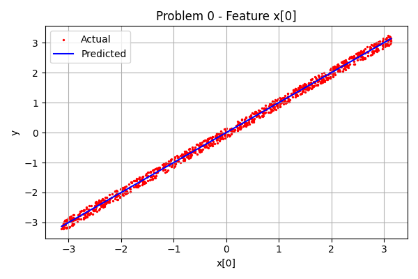
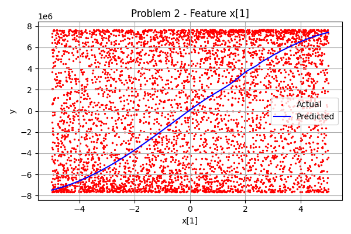
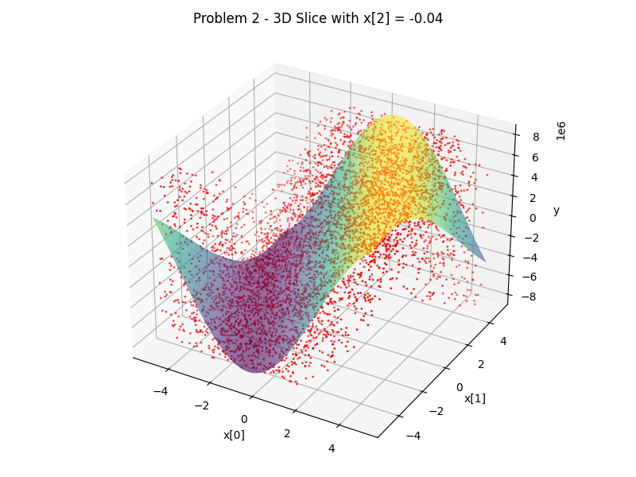
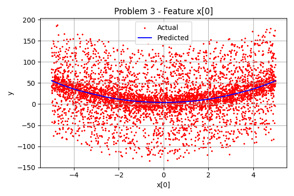
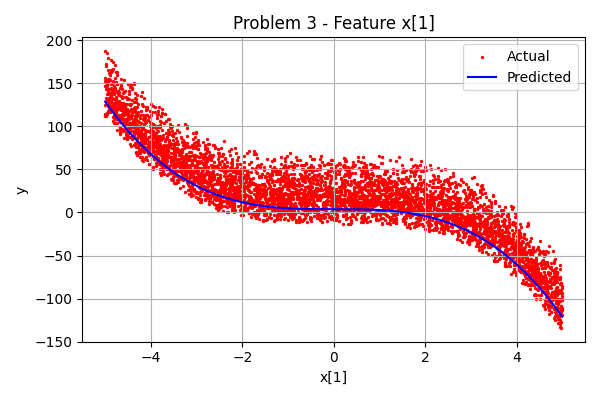
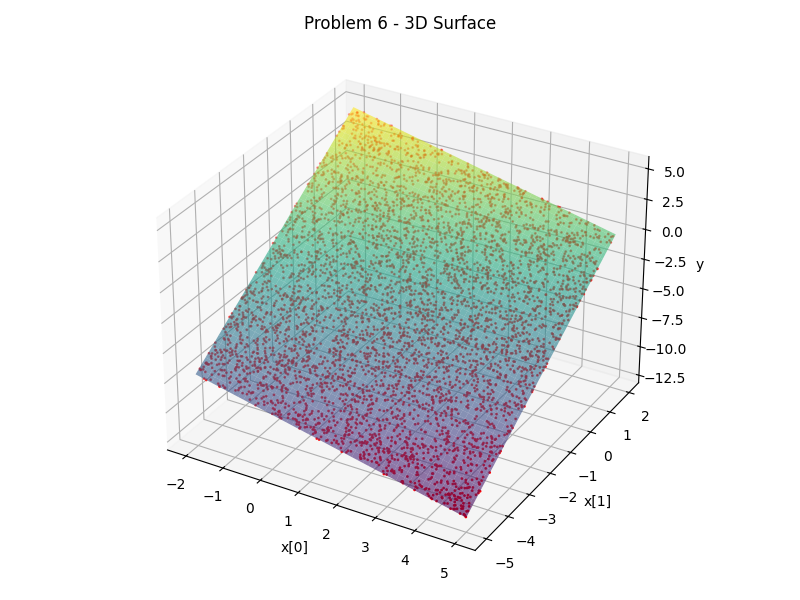
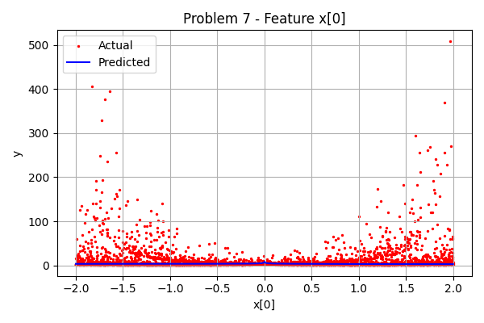
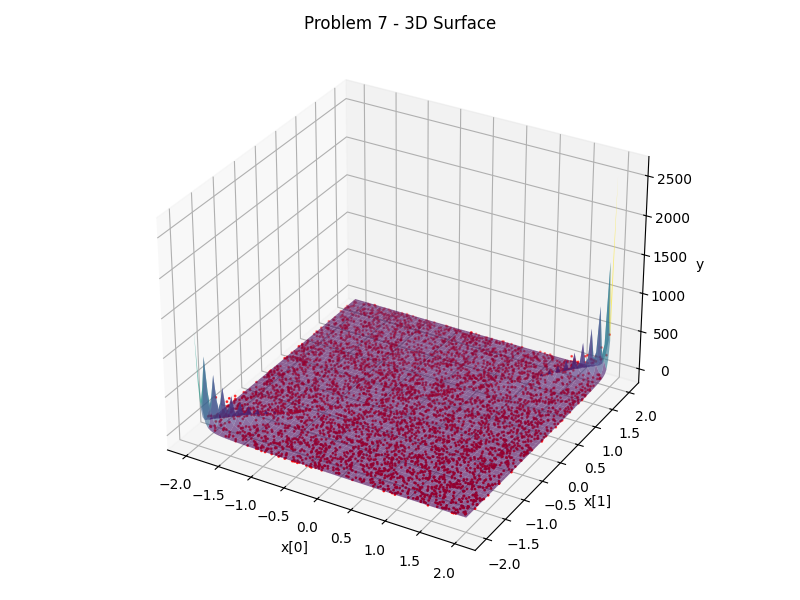
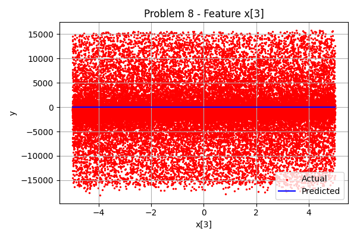

## Lab 1

**ReadMe**
CI2024_lab1 Mattia Cappellino s327277

Hi, i have 2 algorithms in my code, (and 3 starting sets for each algoritm exploring different ideas for the starting sets): a more advanced algorithm with more features and a less advanced one that is able to cycle more. Depending on the set one might work better than the other (the second gets to lower scores, the first one does less cycles).

My suggestion if you are looking from github and it's all in line is to wiew the file from raw (i dont know why it ignored newlines...)

UNIVERSE_SIZE = 100 NUM_SETS = 10 DENSITY = 0.2

more advanced algorithm cost value Diversity => 274.6877793889713 Least covered => 274.6877793889713 Random constrained => 274.6877793889713

more advanced algorithm cost calls Diversity => 41 Least covered => 40 Random constrained => 33

less advanced algorithm cost value Diversity => 274.6877793889713 Least covered => 274.6877793889713 Random constrained => 274.6877793889713 less advanced algorithm cost calls Diversity => 1 Least covered => 1 Random constrained => 1

UNIVERSE_SIZE = 1000 NUM_SETS = 100 DENSITY = 0.2

more advanced algorithm cost value Diversity => 6807.528466334823 Least covered => 5984.429477107501 Random constrained => 7306.036763556991 more advanced algorithm cost calls Diversity => 940 Least covered => 716 Random constrained => 897

less advanced algorithm cost value Diversity => 6747.2901121323675 Least covered => 5984.429477107501 Random constrained => 6964.471043499645 less advanced algorithm cost calls Diversity => 3328 Least covered => 3329 Random constrained => 3291

UNIVERSE_SIZE = 10000 NUM_SETS = 1000 DENSITY = 0.2

more advanced algorithm cost value Diversity => 140764.59204838471 Least covered => 101059.39408340261 Random constrained => 135854.0398608833 more advanced algorithm cost calls Diversity => 903 Least covered => 346 Random constrained => 765

less advanced algorithm cost value Diversity => 127915.45233571355 Least covered => 101059.39408340261 Random constrained => 141130.46520863142 less advanced algorithm cost calls Diversity => 4022 Least covered => 4051 Random constrained => 3999

UNIVERSE_SIZE = 100000 NUM_SETS = 10000 DENSITY = 0.1

more advanced algorithm cost value Diversity => 2209283.905103824 Least covered => 1497734.62056129 Random constrained => 2310731.0671332455 more advanced algorithm cost calls Diversity => 832 Least covered => 345 Random constrained => 495

less advanced algorithm cost value Diversity => 1959502.377867543 Least covered => 1497734.62056129 Random constrained => 2057202.8250984834 less advanced algorithm cost calls Diversity => 4114 Least covered => 4121 Random constrained => 4105

UNIVERSE_SIZE = 100000 NUM_SETS = 10000 DENSITY = 0.2

more advanced algorithm cost value Diversity => 2425064.311360715 Least covered => 1732961.565243992 Random constrained => 2476789.397980283 more advanced algorithm cost calls Diversity => 592 Least covered => 353 Random constrained => 408

less advanced algorithm cost value Diversity => 2210720.348796752 Least covered => 1732961.565243992 Random constrained => 2317491.0218742155 less advanced algorithm cost calls Diversity => 4117 Least covered => 4117 Random constrained => 4124

UNIVERSE_SIZE = 100000 NUM_SETS = 10000 DENSITY = 0.3

more advanced algorithm cost value Diversity => 2765623.033983041 Least covered => 1775688.5793046472 Random constrained => 2519873.5267095375 more advanced algorithm cost calls Diversity => 426 Least covered => 358 Random constrained => 667

less advanced algorithm cost value Diversity => 2262834.899135061 Least covered => 1775688.5793046472 Random constrained => 2355434.4048249093 less advanced algorithm cost calls Diversity => 4130 Least covered => 4130 Random constrained => 4130

**Main ideas**
Main ideas:
I avoided starting from a random solution, because that will have negatively impacted the time 
I created 3 semy-greedy methods to find the most interesting solutions (not the optimal ones, it can be seen because they dont check the cost of the solution, buto only the coverage (least vovered ones), distribution of the sets and the ones that add the most elements for more coverage )    
I added tweaking, temperature and cooling rate to avoid getting stuck in local minimum. The knn groupes similar interesting sets to esplore together.


Diversity greedy start
Purpose: Builds an initial solution by selecting sets that maximize the coverage of new, previously uncovered elements.
Rationale: A diverse starting solution can give a better foundation for optimization, as it ensures high initial coverage.


Least Covered greedy start
Purpose: Builds a solution by prioritizing sets that cover the least-covered elements (elements that appear in fewer sets).
Rationale: This approach ensures that rarer elements are covered early, balancing the coverage.


Random Constrained greedy start
Purpose: Visualizes the progress of both the current solution's cost and the best solution's cost over the iterations.
Rationale: Helps to track and understand the algorithm's performance during the optimization process.


Tweak function
it's objective is to generates a neighboring solution by flipping one or more sets (from selected to not selected and vice versa). It adds randomness in the search process.

Multiple flips: Introduces variation, increasing the chance of escaping local minima.
Improvement attempts: If the solution is valid, it randomly swaps sets to search for better coverage or lower cost.    


simulated annealing
I used a temperature and cooling rate to find an optimal solution by iteratively tweaking the current solution and gradually reducing the search randomness (temperature).
Temperature and cooling rate: The algorithm explores more widely at high temperatures but narrows the search as the temperature decreases. Even if a tweak increases the cost, it can be accepted with a certain probability based on the temperature, helping to avoid local minima.
Early stopping: The process terminates if the temperature gets too low or if no improvement is observed for patience iterations.

K-NN clustering
Clustering: Periodically clusters the best solutions found and refocuses the search on a cluster center, diversifying exploration.


## Lab 2

**ReadMe**
Lab 2 of computational intelligence

The best performer is lab2Nuovo, you can run it to get good results with a popoulation of 200 and 20_000 generations. You will get good (usually optimal) results (not in china ofc) in reasonable time

The code has 3 mutate algorithms: the first one is the most simple one (and pretty inefficient the second one can get very good results, but it's a bit slow the third one is faster and can get results very similar to the second one, but struggles getting to the optimal solution.

If you have time to spare i got china down to 54877.11 km (in 3,5 hours mind you) with a population of 400 and 20_000 generations, and it was still improving... For the others i got optimal results for all of them.

Lab2BadVersion is the one where i was experimenting with new stuff, but has become really slow with the progressive updates... I do not suggest you run it, but if you have a couple hours to spare you are more than welcome to do XD.

The algorithm leverages a Genetic Algorithm (GA) to approximate the shortest path. Key components include:

Population Initialization: The population consists of a mix of routes: Greedy routes starting from various cities to create reasonable initial paths. Random routes for diversity.

Fitness Evaluation: Routes are evaluated by their total distance. The fitness score is inversely proportional to the route's distance, incentivizing shorter paths.

Selection: Uses roulette wheel selection to probabilistically favor shorter routes for breeding.

Crossover (PMX): Implements Partially Mapped Crossover (PMX) to produce valid children that inherit features from both parents without creating duplicates, thus preserving city visitation requirements.

Mutation: Applies two mutation strategies: Inversion Mutation: Randomly reverses a segment within a route to explore alternative subpaths. Insertion Mutation: Randomly repositions a city within a route, providing further diversity and exploring additional neighborhood routes.

Elitism: Preserves a portion of the top-performing routes in each generation to retain good solutions across generations.

In the code i have a couple of mutate algorithms, the one uncommented right now is the best performer one, if you want you can also try the other ones, they all work, albeit a bit slower.

VANUTATU

1345.5449564733112, 1000 generations, 50 popoulation, second mutate algorithm

.

ITALY

4172.762613916409 km, 6000 generations, 200 popoulation, second mutate algorithm

.

RUSSIA

34283.674646845226 km, 36000 generations, 200 popoulation, second mutate algorithm

.

US

40678,28 km, 50000 generations, 500 popoulation, third mutate algorithm

.

CHINA

54877.11 km, 20000 generations, 200 popoulation, third muatate algorithm


## Lab 3

**ReadMe**

# CI2024_lab3
Lab 3 of Computational Intelligence


I have made 3 similar programs, but with a couple of differences

.


The best performer timewise is lab 3.1 , and also has a reduced ram usage

The second best is lab3.0  , with a very big ram usage

The worse performer is lab3.2 , also with a reduced ram usage

.


Table for a 4x4 with 10_000 RANDOMIZED STEPS

lab3.0	time: 17 mins , number of steps: 62 , total actions evaluated: 66141419 (A LOT)

lab3.1	time: 1,23 minutes , number of steps: 46 , total actions evaluated: 28699

lab3.2	time: 72 mins , number of steps: 68 , total actions evaluated: a lot

.


MY IDEAS

lab3.0

this is my start program, and uses a lot of ram (be careful if you run it with high matrixes and number of randomize steps, to avoid crashing your pc i suggest no more than a 7x7 and 200 randomize steps).

I used a a* search algorithm with a custom Manhattan distance heuristic

Custom Manhattan distance: i assign weight to larger tile number to try to simulate variable movement costs.

Pruning: i avoid revisiting states that i already explored with a better or equal cost

I use bytes to store the states to help mitigate the huge ram needs and help for faster hashing

I noticed that using linear conflicts worsened the performance on this program (somehow), but improves the performane significally in the 3.1

.


lab 3.1

This is my best performer, and it's a modified version of lab3.0

The a* algorithm uses a high-priority queue, that helps me to explore states more efficiently, and i track my visited states with a hash (to help use less ram => this one should use no more than 1 GB, even with 7x7 puzzles)

I use a Manhattan distance with linear conflict to predict better paths

i still describe the states with bytes to use less RAM.

.


Lab 3.2

It's a modified version of 3.1, but has a worse performance (and also the less ram used, probably why it's performing worse...). 

I implemented a iterative deepening a* that explores paths dynamically with an increasing cost threshold

I prune the already visited states

i still use the Manhattan distance with linear conflict


# Project : Symbolic Regression with Genetic Programming Project


**Objective:**

The objective of this project is to implement a Genetic Programming (GP) algorithm to solve the problem of symbolic regression. Symbolic regression involves finding mathematical expressions that best approximate a target function, given a set of input-output data points.
 Rather than assuming a predetermined model structure, I allow the GP algorithm to simultaneously discover both the form and parameters of candidate functions, guided solely by their fitness on training data.

**Overview:**

Symbolic regression searches the space of mathematical expressions to discover both the form and parameters of the model. This project uses the `gxgp` library to evolve expression trees capable of approximating the hidden generating function behind a dataset.

To ensure numerical stability and robustness during evolution, i implemented a variety of custom mathematical primitives (e.g., protected division, logarithm, power, square root) that safely handle edge cases such as division by zero and overflow.

The resulting models are evaluated using the Mean Squared Error (MSE) between predicted and actual outputs, with the goal of minimizing this metric through genetic evolution.


## Introduction

I implemented a suite of “protected” primitives—including safe division, logarithm, power, square root, and trigonometric operations—to prevent runtime errors and ensure numerical stability during evolution. By wrapping traditional operators with guards against invalid inputs (e.g., division by zero or negative logarithms), I can widen the search space without sacrificing robustness and avoiding errors that can slow computations down.

Building on the `gxgp` library, I represent individuals as expression trees (via `DagGP`) and apply standard genetic operators: subtree crossover, point mutation, and tournament selection. I incorporate elitism to preserve top solutions and tune mutation and crossover probabilities to balance exploration versus exploitation.

 I measure fitness mainly by using Mean Squared Error (MSE) between predicted and actual values and track convergence over generations. I use tree lenght as a small penalty to avoid overexpansions of the tree when the generations are still few, relaxing the penalty later in the evolution.


# Custom Mathematical Primitives

This section provides a brief description of each custom mathematical function implemented in the code, along with its purpose and any special handling.

The reason i implemented so many is because in problem 2 i could not reach a good fitness value, so went wild with the operators thinking it was some weird operator the missing link (it was not)

---

## Trigonometric Functions

### `custom_sin(x)`  
Sine function that wraps `np.sin`, allowing it to accept both scalars and NumPy arrays.

### `custom_cos(x)`  
Cosine function that wraps `np.cos`, allowing it to accept both scalars and NumPy arrays.

### `custom_tanh(x)`  
Hyperbolic tangent function that wraps `np.tanh`, allowing it to accept both scalars and NumPy arrays.

### `sin1_over_x(x)`  
Computes `sin(1/x)` with a small epsilon (`1e-6`) added to `x` to prevent division by zero.

### `sinc(x)`  
Normalized sinc function, implemented as `np.sinc(x/π)`, which gracefully handles `x = 0`.

---

## Exponential & Logarithmic

### `custom_exp(x)`  
Clips `x` to the range [-100, 100] before calling `np.exp`, preventing overflow.

### `safe_exp(x)`  
Identical to `custom_exp`, but named to emphasize “overflow-safe” behavior.

### `safe_log(x)`  
Protected logarithm: computes `np.log(abs(x) + 1e-6)`, avoiding `log(0)` or negative inputs.

---

## Power & Root

### `square(x)`  
Returns \(x^2\).

### `cube(x)`  
Returns \(x^3\).

### `safe_pow(x, y)`  
1. Takes absolute value of `x` and replaces values below `1e-6` with `1e-6`.  
2. Clips the base to [0, 100] to avoid overflow.  
3. Raises the processed base to the power `y`.

### `safe_sqrt(x)`  
Computes \(\sqrt{|x|}\), ensuring the argument to `np.sqrt` is non-negative.

---

## Division & Modulo

### `safe_div(x, y)`  
Performs \(x / (y + 1e-6)\), adding a small epsilon to the denominator to avoid division by zero.

### `reciprocal(x)`  
Returns \(1 / (x + 1e-6)\), protecting against division by zero.

### `mod(x, y)`  
Computes `np.mod(x, y + 1e-6)`, preventing modulo by zero.

---

## Activation‐Style Functions

### `sigmoid(x)`  
Logistic sigmoid: \(1 / (1 + \exp(-x))\).

### `softsign(x)`  
Softsign: \(x / (1 + |x|)\).

### `hard_sigmoid(x)`  
Clipped linear approximation of sigmoid: \(\mathrm{clip}((x + 1)/2,\,0,\,1)\).

### `logit(x)`  
Inverse sigmoid with clipping:  
1. Clips `x` to [1e-6, 1−1e-6]  
2. Computes \(\log(x / (1 - x))\).

### `relu(x)`  
Rectified Linear Unit: `np.maximum(0, x)`.

### `leaky_relu(x, α=0.01)`  
Leaky ReLU: `x` if `x > 0`, otherwise `α * x`.

### `elu(x, α=1.0)`  
Exponential Linear Unit: `x` if `x > 0`, otherwise `α*(exp(x) − 1)`.

### `swish(x)`  
Swish activation: `x * sigmoid(x)`.

### `mish(x)`  
Mish activation: `x * tanh(ln(1 + exp(x)))`.

### `bent_identity(x)`  
Bent Identity: \(\tfrac{\sqrt{x^2 + 1} - 1}{2} + x\).

---

## Waveform Functions

### `sawtooth(x)`  
Standard sawtooth wave:  
\[
2\!\bigl(\tfrac{x}{2\pi} - \lfloor 0.5 + \tfrac{x}{2\pi}\rfloor\bigr)
\]

### `triangle_wave(x)`  
Triangle wave:  
\[
2\,\bigl|2(\tfrac{x}{2\pi} - \lfloor \tfrac{x}{2\pi} + 0.5\rfloor)\bigr| - 1
\]

### `square_wave(x)`  
Square wave, implemented as `np.sign(np.sin(x))`.

---

## Pairwise Operators

### `max_op(x, y)`  
Element-wise maximum of `x` and `y`.

### `min_op(x, y)`  
Element-wise minimum of `x` and `y`.

### `average(x, y)`  
Element-wise average: \((x + y)/2\).

---

**Notes:**

- All functions accept NumPy arrays (and scalars) as inputs and return arrays of the same shape.  
- Small epsilons (`1e-6`) and clipping (`np.clip`) are used consistently to prevent numerical issues such as division by zero, overflow, and invalid arguments for logarithms and square roots.  
- Activation-style functions broaden the search space of symbolic regression by providing both linear and non-linear transformation primitives.  


# Data Loading and Preprocessing

This section of code selects a problem dataset, loads the input–output arrays, and applies subsampling if the number of samples exceeds a maximum threshold. Finally, it reshapes the inputs so that each row corresponds to one sample.

---


## Load Problem Data

This section selects the problem dataset, loads the raw inputs and targets, applies subsampling if the number of samples exceeds a threshold, and reshapes the input matrix.

```python
"""# -------------------------------
# Load problem data
# -------------------------------
selected_problem = 8
data = np.load(f'../data/problem_{selected_problem}.npz')
x_data = data['x']
y_data = data['y']

MAX_SAMPLES = 2000
if y_data.shape[0] > MAX_SAMPLES:
    step = y_data.shape[0] // MAX_SAMPLES
    y_true = y_data[::step][:MAX_SAMPLES]
    x_data = x_data[:, ::step][:, :MAX_SAMPLES]
else:
    y_true = y_data

# Transpose x_data so that each row is one sample and each column is one variable.
x_data = x_data.T  """


# -------------------------------
# Load problem data
# -------------------------------
selected_problem = 8
data = np.load(f'../data/problem_{selected_problem}.npz')
x_data = data['x']
y_data = data['y']

MAX_SAMPLES = 2000
num_samples = y_data.shape[0]

if num_samples > MAX_SAMPLES:
    indices = np.random.choice(num_samples, size=MAX_SAMPLES, replace=False)
else:
    indices = np.arange(num_samples)

indices = np.sort(indices)

y_true = y_data[indices]
x_data = x_data[:, indices]

x_data = x_data.T


```

I used MAX_SAMPLES to limit the number of samples when testing new algorithms around 2000, and increased it to 5000 when running the whole program to avoid excessive computational times


---


```python
# -------------------------------
# Set up operators and GP parameters
# -------------------------------
# Use one consistent set of operators
operators = [
    operator.add,       # binary: +
    operator.sub,       # binary: -
    operator.mul,       # binary: *
    safe_div,           # binary: protected division
    square,             # unary: square
    cube,               # unary: cube
    custom_sin,         # unary: sine
    custom_cos,         # unary: cosine
    custom_exp,         # unary: exponential (with clipping)
    safe_log,           # unary: protected logarithm
    safe_sqrt,          # unary: protected square root
    custom_tanh,        # unary: tanh
    safe_pow,           # binary: protected power
    reciprocal,         # unary: reciprocal
    sigmoid,            # unary: sigmoid
    gaussian,           # unary: gaussian
    relu,               # unary: ReLU
    leaky_relu,         # unary: leaky ReLU
    elu,                # unary: ELU
    swish,              # unary: swish
    mish,               # unary: mish
    sin1_over_x,        # unary: sin(1/x)
    sinc,               # unary: sinc
    sawtooth,           # unary: sawtooth wave
    triangle_wave,      # unary: triangle wave
    square_wave,        # unary: square wave
    bent_identity,      # unary: bent identity
    softsign,           # unary: softsign
    hard_sigmoid,       # unary: hard sigmoid
    logit,              # unary: logit
    mod,                # binary: modulo
    max_op,             # binary: max
    min_op,             # binary: min
    average             # binary: average
]

# Adjusted parameter settings to allow for more growth and complexity
POP_SIZE = 5000          
NUM_GENS = 100         
OFFSPRING_NUM = 1500      
INITIAL_SIZE_MIN = 1    
INITIAL_SIZE_MAX = 30   
TOURN_SIZE = 250        
LENGTH_PENALTY = 0.00001 
CROSSOVER_PROB = 0.7    
MUTATION_PROB = 0.3     
MAX_TREE_DEPTH = 10     
ADAPTIVE_PENALTY = True 
MIN_SEMANTIC_THRESHOLD = 0.05 

# -------------------------------
# Initialize the GP system with consistent operators
# -------------------------------
gp = DagGP(
    operators=operators,
    variables=x_data.shape[1],
    constants=np.linspace(-5, 5, 2000)
)


```


This is where i set the parameters for the code


---


```python
# -------------------------------
# Tree Structure Functions
# -------------------------------

def has_cycle(node, visited=None):
    """Check if a tree has cycles, which should be avoided in GP."""
    if visited is None:
        visited = set()
    if id(node) in visited:
        return True
    visited.add(id(node))
    for child in node.successors:
        if has_cycle(child, visited.copy()):
            return True
    return False


def validate_and_fix_tree(root):
    """If a tree has cycles, replace it with a valid one."""
    if has_cycle(root):
        new_size = np.random.randint(INITIAL_SIZE_MIN, INITIAL_SIZE_MAX + 1)
        return gp.create_individual(new_size)
    return root


def collect_nodes(node, nodes_list=None):
    """Collect all nodes in a tree into a list."""
    if nodes_list is None:
        nodes_list = []
    nodes_list.append(node)
    for child in node.successors:
        collect_nodes(child, nodes_list)
    return nodes_list

def get_tree_depth(node, depth=0, max_depth=0):
    """Calculate the maximum depth of a tree."""
    current_depth = depth + 1
    max_depth = max(max_depth, current_depth)
    for child in node.successors:
        max_depth = get_tree_depth(child, current_depth, max_depth)
    return max_depth

```


## Tree Structure Functions

- **`has_cycle(node, visited=None)`**  
  Recursively checks whether the tree rooted at `node` contains a cycle.  
  - Uses a `visited` set of node IDs to detect repeats.  
  - Returns `True` as soon as a previously seen node ID is encountered.  
  - Traverses all `node.successors`.

- **`validate_and_fix_tree(root)`**  
  Ensures the given tree has no cycles.  
  - Calls `has_cycle(root)`.  
  - If a cycle is found, generates and returns a fresh individual of random size between `INITIAL_SIZE_MIN` and `INITIAL_SIZE_MAX` via `gp.create_individual()`.  
  - Otherwise, returns the original `root`.

- **`collect_nodes(node, nodes_list=None)`**  
  Gathers every node in the tree into a flat Python list.  
  - Initializes `nodes_list` if not provided.  
  - Appends the current `node`, then recurses over each child in `node.successors`.  
  - Returns the completed list of nodes.

- **`get_tree_depth(node, depth=0, max_depth=0)`**  
  Computes the maximum depth (height) of the tree.  
  - `depth` tracks the current traversal depth; `max_depth` accumulates the deepest level found.  
  - At each node, increments `depth` by 1 and updates `max_depth`.  
  - Recurses over all `node.successors`, propagating and updating the maximum depth.  
  - Returns the overall maximum depth.  


---


```python
# -------------------------------
# Define an improved fitness evaluation function with adaptive complexity penalty
# -------------------------------
def unified_compute_fitness(ind, generation=0, adaptive=True):
    
    ind = validate_and_fix_tree(ind)

    try:
        pred = gp.evaluate(ind, x_data, variable_names=[f'x{i}' for i in range(x_data.shape[1])])
        pred = np.array(pred)

        if np.any(np.isnan(pred)) or np.any(np.isinf(pred)):
            return -1e30  # Extremely bad fitness

        mse_val = np.mean((pred - y_true) ** 2)

        complexity = len(collect_nodes(ind))

        #base_penalty = 0.001
        penalty_weight = LENGTH_PENALTY * max(0.1, 1.0 - generation / NUM_GENS)

        total_penalty = penalty_weight * complexity

        fitness = -(mse_val + total_penalty)
        return fitness

    except Exception as e:
        print(f"Fitness evaluation failed: {e}")
        return -1e30


def semantic_distance(ind1, ind2, x_data):
    y1 = np.array(gp.evaluate(ind1, x_data))
    y2 = np.array(gp.evaluate(ind2, x_data))
    return np.mean(np.abs(y1 - y2))


```

## Fitness & Semantic Functions

- **`unified_compute_fitness(ind, generation=0, adaptive=True)`**  
  1. **Cycle Check**: Calls `validate_and_fix_tree` to ensure `ind` has no cycles.  
  2. **Prediction**:  
     - Uses `gp.evaluate` on `x_data` with variable names `['x0', 'x1', …]`.  
     - Converts output to NumPy array, checks for `NaN`/`Inf` and returns a very low fitness (−1e30) if invalid.  
  3. **MSE Calculation**:  
     - Computes `mse_val = mean((pred − y_true)²)`.  
  4. **Complexity Penalty**:  
     - Counts nodes via `len(collect_nodes(ind))`.  
     - Sets `penalty_weight = LENGTH_PENALTY * max(0.1, 1 − generation/NUM_GENS)`, causing the per-node cost to decay over generations but never drop below 10% of its original.  
     - `total_penalty = penalty_weight * complexity`.  
  5. **Fitness Score**:  
     - Returns `-(mse_val + total_penalty)`, so higher (less negative) is better.  
  6. **Error Handling**:  
     - Catches exceptions during evaluation, logs the error, and returns −1e30.

- **`semantic_distance(ind1, ind2, x_data)`**  
  1. **Evaluate Individuals**:  
     - Computes `y1 = gp.evaluate(ind1, x_data)` and `y2 = gp.evaluate(ind2, x_data)` as NumPy arrays.  
  2. **Distance Metric**:  
     - Returns `mean(abs(y1 − y2))`, measuring the average absolute difference between their predictions.


---


```python

# -------------------------------
# Helper functions for mutation and crossover
# -------------------------------
def get_mutation_strategies(current_size, growth_factor):
    """Determine mutation strategies and their probabilities based on tree size."""
    if current_size < 15:  # For smaller trees, encourage growth more aggressively
        strategies = [
            ("point_mutation", max(0.1, 0.35 - growth_factor * 0.2)),
            ("subtree_replacement", max(0.1, 0.35 - growth_factor * 0.2)),
            ("grow", min(0.7, 0.2 + growth_factor * 0.4)),  # Increase growth probability
            ("shrink", max(0.05, 0.1 - growth_factor * 0.05))
        ]
    else:  # For larger trees, balanced approach
        strategies = [
            ("point_mutation", 0.25),
            ("subtree_replacement", 0.25),
            ("grow", 0.4),  # Still significant growth probability
            ("shrink", 0.1)
        ]
    
    # Normalize probabilities to ensure they sum to 1.0
    total_prob = sum(prob for _, prob in strategies)
    return [(name, prob/total_prob) for name, prob in strategies]


def select_mutation_strategy(strategies):
    """Select a mutation strategy based on probabilities."""
    strategy_names, probabilities = zip(*strategies)
    return np.random.choice(strategy_names, p=probabilities)


def select_node_for_mutation(all_nodes, mutation_type):
    """Select a node to mutate with bias toward leaf nodes for growth operations."""
    if mutation_type == "grow" and len(all_nodes) > 1:
        # Separate nodes into internal and leaf nodes
        leaf_nodes = [node for node in all_nodes if node.is_leaf]
        if leaf_nodes and np.random.rand() < 0.7:  # 70% chance to select a leaf node for growth
            return np.random.choice(leaf_nodes)
    
    return np.random.choice(all_nodes)

def replace_subtree(node, new_subtree, parent=None, parent_idx=None):

    # If we have direct parent access, we can replace the entire node
    if parent is not None and parent_idx is not None:
        parent_successors = list(parent.successors)
        parent_successors[parent_idx] = new_subtree
        try:
            parent.successors = parent_successors
            return True
        except AssertionError:
            return False
    
    # If node and new_subtree have the same number of successors, we can replace content
    if len(node.successors) == len(new_subtree.successors):
        if hasattr(node, '_op') and hasattr(new_subtree, '_op'):
            node._op = new_subtree._op
        
        if hasattr(node, '_data') and hasattr(new_subtree, '_data'):
            node._data = new_subtree._data
            
        if hasattr(node, 'name') and hasattr(new_subtree, 'name'):
            node.name = new_subtree.name
        
        for i, successor in enumerate(new_subtree.successors):
            node_successors = list(node.successors)
            node_successors[i] = successor
            node.successors = node_successors
            
        return True
    
    return False

def find_parent_and_index(root, node, path=None):
    if path is None:
        path = []
    
    # Check if any of root's successors is the target node
    for i, child in enumerate(root.successors):
        if child is node:
            return root, i
    
    for i, child in enumerate(root.successors):
        result = find_parent_and_index(child, node, path + [(root, i)])
        if result is not None:
            return result
    
    return None

def apply_point_mutation(ind, node, gp_instance, current_depth, max_depth):
    if not node.is_leaf:
        new_op = np.random.choice(operators)
        # Create a small new subtree if there is room
        if current_depth < max_depth:
            # Generate a subtree with potentially more complex structure
            depth_allowance = max_depth - current_depth + 1
            max_new_depth = min(3, depth_allowance)
            new_subtree = gp_instance.create_individual(np.random.randint(2, max_new_depth + 1))
            replace_subtree(node, new_subtree)
    return ind


def apply_subtree_replacement(ind, node, gp_instance, generation, current_depth, max_depth):
    if current_depth >= max_depth:
        return ind
        
    parent_info = find_parent_and_index(ind, node)
    
    # Create a new subtree
    base_size = 3 + int((generation / NUM_GENS) * 5)
    size_range = max(2, base_size + np.random.randint(0, 3))
    new_size = np.random.randint(2, size_range + 1)
    
    # Try up to 5 times to create a compatible subtree
    for _ in range(5):
        new_subtree = gp_instance.create_individual(new_size)
        
        # If we have parent info, try direct replacement
        if parent_info:
            parent, idx = parent_info
            parent_successors = list(parent.successors)
            parent_successors[idx] = new_subtree
            try:
                parent.successors = parent_successors
                return ind
            except AssertionError:
                continue  # Try again with a new subtree
        
        # If node and new_subtree have same arity, try content replacement
        if len(node.successors) == len(new_subtree.successors):
            success = replace_subtree(node, new_subtree)
            if success:
                return ind
    
    # If all attempts failed, return unchanged individual
    return ind

def apply_grow_mutation(ind, node, gp_instance, generation, current_depth, max_depth):
    if current_depth >= max_depth:
        return ind
        
    # If node is a leaf, find its parent to replace it
    if node.is_leaf:
        parent_info = find_parent_and_index(ind, node)
        if parent_info:
            parent, idx = parent_info
            
            # Create a new subtree
            max_growth = max(3, int(2 + (generation / NUM_GENS) * 5))
            new_size = np.random.randint(2, max_growth + 1)
            
            # Try up to 5 times to create a compatible replacement
            for _ in range(5):
                new_subtree = gp_instance.create_individual(new_size)
                parent_successors = list(parent.successors)
                parent_successors[idx] = new_subtree
                try:
                    parent.successors = parent_successors
                    return ind
                except AssertionError:
                    continue  # Try again
    else:
        # For non-leaf nodes, try to replace one of its children with a larger subtree
        if node.successors:
            child_idx = np.random.randint(0, len(node.successors))
            child = node.successors[child_idx]
            
            # Create a new subtree
            max_growth = max(3, int(2 + (generation / NUM_GENS) * 5))
            new_size = np.random.randint(2, max_growth + 1)
            
            # Try up to 5 times to create a compatible replacement
            for _ in range(5):
                new_subtree = gp_instance.create_individual(new_size)
                node_successors = list(node.successors)
                node_successors[child_idx] = new_subtree
                try:
                    node.successors = node_successors
                    return ind
                except AssertionError:
                    continue  # Try again
    
    return ind


def apply_shrink_mutation(ind, node):
    if not node.is_leaf and node.successors:
        # Find parent for the node to mutate
        parent_nodes = [node for node in collect_nodes(ind) if node in node.successors]
        if parent_nodes:
            parent = parent_nodes[0]
            parent_successors = parent.successors[:]
            child_idx = parent_successors.index(node)
            
            # Replace with one of node's children
            if node.successors:
                replacement = np.random.choice(node.successors)
                parent_successors[child_idx] = replacement
                parent.successors = parent_successors
    return ind

def select_crossover_point(nodes, growth_bias):
    # Skip root node
    if len(nodes) <= 1:
        return None
    
    # Separate internal nodes (with children) from leaf nodes
    internal_nodes = [n for n in nodes[1:] if not n.is_leaf]
    
    # If we have internal nodes, use them with higher probability based on growth bias
    if internal_nodes and np.random.rand() < growth_bias:
        return np.random.choice(internal_nodes)
    else:
        return np.random.choice(nodes[1:])  # Skip root

def swap_subtrees(parent1, parent2, point1, point2):
    # Get index of crossover points
    idx1 = parent1.successors.index(point1)
    idx2 = parent2.successors.index(point2)
    
    # Swap subtrees
    successors1 = parent1.successors[:]
    successors2 = parent2.successors[:]
    successors1[idx1], successors2[idx2] = point2, point1
    parent1.successors = successors1
    parent2.successors = successors2

def is_valid_depth(child1, child2, generation):
    depth1 = get_tree_depth(child1)
    depth2 = get_tree_depth(child2)
    
    # More permissive depth check that relaxes as generations progress
    max_allowed_depth = MAX_TREE_DEPTH
    if np.random.rand() < (generation / NUM_GENS) * 0.3:
        # Occasionally allow slightly deeper trees in later generations
        max_allowed_depth += 2
        
    return depth1 <= max_allowed_depth and depth2 <= max_allowed_depth
```


## Helper Functions for Mutation & Crossover

- **`get_mutation_strategies(current_size, growth_factor)`**  
  Chooses mutation types (“point_mutation”, “subtree_replacement”, “grow”, “shrink”) and assigns probabilities that favor growth when trees are small (size < 15) and a balanced mix when larger. Normalizes so probabilities sum to 1.

- **`select_mutation_strategy(strategies)`**  
  Randomly selects one strategy name from the list of `(name, probability)` pairs using the given probabilities.

- **`select_node_for_mutation(all_nodes, mutation_type)`**  
  Picks a node to mutate. If the strategy is “grow”, 70% chance to pick among leaf nodes (to extend the tree); otherwise chooses uniformly from all nodes.

- **`replace_subtree(node, new_subtree, parent=None, parent_idx=None)`**  
  Attempts to replace `node` with `new_subtree`.  
  1. If `parent` and `parent_idx` provided: replaces in the parent’s successor list.  
  2. Else if arities match: copies operator, data, name, and reconnects successors one by one.  
  Returns `True` on success, `False` otherwise.

- **`find_parent_and_index(root, node)`**  
  Recursively searches from `root` to locate the direct parent of `node` and its index among `parent.successors`. Returns `(parent, index)` or `None`.

- **`apply_point_mutation(ind, node, gp_instance, current_depth, max_depth)`**  
  If `node` is internal and depth allows, replaces it with a small randomly generated subtree (size up to 3) or simply swaps its operator via `replace_subtree`.

- **`apply_subtree_replacement(ind, node, gp_instance, generation, current_depth, max_depth)`**  
  Generates a new subtree of size influenced by `generation` and attempts up to five times to graft it in place of `node`, using either direct parent replacement or `replace_subtree` when arity matches.

- **`apply_grow_mutation(ind, node, gp_instance, generation, current_depth, max_depth)`**  
  When `node` is a leaf: replaces it in its parent with a larger subtree.  
  When internal: picks one child and replaces it with a larger subtree.  
  Both use up to five attempts to ensure arity compatibility.

- **`apply_shrink_mutation(ind, node)`**  
  For non-leaf `node`, finds its parent and replaces `node` with one of its own children, thereby pruning the tree.

- **`select_crossover_point(nodes, growth_bias)`**  
  Chooses a crossover point: skips the root and, with probability `growth_bias`, picks among internal nodes; otherwise picks any non-root node uniformly.

- **`swap_subtrees(parent1, parent2, point1, point2)`**  
  Identifies each point’s index in its parent’s successor list, then swaps the two subtrees by reassigning `parent.successors`.

- **`is_valid_depth(child1, child2, generation)`**  
  Checks both offspring depths against `MAX_TREE_DEPTH`, but with a small chance (proportional to `generation/NUM_GENS`) to allow depth + 2 in later generations, supporting controlled bloat.


---


```python

# -------------------------------
# Streamlined Selection, Mutation, and Crossover Operations
# -------------------------------
def tournament_select(pop, generation=0, size_aware=False):
    
    participants = np.random.choice(pop, size=min(TOURN_SIZE, len(pop)), replace=False)
    
    if size_aware and np.random.rand() < min(0.3, (generation / NUM_GENS) * 0.4):
        avg_size = np.mean([len(collect_nodes(ind)) for ind in pop])
        
        # Occasionally favor larger trees if they're above average size
        # but not too far below average fitness
        sorted_participants = sorted(participants, key=lambda ind: ind.fitness, reverse=True)
        
        for ind in sorted_participants:
            ind_size = len(collect_nodes(ind))
            if ind_size > avg_size * 1.2:  # Tree is 20% larger than average
                # If fitness is at least 80% of the best participant, select it
                best_fitness = sorted_participants[0].fitness
                if ind.fitness >= best_fitness * 0.8:
                    return ind
    
    # Default to regular tournament selection
    return max(participants, key=lambda ind: ind.fitness)


def enhanced_mutate(ind, gp_instance, generation):
    
    ind_copy = copy.deepcopy(ind)
    
    current_size = len(collect_nodes(ind_copy))
    current_depth = get_tree_depth(ind_copy)
    
    # Growth factor increases with generation
    growth_factor = min(0.8, generation / NUM_GENS)
    
    strategies = get_mutation_strategies(current_size, growth_factor)
    
    strategy = select_mutation_strategy(strategies)
    
    all_nodes = collect_nodes(ind_copy)
    
    # Select a node to mutate, with bias toward appropriate nodes for the strategy
    node = select_node_for_mutation(all_nodes, strategy)
    
    if strategy == "point_mutation":
        ind_copy = apply_point_mutation(ind_copy, node, gp_instance, current_depth, MAX_TREE_DEPTH)
    elif strategy == "subtree_replacement":
        ind_copy = apply_subtree_replacement(ind_copy, node, gp_instance, generation, current_depth, MAX_TREE_DEPTH)
    elif strategy == "grow":
        ind_copy = apply_grow_mutation(ind_copy, node, gp_instance, generation, current_depth, MAX_TREE_DEPTH)
    elif strategy == "shrink":
        ind_copy = apply_shrink_mutation(ind_copy, node)
    
    # Validate the tree after mutation
    ind_copy = validate_and_fix_tree(ind_copy)
    
    return ind_copy


def growth_enhanced_crossover(parent1, parent2, generation):
    
    # Make deep copies to avoid modifying the parents
    child1 = copy.deepcopy(parent1)
    child2 = copy.deepcopy(parent2)
    
    # Allow crossover to become more aggressive in later generations
    growth_bias = min(0.8, 0.3 + (generation / NUM_GENS) * 0.5)
    
    # Select nodes from both parents, with increasing bias towards internal nodes
    # that could lead to more interesting genetic material exchange
    nodes1 = collect_nodes(child1)
    nodes2 = collect_nodes(child2)
    
    point1 = select_crossover_point(nodes1, growth_bias)
    point2 = select_crossover_point(nodes2, growth_bias)
    
    # If valid crossover points found in both trees
    if point1 and point2:
        # Find parent nodes for each selected crossover point
        parent_nodes1 = [n for n in nodes1 if point1 in n.successors]
        parent_nodes2 = [n for n in nodes2 if point2 in n.successors]
        
        if parent_nodes1 and parent_nodes2:
            # Perform the crossover by swapping subtrees
            swap_subtrees(parent_nodes1[0], parent_nodes2[0], point1, point2)
            
            if not is_valid_depth(child1, child2, generation):
                # If constraints violated, create new children with appropriate sizes
                size1 = len(collect_nodes(parent1))
                size2 = len(collect_nodes(parent2))
                child1 = gp.create_individual(size1)
                child2 = gp.create_individual(size2)
    
    return child1, child2

```

## Streamlined Selection, Mutation & Crossover Operations

### `tournament_select(pop, generation=0, size_aware=False)`  
**Objective:** Efficiently choose parents for reproduction by balancing raw fitness with structural complexity (tree size) when requested.  
- **Fitness-driven:** Primarily picks the individual with the highest fitness among a random subset (`TOURN_SIZE`), ensuring strong candidates propagate.  
- **Size-aware mode:** As evolution progresses, occasionally biases selection toward larger—yet still competitive—trees, promoting discovery of more expressive models without sacrificing quality.

---

### `enhanced_mutate(ind, gp_instance, generation)`  
**Objective:** Introduce targeted variation into an individual, adapting both the type and intensity of mutation to its current size, depth, and the evolutionary stage.  
- **Adaptive strategy mix:** Chooses among point mutations, subtree replacements, growth, or shrink operations based on tree size and a “growth factor” that increases over generations.  
- **Node-specific targeting:** Selects which node to mutate—favoring leaves when growing or internal nodes for structural tweaks—so changes are semantically meaningful.  
- **Robustness:** Deep-copies the individual, applies mutation, then validates and repairs cycles or invalid trees, ensuring every offspring is structurally sound.

---

### `growth_enhanced_crossover(parent1, parent2, generation)`  
**Objective:** Recombine two parents to produce offspring that not only blend existing structures but also encourage constructive growth in later generations.  
- **Controlled bias:** Starts with modest preference for internal crossover points and ramps this up over time (via `growth_bias`), fostering exchange of larger substructures and more complex behaviors as the search matures.  
- **Depth safeguarding:** After swapping subtrees, checks offspring depths against a (potentially relaxed) maximum; if violated, regenerates new individuals with appropriate sizes to prevent uncontrolled bloat.  
- **Preservation of diversity:** By copying parents before crossover and conditionally repairing oversized children, this function maintains a healthy balance between exploration of new structures and respect for computational constraints.


---


```python
# Diversity injection that creates larger trees in later generations
def enhanced_diversity_injection(population, gp_instance, generation):
    diversity = calculate_population_diversity(population)
    
    # Calculate average tree size
    sizes = [len(collect_nodes(ind)) for ind in population]
    avg_size = np.mean(sizes)
    max_size = max(sizes)
    
    # More aggressive diversity injection as generations progress
    diversity_threshold = max(0.1, 0.3 - (generation / NUM_GENS) * 0.1)
    
    # Inject diversity if population is too homogeneous or trees are too small
    if diversity < diversity_threshold or (generation > NUM_GENS * 0.5 and max_size < 20):
        print(f"Generation {generation}: Low diversity ({diversity:.2f}) or small trees (avg:{avg_size:.1f}, max:{max_size}). Injecting new individuals.")
        
        # Replace more individuals in later generations
        replacement_rate = min(0.2, 0.1 + (generation / NUM_GENS) * 0.1)
        num_to_replace = max(1, int(replacement_rate * len(population)))
        
        if generation > NUM_GENS * 0.4 and avg_size < 15:
            # Replace smallest trees with some probability
            candidates = [(i, ind) for i, ind in enumerate(population) 
                         if len(collect_nodes(ind)) < avg_size * 0.8]
            if candidates:
                # Replace some smallest trees
                small_indices = [i for i, _ in sorted(candidates, key=lambda x: len(collect_nodes(x[1])))[:num_to_replace//2]]
                # replace some lowest fitness individuals
                sorted_pop = sorted(enumerate(population), key=lambda x: x[1].fitness)
                low_fitness_indices = [i for i, _ in sorted_pop[:num_to_replace - len(small_indices)]]
                indices_to_replace = small_indices + low_fitness_indices
            else:
                # Default to replacing lowest fitness
                sorted_pop = sorted(enumerate(population), key=lambda x: x[1].fitness)
                indices_to_replace = [i for i, _ in sorted_pop[:num_to_replace]]
        else:
            # Default to replacing lowest fitness
            sorted_pop = sorted(enumerate(population), key=lambda x: x[1].fitness)
            indices_to_replace = [i for i, _ in sorted_pop[:num_to_replace]]
        
        # Create new individuals with size scaling with generation
        new_individuals = []
        for _ in range(len(indices_to_replace)):
            # Progressively larger trees as generations increase
            min_size = INITIAL_SIZE_MIN + int((generation / NUM_GENS) * 3)
            max_size = INITIAL_SIZE_MAX + int((generation / NUM_GENS) * 15)
            
            size = np.random.randint(min_size, max_size + 1)
            new_ind = gp_instance.create_individual(size)
            new_ind.fitness = unified_compute_fitness(new_ind, generation)
            new_individuals.append(new_ind)
        
        # Replace selected individuals
        for idx, new_ind in zip(indices_to_replace, new_individuals):
            population[idx] = new_ind
    
    return population

# -------------------------------
# Adaptive Diversity Maintenance
# -------------------------------
def calculate_population_diversity(population, sample_size=None):
    
    if sample_size and sample_size < len(population):
        individuals = random.sample(population, sample_size)
    else:
        individuals = population
    
    n = len(individuals)
    if n <= 1:
        return 0.0
    
    # Calculate pairwise distances
    total_distance = 0.0
    pair_count = 0
    
    for i in range(n):
        for j in range(i+1, n):
            distance = semantic_distance(individuals[i], individuals[j], x_data)
            if distance != float('inf'):
                total_distance += distance
                pair_count += 1
                
    # Normalize and return diversity score
    if pair_count > 0:
        avg_distance = total_distance / pair_count
        normalized_diversity = min(1.0, avg_distance / 10.0)
        return normalized_diversity
    else:
        return 0.0

def enhanced_diversity_injection(population, gp_instance, generation):
    
    # Early generations: subtle diversity, later generations: more aggressive
    diversity_rate = 0.05 + (generation / NUM_GENS) * 0.15
    
    current_diversity = calculate_population_diversity(population, sample_size=min(20, len(population)))
    
    # Only inject if diversity is low
    if current_diversity < 0.3 or (generation % 10 == 0 and generation > 0):
        num_to_inject = max(1, int(POP_SIZE * diversity_rate))
        
        # Identify individuals to replace (lower fitness ones)
        population_sorted = sorted(population, key=lambda ind: ind.fitness)
        to_replace = population_sorted[:num_to_inject]
        
        # Create new diverse individuals
        for i in range(num_to_inject):
            # More aggressive size scaling with generation
            base_size = 3 + int((generation / NUM_GENS) * 12)
            size_range = max(INITIAL_SIZE_MIN, base_size + np.random.randint(-2, 5))
            size = np.random.randint(INITIAL_SIZE_MIN, size_range + 1)
            
            new_ind = gp_instance.create_individual(size)
            new_ind.fitness = unified_compute_fitness(new_ind, generation)
            
            # Replace in the population
            idx = population.index(to_replace[i])
            population[idx] = new_ind
            
        print(f"Generation {generation}: Injected {num_to_inject} new individuals for diversity")
    
    return population

```


## Diversity Maintenance & Injection

### `calculate_population_diversity(population, sample_size=None)`  
**Objective:** Quantify how “different” individuals are based on their semantic outputs, providing a normalized score in [0, 1].  
- **Sampling:** Optionally subsamples the population for efficiency.  
- **Pairwise Semantic Distance:** Uses `semantic_distance(ind_i, ind_j, x_data)` to measure average absolute output difference over all (or sampled) pairs.  
- **Normalization:** Divides the mean pairwise distance by a constant (10.0) and caps at 1.0, yielding a consistent diversity metric regardless of problem scale.

---

### `enhanced_diversity_injection(population, gp_instance, generation)`  
**Objective:** Prevent premature convergence by injecting new, larger—or structurally different—individuals when diversity drops or trees remain too small.  

1. **Assess Diversity & Size:**  
   - Compute current diversity via `calculate_population_diversity`.  
   - Track average and maximum tree sizes.  

2. **Trigger Conditions:**  
   - **Low semantic diversity:** below a `diversity_threshold` that tightens over generations (`0.3 → 0.1`).  
   - **Under‐complexity:** after halfway through evolution, if all trees remain small (`max_size < 20`).  

3. **Select Replacement Candidates:**  
   - Later generations may target the smallest trees (≤80% of average size) *and* lowest‐fitness individuals.  
   - Earlier or fallback cases simply replace the worst‐performers by fitness.

4. **Generate New Individuals:**  
   - **Progressive scaling:** minimum and maximum subtree sizes increase with `generation`, ensuring later injections are larger and more exploratory.  
   - **Fitness initialization:** immediately evaluates and assigns a fitness to each newcomer (`unified_compute_fitness`).

5. **Population Update:**  
   - Overwrites selected indices with new individuals, injecting diversity and structural novelty.

By dynamically coupling injection rate and tree size to the generation count—and selectively replacing both under‐performing and under‐sized individuals—this mechanism maintains semantic variety and fosters exploration of more complex expressions as evolution proceeds.  

---


```python


def run_streamlined_evolution():
    
    global LENGTH_PENALTY, population
    
    history = {
        'best_fitness': [],
        'avg_fitness': [],
        'complexity': [],
        'diversity': []
    }
    
    state = {
        'stagnation_counter': 0,
        'last_best_fitness': float('-inf'),
        'growth_stagnation': 0,
        'max_size_seen': max(len(collect_nodes(ind)) for ind in population),
        'found_special_solution': False,
        'special_solution_gen': -1,
        'best_formula_found': ""
    }
    
    # Sort initial population by fitness (highest first)
    population = sorted(population, key=lambda ind: ind.fitness, reverse=True)
    
    # Main evolutionary loop
    for gen in tqdm(range(NUM_GENS), desc="Generations", leave=True):
        # ---- PHASE 1: Diversity and Offspring Generation ----
        
        # Inject diversity to prevent premature convergence
        population = enhanced_diversity_injection(population, gp, gen)
        
        # Determine offspring count based on stagnation indicators
        offspring_size = OFFSPRING_NUM
        if state['stagnation_counter'] > 10:
            offspring_size = int(OFFSPRING_NUM * 1.5)
            tqdm.write(f"Generation {gen}: Fitness stagnation detected. Increasing offspring to {offspring_size}")
        if state['growth_stagnation'] > 8:
            offspring_size = int(offspring_size * 1.2)
            tqdm.write(f"Generation {gen}: Size stagnation detected. Further increasing offspring to {offspring_size}")
        
        # ---- PHASE 2: Generate New Offspring ----
        new_offspring = []
        
        # Generate offspring through crossover and mutation
        while len(new_offspring) < offspring_size:
            # Select first parent using tournament selection
            parent1 = tournament_select(population, gen)                    
            
            if np.random.rand() < CROSSOVER_PROB:
                # Crossover operation
                parent2 = tournament_select(population, gen)
                child1, child2 = growth_enhanced_crossover(parent1, parent2, gen)
                
                # Validate children
                child1 = validate_and_fix_tree(child1)
                child2 = validate_and_fix_tree(child2)
                
                # Apply semantic check and additional mutation if needed
                if semantic_distance(child1, parent1, x_data) < MIN_SEMANTIC_THRESHOLD:
                    child1 = enhanced_mutate(child1, gp, gen)
                    child1 = validate_and_fix_tree(child1)
                    
                new_offspring.append(child1)
                
                # Add second child if space allows
                if len(new_offspring) < offspring_size:
                    if semantic_distance(child2, parent2, x_data) < MIN_SEMANTIC_THRESHOLD:
                        child2 = enhanced_mutate(child2, gp, gen)
                        child2 = validate_and_fix_tree(child2)
                    new_offspring.append(child2)
            else:
                # Mutation operation
                mutant = enhanced_mutate(parent1, gp, gen)
                mutant = validate_and_fix_tree(mutant)
                
                # Check semantic difference and possibly mutate again
                if semantic_distance(mutant, parent1, x_data) < MIN_SEMANTIC_THRESHOLD:
                    mutant = enhanced_mutate(mutant, gp, gen)
                    mutant = validate_and_fix_tree(mutant)
                    
                new_offspring.append(mutant)
                
            # Stop after generating enough offspring
            if len(new_offspring) >= offspring_size:
                break
        
        # ---- PHASE 3: Evaluate Offspring ----
        for ind in new_offspring:
            ind.fitness = unified_compute_fitness(ind, gen)
        
        # ---- PHASE 4: Selection with Size Diversity Preservation ----
        population.extend(new_offspring)
        
        # Selection strategy
        if gen > NUM_GENS * 0.3 and np.random.rand() < 0.3:
            # Occasionally preserve some large trees to maintain structural diversity
            population.sort(key=lambda ind: ind.fitness, reverse=True)
            selected = population[:int(POP_SIZE * 0.9)]
            remaining = population[int(POP_SIZE * 0.9):]
            largest_trees = sorted(remaining, key=lambda ind: len(collect_nodes(ind)), reverse=True)
            selected.extend(largest_trees[:POP_SIZE - len(selected)])
            population = selected
        else:
            # Standard selection by fitness
            population = sorted(population, key=lambda ind: ind.fitness, reverse=True)[:POP_SIZE]
        
        # ---- PHASE 5: Compute Statistics ----
        best_fitness = population[0].fitness
        avg_fitness = np.mean([ind.fitness for ind in population])
        best_complexity = len(collect_nodes(population[0]))
        current_max_size = max(len(collect_nodes(ind)) for ind in population)
        diversity = calculate_population_diversity(population, sample_size=min(20, len(population)))
        
        # Update history
        history['best_fitness'].append(best_fitness)
        history['avg_fitness'].append(avg_fitness)
        history['complexity'].append(best_complexity)
        history['diversity'].append(diversity)
        
        # ---- PHASE 6: Stagnation Detection and Response ----
        
        # Check fitness stagnation
        if best_fitness <= state['last_best_fitness'] + 1e-6:
            state['stagnation_counter'] += 1
        else:
            state['stagnation_counter'] = 0
            state['last_best_fitness'] = best_fitness
        
        # Check growth stagnation
        if current_max_size <= state['max_size_seen']:
            state['growth_stagnation'] += 1
        else:
            state['growth_stagnation'] = 0
            state['max_size_seen'] = current_max_size
        
        # ---- PHASE 7: Adaptive Control Mechanisms ----
        
        # Control size explosion if trees are growing too fast without fitness improvement
        if (current_max_size > 50 and state['stagnation_counter'] > 15) or current_max_size > 100:
            old_penalty = LENGTH_PENALTY
            LENGTH_PENALTY = old_penalty * 2
            tqdm.write(f"Generation {gen}: Controlling bloat. Increasing penalty temporarily from {old_penalty:.6f} to {LENGTH_PENALTY:.6f}")
            for ind in population:
                ind.fitness = unified_compute_fitness(ind, gen)
            if gen > 3:
                LENGTH_PENALTY = old_penalty
                
        # Accelerate growth when trees are too small
        if gen > 10 and state['max_size_seen'] < 15 and state['growth_stagnation'] > 5:
            old_penalty = LENGTH_PENALTY
            LENGTH_PENALTY = old_penalty * 0.1
            tqdm.write(f"Generation {gen}: Trees too small. Drastically reducing complexity penalty from {old_penalty:.6f} to {LENGTH_PENALTY:.6f}")
            
            # Inject larger trees into population
            num_large_trees = POP_SIZE // 10
            for _ in range(num_large_trees):
                size = np.random.randint(15, 25)
                new_ind = gp.create_individual(size)
                new_ind.fitness = unified_compute_fitness(new_ind, gen)
                
                # Replace individuals from the bottom half of the population
                bottom_half = sorted(population, key=lambda ind: ind.fitness)[:POP_SIZE // 2]
                to_replace = np.random.choice(bottom_half)
                idx = population.index(to_replace)
                population[idx] = new_ind
                
            state['growth_stagnation'] = 0
        
        """# ---- PHASE 8: Special Solution Detection ----
        #used at the beginning of the project, in the problem 1 to see if i got the right solution
        best_formula = population[0].long_name.lower()
        if not state['found_special_solution']:
            if "sin(x0)" in best_formula or "custom_sin(x0)" in best_formula:
                state['found_special_solution'] = True
                state['special_solution_gen'] = gen
                state['best_formula_found'] = "sin(x0)"
                tqdm.write(f"Found sin(x0) at generation {gen}!")"""
        
        # ---- PHASE 9: Logging ----
        if gen % 5 == 0 or gen == NUM_GENS - 1:
            current_sizes = [len(collect_nodes(ind)) for ind in population]
            tqdm.write(f"Generation {gen}: Best Fitness = {best_fitness:.6f}, Avg Fitness = {avg_fitness:.6f}")
            tqdm.write(f"Tree sizes: Min = {min(current_sizes)}, Avg = {sum(current_sizes)/len(current_sizes):.1f}, Max = {max(current_sizes)}")
            tqdm.write(f"Best complexity: {best_complexity}, Diversity: {diversity:.2f}")
            tqdm.write(f"Best formula: {population[0].long_name}")
    
    return (population, history['best_fitness'], history['avg_fitness'], 
            history['complexity'], history['diversity'], state['found_special_solution'], 
            state['special_solution_gen'], state['best_formula_found'])

```


## `run_streamlined_evolution`: A Detailed Walkthrough

This high-level function orchestrates the entire Genetic Programming (GP) run, integrating adaptive mechanisms for diversity, size control, stagnation detection, and special-solution monitoring. Below we break down its objectives and behavior step by step.

---

### 1. Initialization & State Tracking

- **Global Adjustment**  
  - Reads and potentially modifies the global `LENGTH_PENALTY` to throttle complexity costs on the fly.
- **History Dictionary**  
  - `best_fitness`, `avg_fitness`, `complexity`, `diversity`: lists to record the population’s performance, structural size, and semantic variety at each generation.
- **State Dictionary**  
  - **Stagnation Counters**  
    - `stagnation_counter`: counts consecutive generations without fitness improvement.  
    - `growth_stagnation`: counts generations without increase in maximum tree size.  
  - **Size Metrics**  
    - `max_size_seen`: remembers the largest tree size encountered so far.  
  - **Special Solution Flags**  
    - `found_special_solution`, `special_solution_gen`, `best_formula_found`: used to detect and record if a target pattern (e.g., `sin(x0)`) emerges.

Initially, the existing `population` is sorted by fitness so that the fittest individuals are always first.

The `special solution` were used at the start of the project, in problem 1, to see if i got the sin(x0) that is the optimal solution for that problem, to understand if my algorithm was working correctly


---

### 2. Main Evolutionary Loop

Iterates `NUM_GENS` times. Each generation proceeds through nine distinct phases:

---

#### Phase 1: Diversity & Offspring Budgeting

1. **Diversity Injection**  
   - Calls `enhanced_diversity_injection` to introduce new, potentially larger or structurally novel individuals when semantic diversity falls below a generation-adaptive threshold or when trees remain too small halfway through the run.
2. **Dynamic Offspring Count**  
   - Base offspring count is `OFFSPRING_NUM`.  
   - If fitness hasn’t improved for >10 generations, offspring are multiplied by 1.5 to boost exploration.  
   - If tree size hasn’t grown for >8 generations, offspring are further increased by 20%.  
   - Messages are logged via `tqdm.write` to explain increases.

---

#### Phase 2: Offspring Generation

- **Loop until Desired Offspring Count**  
  - **Parent Selection**: first parent via `tournament_select`.  
  - **Recombination vs. Mutation**  
    - With probability `CROSSOVER_PROB`, performs `growth_enhanced_crossover` between two tournament-selected parents.  
      - Children are validated (`validate_and_fix_tree`).  
      - If a child’s semantics differ too little from its parent (`semantic_distance < MIN_SEMANTIC_THRESHOLD`), it receives an extra `enhanced_mutate` pass.  
      - Both children are appended, as long as room remains.  
    - Otherwise, applies a single `enhanced_mutate` to the parent, again ensuring semantic novelty via re-mutation if needed.

This design blends exploitation (crossover) with exploration (mutation), with semantic checks guarding against “neutral” edits.

---

#### Phase 3: Offspring Evaluation

Each newly created individual has its fitness recomputed via `unified_compute_fitness`, incorporating MSE and an adaptive complexity penalty.

---

#### Phase 4: Population Selection

- **Combine & Cull**  
  - The current population and new offspring are concatenated.  
- **Size-Diverse Selection (30% chance after 30% of generations)**  
  - Retain the top 90% by fitness.  
  - From the remainder, promote the largest trees to fill out the population, preserving structural diversity.  
- **Standard Selection**  
  - Otherwise, simply keep the top `POP_SIZE` individuals by fitness.

This mixture ensures that occasional “big but untried” structures survive to challenge the status quo.

---

#### Phase 5: Statistics & Logging

- **Compute Metrics**  
  - `best_fitness`, `avg_fitness`, `best_complexity` (node count of the best individual), `current_max_size`, and semantic `diversity`.  
- **Update History**  
  - Appended to the respective history lists for post-run analysis.  
- **Periodic Logging**  
  - Every 5 generations (and at the final generation), prints detailed summaries: fitness statistics, tree-size distribution, diversity, and the current best formula.

---

#### Phase 6: Stagnation Detection

- **Fitness Stagnation**  
  - If the best fitness fails to exceed its previous value by more than 1e-6, increment `stagnation_counter`; otherwise reset and update `last_best_fitness`.
- **Growth Stagnation**  
  - Similarly tracks if `current_max_size` fails to surpass `max_size_seen`.

These counters drive adaptive responses in later phases.

---

#### Phase 7: Adaptive Complexity Control

- **Bloat Control**  
  - If trees exceed 50 nodes with fitness stagnation >15 generations—or any tree exceeds 100 nodes—the per-node penalty (`LENGTH_PENALTY`) is temporarily doubled.  
  - All fitnesses are re-evaluated under the higher penalty to discourage unnecessary growth.  
  - Reverts after one generation if the run is sufficiently advanced.
- **Growth Acceleration**  
  - If, after generation 10, the largest tree is still under 15 nodes and growth has stalled >5 generations, the penalty is slashed to 10% of its normal value.  
  - Simultaneously injects a batch of large (size 15–25) fresh individuals into the bottom half of the population to jump-start complexity.

These countermeasures automatically balance parsimony against necessary complexity.

---

#### Phase 8: Special-Solution Detection

Monitors the best individual’s expression (`long_name`) for a target pattern (e.g., `sin(x0)`), flags its discovery, and logs the generation when it first appears.
This was used at the start of the project development, to understand in problem 1 if i was finding the best solution, was commented later because it's basically useless

---

#### Phase 9: Logging & Finalization

- Prints generation milestones (every 5 gens and at the end) summarizing the run’s state.  
- After the loop, returns a tuple containing:  
  1. Final `population`  
  2. Lists of `best_fitness`, `avg_fitness`, `complexity`, `diversity`  
  3. `found_special_solution` flag  
  4. `special_solution_gen`, and  
  5. `best_formula_found`

---

### Overall Objectives & Design Principles

1. **Adaptive Exploration**  
   - Dynamically varying offspring count, mutation/crossover pressure, and diversity injections based on stagnation signals.
2. **Balanced Parity of Fitness vs. Complexity**  
   - Complexity penalties rise and fall to prevent both premature bloat and underfitting.
3. **Semantic Guards**  
   - Ensures offspring meaningfully differ from parents, avoiding wasted evaluations on neutral mutations.
4. **Diversity Preservation**  
   - Injects novel structures and occasionally preserves large trees to maintain a rich search space.
5. **Automated Milestone Detection**  
   - Watches for emergence of known-in-advance solutions to track algorithmic breakthroughs.

This deeply instrumented, phase-structured evolution loop leverages statistical feedback to steer GP towards accurate, robust, and appropriately complex symbolic models.  


---


```python
def main():
    
    # Set random seed for reproducibility
    np.random.seed(42)
    
    print(f"Loading problem {selected_problem}...")
    print(f"Data shape: x={x_data.shape}, y={y_true.shape}")
    
    # Initialize operators and GP system
    print("Initializing GP system...")
    global gp, population
    
    
    # Initialize population with diverse individuals
    print("Initializing population...")
    population = []
    
    # Initialize with diverse sizes
    for _ in range(POP_SIZE):
        size = np.random.randint(INITIAL_SIZE_MIN, INITIAL_SIZE_MAX + 1)
        ind = gp.create_individual(size)
        ind.fitness = unified_compute_fitness(ind)
        population.append(ind)
    
    
    
    print(f"Initial population size: {len(population)}")
    
    # Run the evolutionary algorithm
    print("\nStarting evolutionary process...")
    (final_population, best_fitness_history, avg_fitness_history, 
     complexity_history, diversity_history, found_special_solution, 
     special_solution_gen, best_formula_found) = run_streamlined_evolution()    #-------------------------------------------------------------
    
    
    print("\nEvolution completed!")
    
    # Plot fitness evolution and population statistics
    print("Generating plots...")
    plt.figure(figsize=(15, 12))
    
    # Plot fitness evolution
    plt.subplot(3, 1, 1)
    plt.plot(best_fitness_history, label="Best Fitness")
    #plt.plot(avg_fitness_history, label="Average Fitness")
    if found_special_solution:
        plt.axvline(x=special_solution_gen, color='r', linestyle='--', 
                    label=f"{best_formula_found} found (gen {special_solution_gen})")
    plt.xlabel("Generation")
    plt.ylabel("Fitness (negative MSE with penalty)")
    plt.title("Evolution of Fitness")
    plt.legend()
    plt.grid(True)
    
    # Plot complexity
    plt.subplot(3, 1, 2)
    plt.plot(complexity_history, label="Complexity (nodes)")
    plt.xlabel("Generation")
    plt.ylabel("Number of Nodes")
    plt.title("Complexity of Best Individual")
    plt.legend()
    plt.grid(True)
    
    # Plot diversity
    plt.subplot(3, 1, 3)
    plt.plot(diversity_history, label="Population Diversity", color="green")
    plt.xlabel("Generation")
    plt.ylabel("Diversity (semantic distance)")
    plt.title("Population Diversity")
    plt.legend()
    plt.grid(True)
    
    plt.tight_layout()
    plt.savefig(f"evolution_problem_{selected_problem}.png")
    plt.show()
    
    # Visualize and Print the Best Individual
    best_individual = final_population[0]
    try:
        best_individual.draw()  # Leverage the teacher library's built-in draw method
        plt.title("Best GP Expression Tree")
        plt.savefig(f"best_tree_problem_{selected_problem}.png")
        plt.show()
    except Exception as e:
        print(f"Tree visualization failed: {e}")
    
    print("\nBest formula:", best_individual.long_name)
    
    # Compare Model Prediction vs Ground Truth
    predicted = gp.evaluate(best_individual, x_data, 
                            variable_names=[f'x{i}' for i in range(x_data.shape[1])])
    plt.figure(figsize=(12, 6))
    plt.plot(predicted, label="GP Prediction", color="blue")
    plt.plot(y_true, label="True Data", color="red", linestyle="--")
    plt.xlabel("Data Index")
    plt.ylabel("Output")
    plt.title("GP Model Prediction vs Ground Truth")
    plt.legend()
    plt.grid(True)
    plt.savefig(f"prediction_problem_{selected_problem}.png")
    plt.show()
    
    # Calculate MSE to evaluate solution quality
    mse = np.mean((np.array(predicted) - y_true) ** 2)
    print(f"\nMean Squared Error: {mse:.6f}")
    
    # Split data into training and validation sets
    split_index = int(0.8 * len(y_true))
    x_train = x_data[:split_index]
    x_validation = x_data[split_index:]
    y_train = y_true[:split_index]
    y_validation = y_true[split_index:]
    
    def evaluate_best(x):
        return gp.evaluate(best_individual, x, variable_names=[f'x{i}' for i in range(x.shape[1])])
    
    pred_train = evaluate_best(x_train)
    pred_validation = evaluate_best(x_validation)
    
    # Print MSE using teacher's style
    train_mse = 100 * np.square(np.array(y_train) - np.array(pred_train)).sum() / len(y_train)
    validation_mse = 100 * np.square(np.array(y_validation) - np.array(pred_validation)).sum() / len(y_validation)
    
    print(f"MSE (train): {train_mse:g}")
    print(f"MSE (validation): {validation_mse:g}")
    
    # Save best solution information
    with open(f"solution_problem_{selected_problem}.txt", "w") as f:
        f.write(f"Best formula: {best_individual.long_name}\n")
        f.write(f"MSE (train): {train_mse:g}\n")
        f.write(f"MSE (validation): {validation_mse:g}\n")
        f.write(f"Complexity (nodes): {len(collect_nodes(best_individual))}\n")
        f.write(f"Final fitness: {best_individual.fitness}\n")
        if found_special_solution:
            f.write(f"Found {best_formula_found} at generation {special_solution_gen}\n")
    
    print("\nResults saved to files.")
    return best_individual

if __name__ == "__main__":
    best_solution = main()

```


## `main()`: End-to-End Orchestration of the Genetic Programming Run

The `main()` function encapsulates the complete workflow—from seeding randomness through data confirmation, population initialization, evolutionary execution, to final reporting and persistence. Below is a structured description of each phase and its objectives.

---

### 1. Reproducibility & Startup Logging  
- **`np.random.seed(42)`**  
  Fixes NumPy’s random number generator so that every run with the same inputs yields identical initial populations, mutation draws, and crossover points.  
- **Console Output**  
  Prints which problem dataset is being loaded (`selected_problem`) and the shapes of `x_data` (input matrix) and `y_true` (target vector). This immediate feedback confirms that data have been loaded correctly and reminds the user of dimensionalities.

---

### 2. GP Engine Initialization  
- **Placeholder Print**  
  Outputs “Initializing GP system…”, signaling to the user that the genetic programming engine (the `DagGP` instance and its operator/constant configuration) should already be in place.  
- **Global Declarations**  
  Marks `gp` and `population` as global variables, ensuring that subsequent calls (e.g., to `run_streamlined_evolution`) refer to this same GP instance and population list.

---

### 3. Population Seeding  
- **Diverse Initial Sizes**  
  Iterates `POP_SIZE` times, each time drawing a random tree size uniformly between `INITIAL_SIZE_MIN` and `INITIAL_SIZE_MAX`.  
- **Individual Creation & Fitness Assignment**  
  For each random size, calls `gp.create_individual(size)` to generate a new expression tree, immediately evaluates it via `unified_compute_fitness()` (incorporating MSE + complexity penalty), and appends it to the `population` list.  
- **Progress Print**  
  Reports the total number of individuals initialized, which should equal `POP_SIZE`.

---

### 4. Launching Evolution  
- **Signal Start**  
  Prints “Starting evolutionary process…” to distinguish between setup and the main compute-intensive loop.  
- **Delegation**  
  Calls `run_streamlined_evolution()`, passing control of selection, crossover, mutation, diversity injection, stagnation handling, and special-solution detection to that modular function.  
- **Captured Outputs**  
  Receives back:  
  1. `final_population` (the post-evolution individuals)  
  2. Time series lists (`best_fitness_history`, `avg_fitness_history`, `complexity_history`, `diversity_history`) for plotting  
  3. Flags and metadata about any “special” formula discovered (`found_special_solution`, `special_solution_gen`, `best_formula_found`).

---

### 5. Visualizing Convergence & Structure  
- **Plot Setup**  
  Creates a 3×1 figure with generous size for readability.  
- **Fitness Evolution**  
  - Plots the best‐ever fitness per generation.  
  - If a target solution was detected, marks that generation with a vertical line and label.  
- **Complexity Trajectory**  
  Plots the node count of the best individual over time, revealing growth patterns and bloat control effects.  
- **Semantic Diversity**  
  Plots the population’s diversity score each generation, illustrating exploration vs. convergence phases.  
- **Persistence & Display**  
  Saves the composite figure as `evolution_problem_{selected_problem}.png` and displays it.

---

### 6. Inspecting the Best Individual  
- **Tree Diagram**  
  Attempts to draw the best individual’s expression tree via `best_individual.draw()`. If successful, saves the plot to `best_tree_problem_{selected_problem}.png`. If drawing fails, logs the exception but continues.  
- **Formula Output**  
  Prints the human‐readable expression (`best_individual.long_name`) of the top individual.

---

### 7. Prediction vs. Ground Truth  
- **Full‐Dataset Evaluation**  
  Runs `gp.evaluate(best_individual, x_data, variable_names=[…])` to compute predictions for every input sample.  
- **Overlay Plot**  
  - Plots predictions (solid blue) and true outputs (dashed red) on the same axes.  
  - Saves as `prediction_problem_{selected_problem}.png` and displays.  
- **MSE Computation**  
  Calculates and prints the mean squared error on the full dataset to quantify overall model accuracy.

---

### 8. Train/Validation Split & Metrics  
- **80/20 Split**  
  Divides `x_data` and `y_true` into training (first 80%) and validation (remaining 20%) subsets.  
- **Subset Evaluation**  
  Evaluates the best individual on both sets.  
- **Teacher‐Style MSE**  
  Computes and prints scaled MSE values (`100 * sum((y − ŷ)²) / N`) for training and validation, facilitating comparison to any pedagogical benchmarks or grading schemes.

---

### 9. Results Persistence  
- **Text File Output**  
  Writes a summary to `solution_problem_{selected_problem}.txt`, including:  
  - Best formula  
  - Training and validation MSE  
  - Model complexity (node count)  
  - Final fitness  
  - If applicable, the generation where a special solution was found.  
- **Final Confirmation**  
  Prints “Results saved to files.” to signal completion of all reporting tasks.

---

### 10. Entrypoint Guard  
- **`if __name__ == "__main__":`**  
  Ensures that `main()` runs only when the script is executed directly, not when imported as a module.  
- **Return Value**  
  Captures `best_solution` (the best individual) for potential downstream use or inspection.

---

**Summary:**  
The `main()` function delivers a reproducible, transparent, and comprehensive pipeline for symbolic regression via Genetic Programming. It handles randomness control, population initialization, delegation to a robust evolutionary core, rich visualization of performance and structure, rigorous evaluation on held-out data, and automated saving of both graphical and textual artifacts—making it ideally suited for inclusion in a university‐level project report.  


---

# RESULTS

| Problem | Population Size | Generations | Formula                          |  Offspring Num | Init Size Min | Init Size Max | Tournament Size | MSE x 100      |
|---------|------------------|-------------|----------------------------------|---------|----------------|----------------|----------------|------------------|
| 0     | 5000              | 200         |  add(x[0], mul(0.182591, min_op(x[1], 0.882941)))    | 1500                  | 1            | 25               | 250              |     0.0018137                           |
| 1       | 50              | 10          | custom_sin(x[0])                | 75        | 1             | 25              | 12              | 7.12594e-32                |
| 2       | 300                        | 200                   | safe_div(leaky_relu(leaky_relu(average(min_op(add(min_op(add(add(add(x[1], x[0]), x[0]), min_op(add(cube(safe_pow(safe_log(max_op(sub(1.47295, x[0]), 4.85972)), logit(triangle_wave(x[0])))), x[2]), min_op(max_op(add(triangle_wave(x[0]), x[2]), safe_pow(4.77956, -0.711423)), custom_exp(logit(safe_pow(logit(safe_pow(1.79359, elu(4.33868, mod(x[1], 3.65731)))), safe_pow(1.79359, elu(4.33868, mod(x[1], 3.65731))))))))), min_op(add(cube(x[0]), x[2]), min_op(max_op(leaky_relu(gaussian(4.61924), sub(x[1], triangle_wave(-2.89579))), 4.85972), 3.85772))), min_op(add(add(x[1], x[0]), x[2]), min_op(add(x[1], x[0]), sub(x[1], -3.998)))), cube(relu(safe_log(mul(4.65932, square_wave(safe_pow(triangle_wave(x[0]), relu(sinc(sub(1.47295, x[0])))))))))), 4.65932), relu(safe_log(sub(logit(elu(x[1], 2.39479)), add(add(add(x[1], x[0]), x[0]), min_op(add(cube(safe_pow(safe_log(max_op(sub(1.47295, x[0]), 4.85972)), logit(triangle_wave(x[0])))), x[2]), min_op(max_op(logit(x[2]), safe_pow(4.77956, -0.711423)), custom_exp(logit(safe_pow(logit(safe_pow(1.79359, elu(cube(x[0]), mod(x[1], 3.65731)))), safe_pow(1.79359, elu(4.33868, mod(x[1], 3.65731))))))))))))), relu(sinc(leaky_relu(x[0], 0.831663)))), mul(bent_identity(leaky_relu(gaussian(4.61924), sub(logit(elu(x[1], 2.39479)), triangle_wave(-2.89579)))), sub(triangle_wave(safe_pow(x[1], -4.23848)), leaky_relu(logit(elu(x[1], sinc(sub(1.47295, x[0])))), sub(logit(elu(x[1], 2.39479)), add(add(add(x[1], x[0]), x[0]), min_op(add(cube(safe_pow(safe_log(max_op(sub(1.47295, x[0]), 4.85972)), logit(triangle_wave(x[0])))), x[2]), min_op(max_op(logit(x[2]), safe_pow(4.77956, -0.711423)), custom_exp(logit(triangle_wave(x[0])))))))))))         | 75        | 1             | 25              | 12              | 1.90401e+15                |
| 3       | 2000              | 100          | add(sub(square(mul(-1.12306, x[0])), cube(x[1])), square(min_op(add(safe_sqrt(x[2]), min_op(-1.95848, x[0])), min_op(min_op(x[2], add(x[2], min_op(add(safe_sqrt(x[2]), min_op(-1.95848, x[0])), sub(safe_sqrt(x[2]), x[0])))), sub(safe_sqrt(x[2]), x[0])))))      | 1500  | 1             | 25              | 250              | 7484.06                |
| 4     | 300                        | 200                  | mul(min_op(min_op(sinc(bent_identity(sub(0.350701, x[1]))), sinc(sub(bent_identity(sub(sinc(sub(leaky_relu(-4.0982, custom_sin(-1.35271)), x[1])), add(x[1], custom_exp(average(min_op(safe_sqrt(3.45691), x[0]), min_op(-4.97996, 2.09419)))))), elu(x[1], x[1])))), sinc(relu(max_op(max_op(bent_identity(min_op(sub(bent_identity(4.65932), elu(x[1], 0.350701)), x[1])), safe_log(-4.0982)), bent_identity(min_op(sub(leaky_relu(max_op(-1.91383, x[1]), custom_sin(elu(safe_div(x[1], average(x[1], 3.65731)), 2.05411))), x[1]), relu(max_op(max_op(sinc(-1.35271), safe_log(-4.0982)), min_op(softsign(x[0]), max_op(average(3.37675, x[0]), x[0])))))))))), bent_identity(bent_identity(bent_identity(4.65932))))                              | 75     | 1            | 25            | 12            | 6.85984              |
| 5     | 5000                                  | 400                  | relu(-0.771543)                              | 1500           | 1            | 30            | 250            | 1.8845e-17              |
| 6     | 200              | 200         | add(sub(x[1], x[0]), average(mul(safe_pow(-2.63527, gaussian(2.51503)), x[1]), average(average(x[1], average(x[1], x[0])), x[0])))                              | 75     | 1            | 25            | 12            | 0.00163053              |
| 7     | 2000              | 100         | mul(elu(leaky_relu(mul(x[0], mul(-4.0045, x[1])), -4.0045), x[1]), average(elu(elu(elu(mul(-3.8044, 4.75988), mul(x[0], mul(x[1], 1.15308))), mul(x[0], triangle_wave(mod(mul(mod(x[1], x[0]), 1.07804), x[0])))), elu(mul(-3.8044, 4.75988), mul(elu(mul(x[0], 4.75988), mul(x[0], triangle_wave(mod(mul(mod(x[1], x[0]), 1.07804), x[0])))), triangle_wave(mod(mul(mod(x[1], -4.0045), 1.07804), x[0]))))), mul(x[0], x[1])))                               | 1500     | 1            | 25            | 250            | 32498.9              |
| 8     | 200                        | 100         | mul(sub(sub(sub(sub(sub(average(safe_pow(leaky_relu(logit(triangle_wave(-0.270541)), safe_sqrt(4.01804)), safe_sqrt(x[5])), leaky_relu(logit(triangle_wave(safe_sqrt(x[5]))), x[5])), logit(safe_sqrt(average(sub(sub(sub(triangle_wave(safe_sqrt(x[5])), logit(safe_sqrt(average(max_op(x[1], 1.25251), logit(safe_sqrt(x[5])))))), logit(safe_sqrt(average(average(x[3], 4.01804), logit(safe_sqrt(x[5])))))), logit(x[5])), logit(sub(average(safe_pow(x[5], safe_sqrt(x[5])), leaky_relu(logit(max_op(x[1], 1.25251)), x[5])), logit(safe_sqrt(average(x[3], 4.01804))))))))), logit(safe_sqrt(average(sub(sub(logit(triangle_wave(safe_sqrt(x[5]))), logit(safe_sqrt(average(x[3], average(x[3], logit(triangle_wave(-0.270541))))))), logit(x[5])), logit(safe_sqrt(logit(safe_sqrt(average(max_op(x[1], 1.25251), logit(safe_sqrt(x[5]))))))))))), logit(x[5])), logit(safe_sqrt(average(sub(sub(sub(triangle_wave(-0.270541), logit(safe_sqrt(average(max_op(x[1], 1.25251), logit(safe_sqrt(x[5])))))), logit(safe_sqrt(average(max_op(x[1], 1.25251), logit(safe_sqrt(x[5])))))), logit(x[5])), logit(sub(average(safe_pow(x[5], safe_sqrt(x[5])), leaky_relu(logit(triangle_wave(safe_sqrt(x[5]))), x[5])), logit(safe_sqrt(average(x[3], 4.01804))))))))), logit(x[5])), mul(3.73747, x[5]))                              | 75     | 1            | 25            | 12            | 1.1711e+08              |


---

**Graphs**

## Problem 0



## Problem 1 


## Problem 2






## Problem 3



i fixed x2 to its median value for this 3d image


## Problem 4


## Problem 5


## Problem 6





## Problem 7





## Problem 8





